### Chapter 14: Design YouTube - Summary

This chapter provides a comprehensive guide to designing a large-scale video streaming service like YouTube. The design process starts by defining a clear scope: a system that supports 5 million DAU, focusing on fast video uploads and smooth, adaptive video streaming for various clients (mobile, web, smart TV).

The high-level architecture is broken into two primary workflows: **video uploading** and **video streaming**. The design heavily leverages existing cloud infrastructure, specifically **blob storage** for raw and transcoded video files and a **Content Delivery Network (CDN)** to ensure low-latency streaming to a global audience.

The **uploading flow** is a complex, asynchronous pipeline. It involves uploading the raw video file to an "original storage" location while simultaneously updating a metadata database. The core of this flow is a powerful **transcoding service** that converts the raw video into multiple formats and resolutions (for adaptive streaming). This service is architected using a **Directed Acyclic Graph (DAG)** model, which provides the flexibility to create custom, parallel processing pipelines for different videos (e.g., adding watermarks, generating thumbnails).

The **streaming flow** is simpler from a user's perspective but relies on sophisticated technology. When a user plays a video, the content is streamed directly from the nearest CDN edge server, using standard streaming protocols like MPEG-DASH or HLS to ensure smooth playback.

The deep dive focuses on crucial optimizations for **speed** (parallel uploads via GOP splitting, geographically distributed upload centers), **safety** (using pre-signed URLs for secure uploads, DRM/encryption for content protection), and **cost-saving** (a hybrid CDN/private server model based on video popularity to mitigate expensive CDN bandwidth costs). The chapter concludes with a robust error-handling strategy for each component and discusses further scaling considerations like live streaming and video takedowns.

---

### 1. Requirements and Scope

*   **Core Features:**
    *   Ability to upload videos.
    *   Ability to watch videos smoothly.
    *   Ability to change video quality (adaptive streaming).
*   **Clients:** Mobile apps, web browsers, Smart TVs.
*   **Scale:** 5 million Daily Active Users (DAU).
*   **Constraints:**
    *   Max video file size: 1GB.
    *   High availability, scalability, and reliability are critical.
    *   Leverage existing cloud services (CDN, Blob Storage).

#### Back-of-the-Envelope Estimation
*   **DAU:** 5 million
*   **Videos watched per user/day:** 5
*   **Uploaders (10% of DAU):** 500,000
*   **Average video size:** 300 MB
*   **Total daily storage needed:** 500,000 users * 1 video/user * 300 MB/video = **150 TB/day**
*   **Estimated daily CDN cost (rough estimate):** 5M users * 5 videos * 0.3GB/video * $0.02/GB = **$150,000 per day**. This highlights the need for cost optimization.

---

### 2. High-Level Design

The system is split into two primary workflows built on three main components.

*   **Detailed Components:**
    *   **Client:** The user's viewing device (computer, mobile phone, smart TV). Initiates video uploads and playback requests.
    *   **API Servers:** The brain of the operation. Handles all non-video-streaming logic: user authentication, processing metadata, generating upload URLs, feed recommendations, etc. These are stateless and can be horizontally scaled.
    *   **CDN (Content Delivery Network):** A geographically distributed network of servers that caches video content. When a user plays a video, it is streamed from the nearest CDN edge server for low latency.

#### Video Uploading Flow
This flow describes the process from a user uploading a video to it being available for streaming.

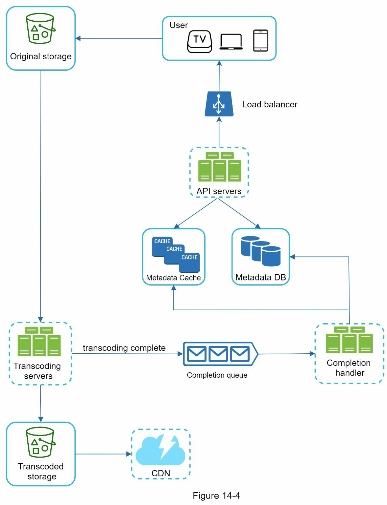
*   **Detailed Components:**
    *   **User:** Initiates the upload from their device.
    *   **Load Balancer:** Distributes incoming metadata update requests to the API servers.
    *   **API Servers:** Handles the request to upload a video, primarily by processing its metadata.
    *   **Metadata DB & Cache:** Stores and caches video information like title, description, user ID, status ("uploading", "processing", "ready"), etc.
    *   **Original Storage:** A durable blob storage system (like Amazon S3) where the original, high-quality video file is uploaded.
    *   **Transcoding Servers:** A fleet of servers that performs the heavy lifting of converting the video into multiple formats and resolutions.
    *   **Transcoded Storage:** A separate blob storage that holds the output files from the transcoding servers.
    *   **CDN:** The transcoded videos are pushed here so they are geographically close to users.
    *   **Completion Queue & Handler:** An asynchronous mechanism. When transcoding is done, a message is put in the queue. The handler picks up this message and updates the video's status to "ready" in the metadata database.

*   **Parallel Processes:**
    1.  **Upload Video File:** The actual video file is uploaded to blob storage. This kicks off the transcoding pipeline.
    2.  **Update Metadata:** In parallel, the client sends video information (title, description, etc.) to the API servers, which update a metadata database and cache.

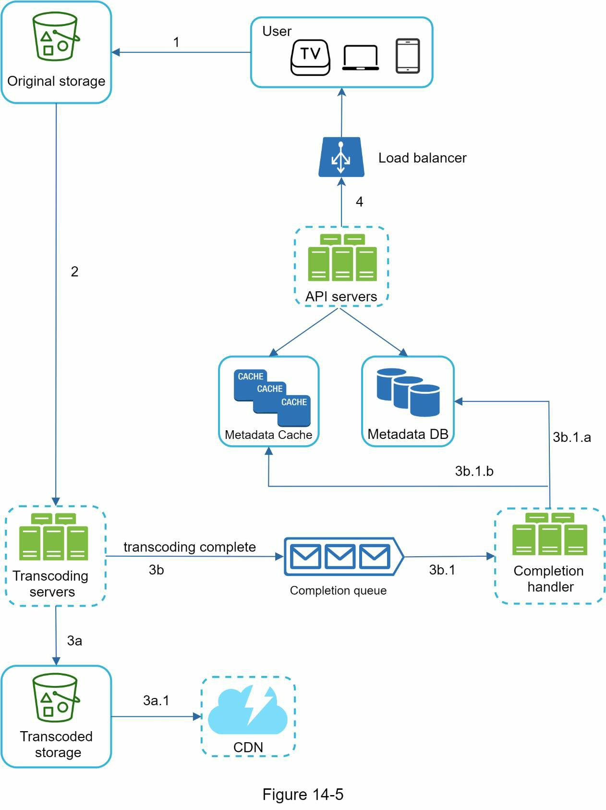
*   **Detailed Flow:** This diagram shows the asynchronous, event-driven nature of the video processing pipeline.
    1.  The video lands in **Original Storage**.
    2.  **Transcoding servers** are triggered to begin work.
    3.  Once transcoding is complete, the process forks: the video files are sent to **Transcoded Storage** (3a) and a "success" message is sent to the **Completion Queue** (3b).
    4.  The transcoded files are then distributed from storage to the **CDN** (3a.1).
    5.  In parallel, the **Completion Handler** consumes the success message (3b.1) and updates the **Metadata DB and Cache** (3b.1.a, 3b.1.b) to mark the video as ready for viewing.

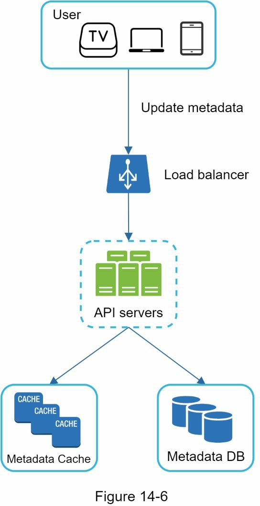
*   **Detailed Flow:** This diagram illustrates the simple, synchronous path for metadata. While the large video file is being uploaded (which can take a long time), the client sends a separate, quick API request containing the title, description, etc. The API servers write this information directly to the database and cache.

#### Video Streaming Flow
This flow describes how a user watches a video. The key is that video is streamed from the CDN, not directly from the API servers.

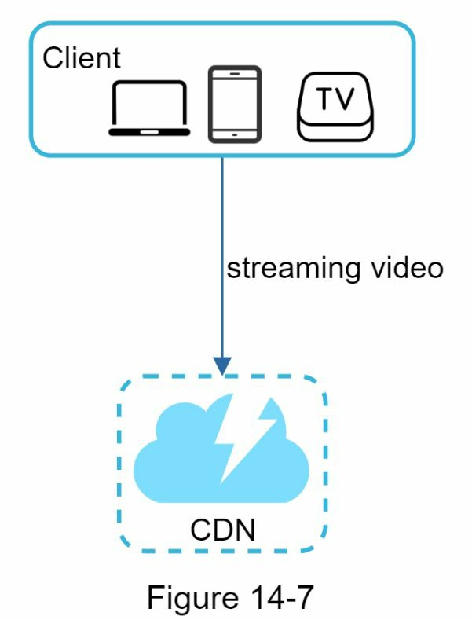
*   **Detailed Flow:**
    1.  The user's client (e.g., the YouTube web page or mobile app) gets the video metadata from the API servers, which includes the CDN URL for the video.
    2.  The client's video player then makes requests directly to the nearest **CDN edge server** to fetch video segments. The API servers are no longer involved in this part of the process.

---

### 3. Deep Dive

#### Video Transcoding
This is the process of converting a video from its original format into different formats and resolutions to ensure compatibility and support adaptive bitrate streaming.

*   **Why it's important:**
    *   Reduces file size (raw video is huge).
    *   Ensures compatibility across all devices and browsers.
    *   Enables adaptive bitrate streaming, where video quality changes based on the user's network speed.
*   **Key Concepts:**
    *   **Container:** The file wrapper (e.g., .mp4, .mov).
    *   **Codecs:** The compression/decompression algorithms (e.g., H.264, VP9).

#### Directed Acyclic Graph (DAG) Model for Transcoding
To handle complex and varied processing needs, a DAG model is used. This defines a series of tasks that can be run in parallel or sequentially, providing great flexibility.

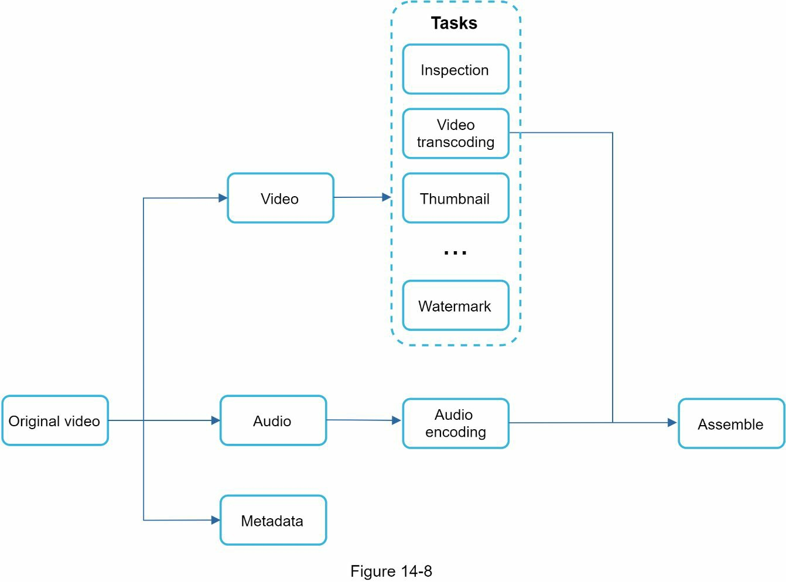
*   **Detailed Components:** This diagram shows the logical flow of tasks, not the physical servers.
    *   **Original:** The source video file.
    *   **Splitting:** The file is conceptually split into its core components: video, audio, and metadata.
    *   **Parallel Tasks:** Various independent tasks can be performed on the components, such as **Video Encoding** (creating different resolutions), generating **Thumbnails**, and adding **Watermarks**.
    *   **Merge:** A final step where the processed video and audio tracks are muxed (combined) back into final, playable video files.

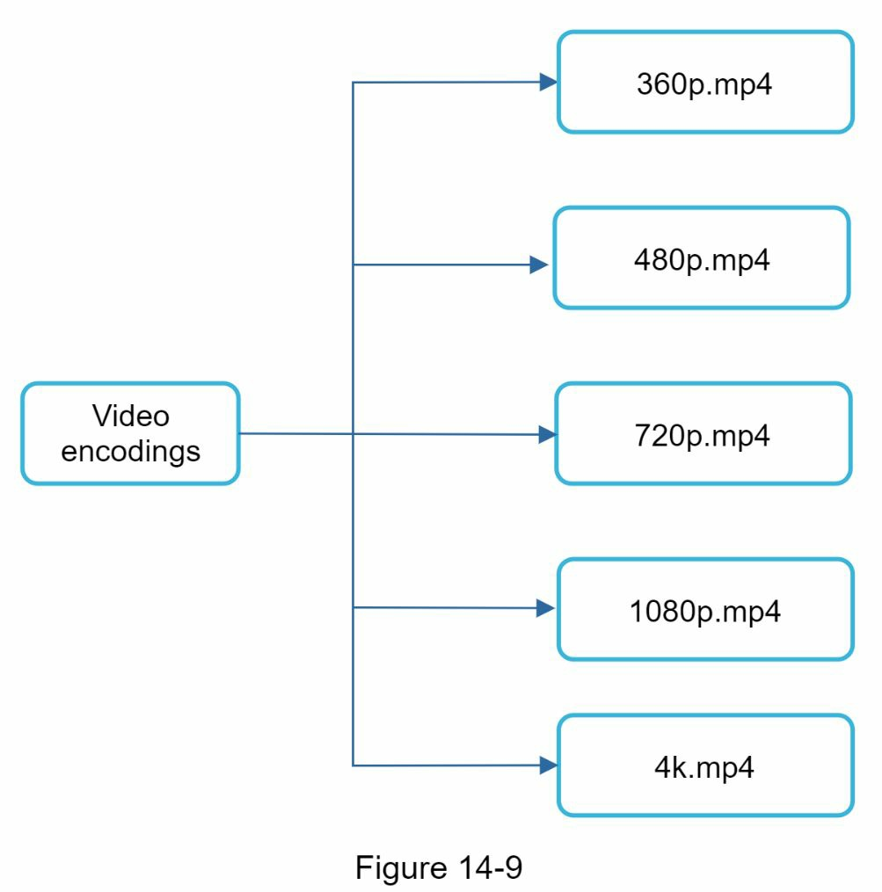

#### Video Transcoding Architecture
This is a detailed look at the services that execute the DAG.

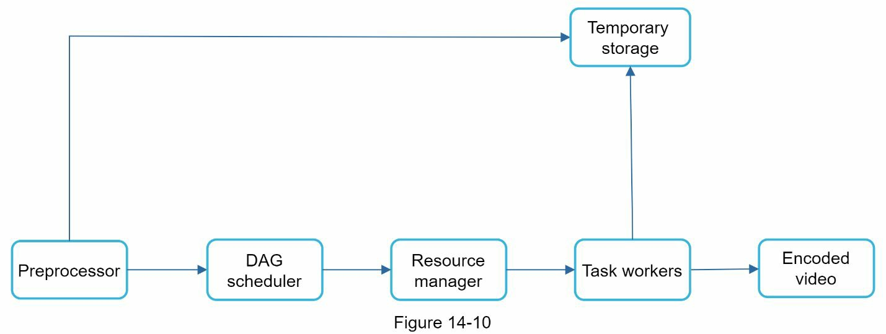
*   **Detailed Components:**
    *   **Preprocessor:** The entry point. It validates the video, splits it into GOPs (playable chunks), generates the specific DAG of tasks to be run, and saves the chunks to temporary storage.
    *   **DAG Scheduler:** Interprets the DAG and breaks it down into stages of individual tasks that can be executed. It then submits these tasks to the Resource Manager's queue.
    *   **Resource Manager:** The "traffic cop" that manages a fleet of Task Workers. It keeps track of available workers and assigns tasks to them from its queues to maximize efficiency.
    *   **Task Workers:** The "muscle." A fleet of servers that execute specific jobs from the DAG, such as encoding, thumbnailing, etc.
    *   **Temporary Storage:** A mix of blob storage and caches used to hold video chunks and metadata during the complex transcoding process.

1.  **Preprocessor:** Splits the video into smaller, playable chunks called GOPs (Group of Pictures). It also generates the DAG from config files and caches the GOPs in temporary storage.
    *Example DAG Representation and Config:*
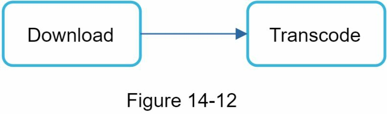
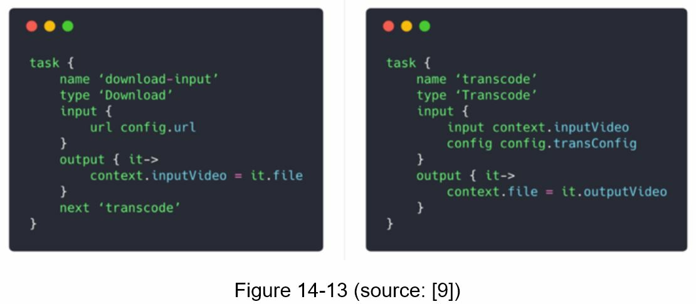
2.  **DAG Scheduler:** Splits the DAG into stages of tasks and sends them to the Resource Manager.
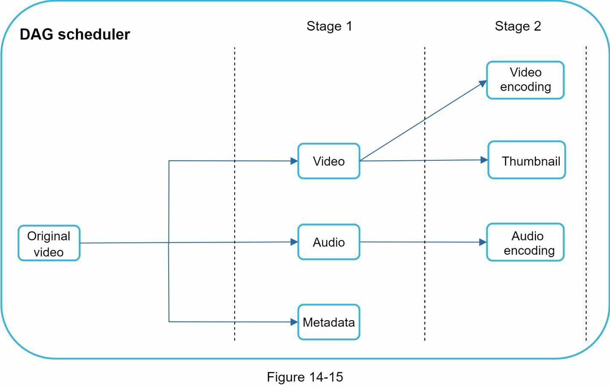
*   **Detailed Flow:** This shows the DAG Scheduler in action. It takes the full DAG and identifies which tasks can be run in parallel (Stage 2 tasks like video encoding, thumbnailing, and audio encoding can all start after Stage 1 is complete). It then schedules these stages of tasks.
3.  **Resource Manager:** Manages a pool of workers efficiently. It uses a task queue, a worker queue, and a running queue to assign the highest-priority tasks to the most suitable available workers.
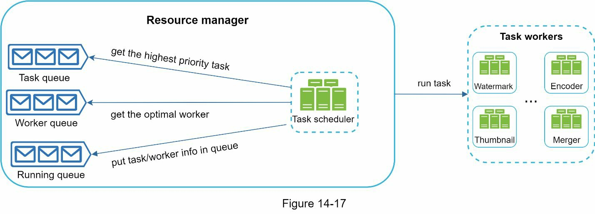
*   **Detailed Components:**
    *   **Task Queue:** A priority queue of all jobs that need to be run.
    *   **Worker Queue:** A priority queue of all available workers, perhaps ranked by what type of job they can do or how busy they are.
    *   **Task Scheduler:** The logic that matches a task from the task queue with a worker from the worker queue.
    *   **Running Queue:** A list of jobs currently in progress and which worker is handling them.

4.  **Task Workers:** These are the servers that perform the actual work defined in the DAG, such as video encoding, thumbnail generation, etc.
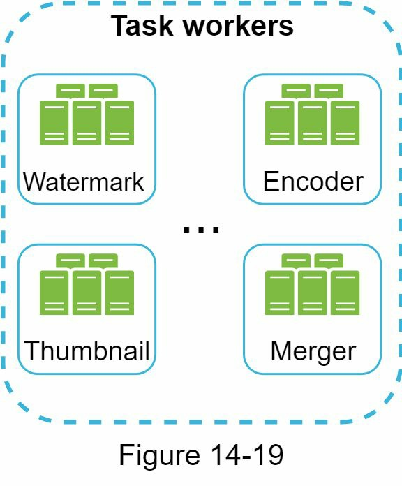
*   **Detailed View:** This shows a heterogeneous pool of workers. Some may be generic, while others are specialized for certain tasks (e.g., servers with powerful GPUs for video encoding).

5.  **Temporary Storage:** A mix of in-memory caches (for metadata) and blob storage (for video chunks) used during the transcoding process.
6.  **Encoded Video:** The final output of the pipeline, ready to be sent to the CDN.

#### System Optimizations

*   **Speed Optimizations:**
    *   **Parallelize Uploads:** The client splits the video into GOP chunks *before* uploading. This allows for faster, resumable uploads.
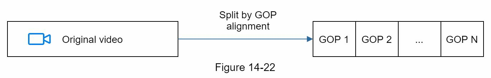
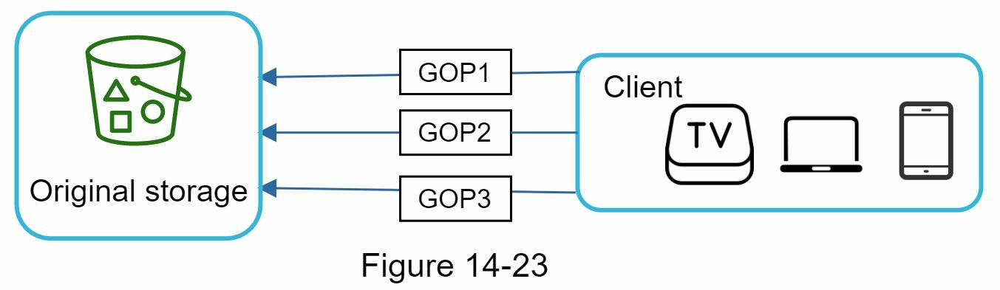
*   **Detailed Flow:** The client application itself, rather than a server, is responsible for intelligently breaking the large video file into smaller chunks before starting the upload. This enables chunks to be uploaded in parallel and makes the process resumable if the network connection drops.

    *   **Geographic Upload Centers:** Use CDNs as upload points to reduce latency for users far from your main servers.
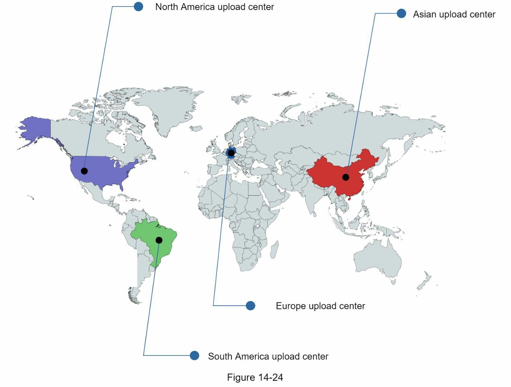
*   **Detailed Flow:** A user's upload traffic is sent to the nearest CDN edge location, which then forwards the file to a regional upload center. This minimizes the initial network latency for the user, making the upload feel faster.

    *   **Loosely Coupled Pipeline:** Use message queues between steps of the transcoding pipeline to allow each stage to work in parallel, rather than waiting for the previous stage to finish.
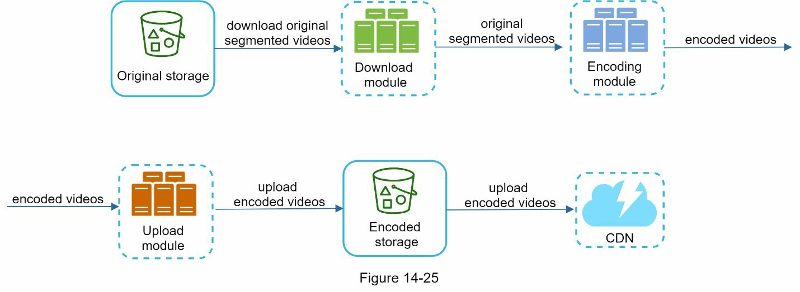
*   **Description:** This shows a dependent pipeline where the encoding module cannot start until the download module is completely finished. This is inefficient.

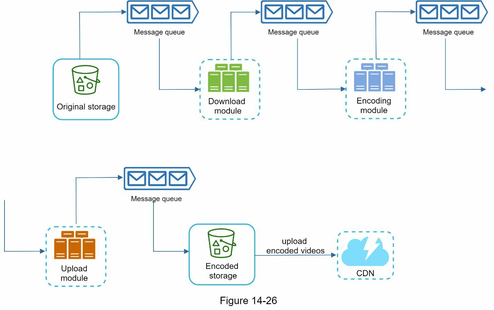
*   **Description:** This shows a superior, decoupled design. When the download module finishes with a piece of work, it places a message in a queue. The encoding module can immediately start processing that message, even while the download module is working on the next piece of data. This allows for much higher parallelism and throughput.

*   **Safety Optimizations:**
    *   **Pre-Signed URLs:** The client first asks the API server for a secure, time-limited URL to upload the video to. This ensures only authenticated users can upload to a specific, authorized location in your blob storage.
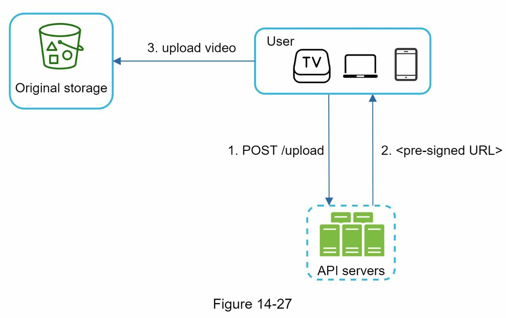
*   **Detailed Flow:**
    1. The client asks the API server, "I want to upload a file."
    2. The API server authenticates the client and generates a special, time-limited URL that grants temporary write access to a specific location in cloud storage.
    3. The client receives this URL and then uploads the large video file directly to cloud storage, bypassing the API servers for the heavy data transfer.

    *   **Content Protection:** Use Digital Rights Management (DRM), AES encryption, or visual watermarking to protect copyrighted videos from theft.

*   **Cost-Saving Optimizations:**
    *   **Hybrid CDN Strategy:** Since YouTube videos follow a long-tail distribution (a few videos are extremely popular, most are not), only serve the most popular videos from the expensive CDN. Serve less-popular videos from your own servers, which have a lower bandwidth cost.
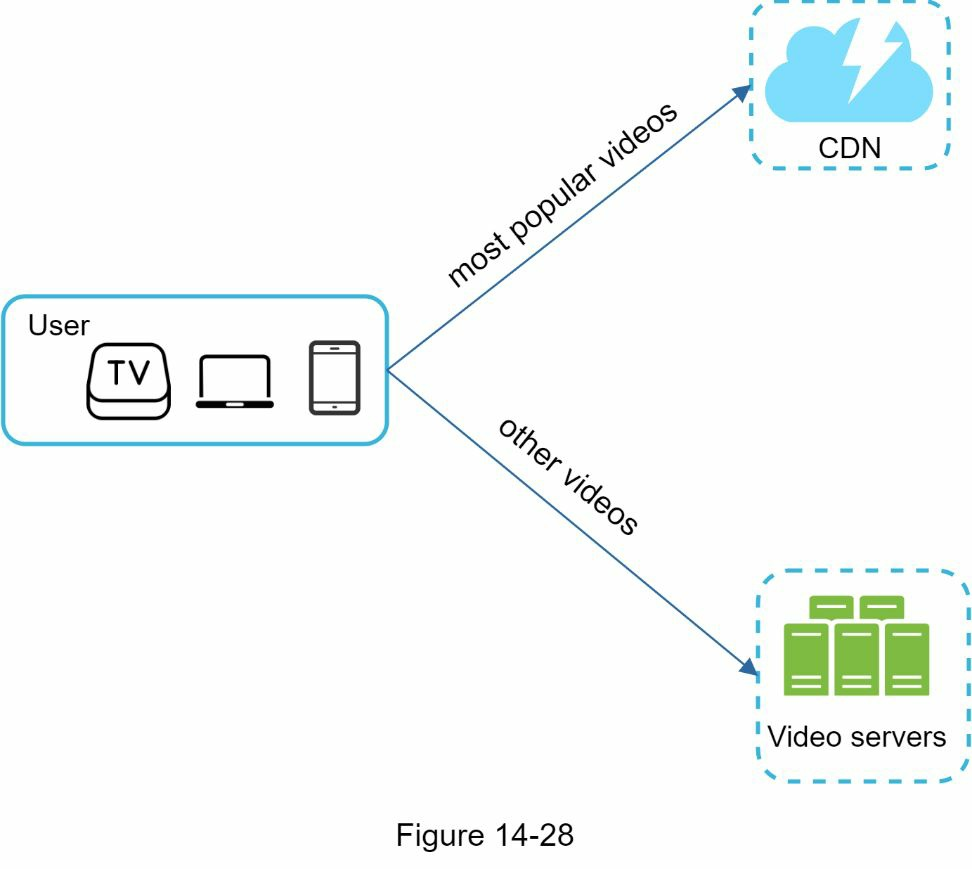
*   **Detailed Flow:** A request for a video first goes to a service that determines its popularity. If it's a "hot" video, the client is directed to the CDN. If it's a less popular "long-tail" video, the client is directed to a separate cluster of video servers with cheaper bandwidth.

    *   **Other strategies:** Encode less-popular videos on-demand, avoid distributing regionally popular videos globally, and partner with ISPs to reduce bandwidth costs.

#### Error Handling
A robust system must handle failures at every step.
| Component Error             | Handling Strategy                                           |
|-----------------------------|-------------------------------------------------------------|
| **Upload Error**            | Retry the upload a few times.                               |
| **Transcoding Error**       | Retry the specific failed task.                             |
| **Task Worker Down**        | Reschedule the task on a new worker.                        |
| **API Server Down**         | Stateless; load balancer will redirect to a healthy server. |
| **Metadata Cache Down**     | Access a replica; bring up a new node to replace the dead one. |
| **Metadata DB Master Down** | Promote a slave replica to become the new master.           |
| **Metadata DB Slave Down**  | Read from another replica; bring up a new slave node.       |

---

### 4. Wrap-up and Further Considerations

*   **Live Streaming:** Requires lower latency protocols and different error handling (retries that take too long are not acceptable).
*   **Video Takedowns:** A system is needed to remove videos that violate copyright or community guidelines, both proactively (scanning during upload) and reactively (user flagging).
*   **Scaling API and DB:** The stateless API tier can be scaled horizontally. The database can be scaled using standard replication and sharding techniques.
