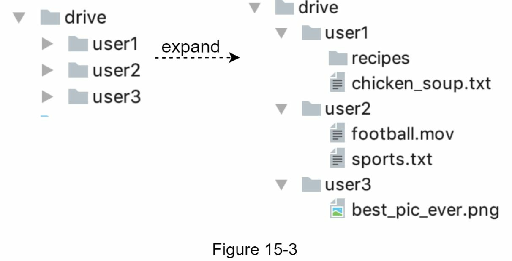
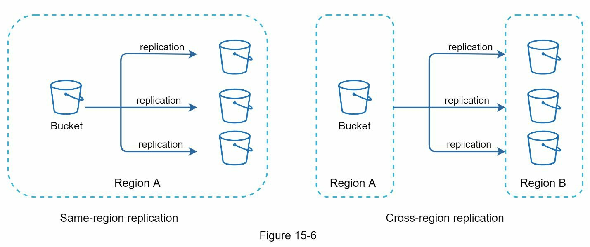
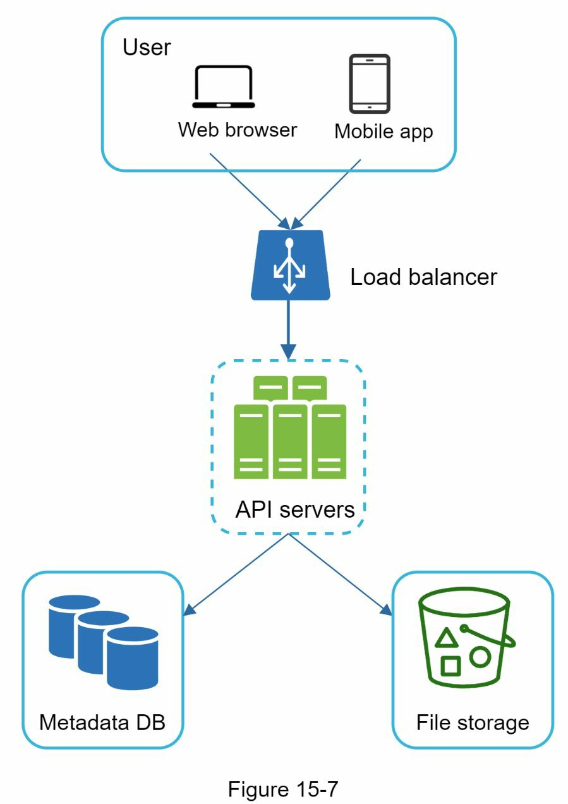
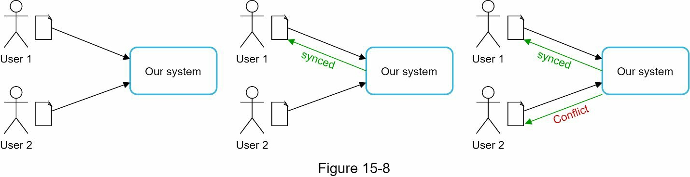
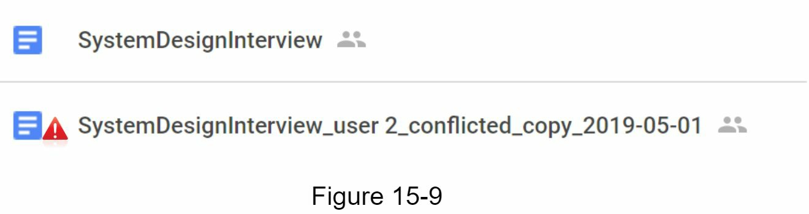
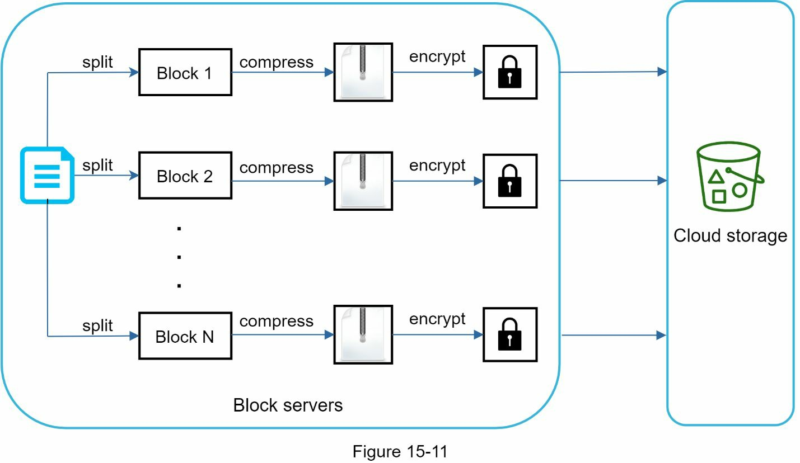
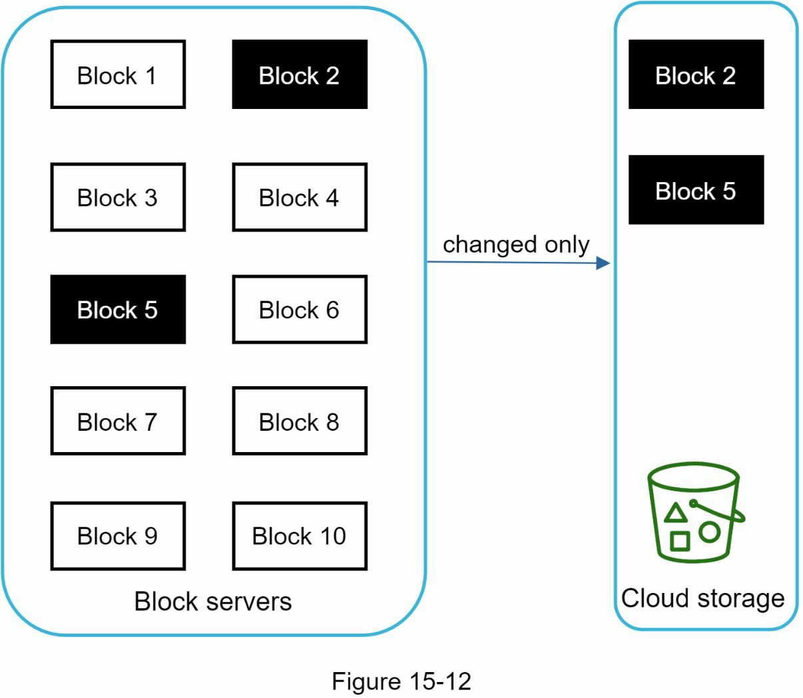
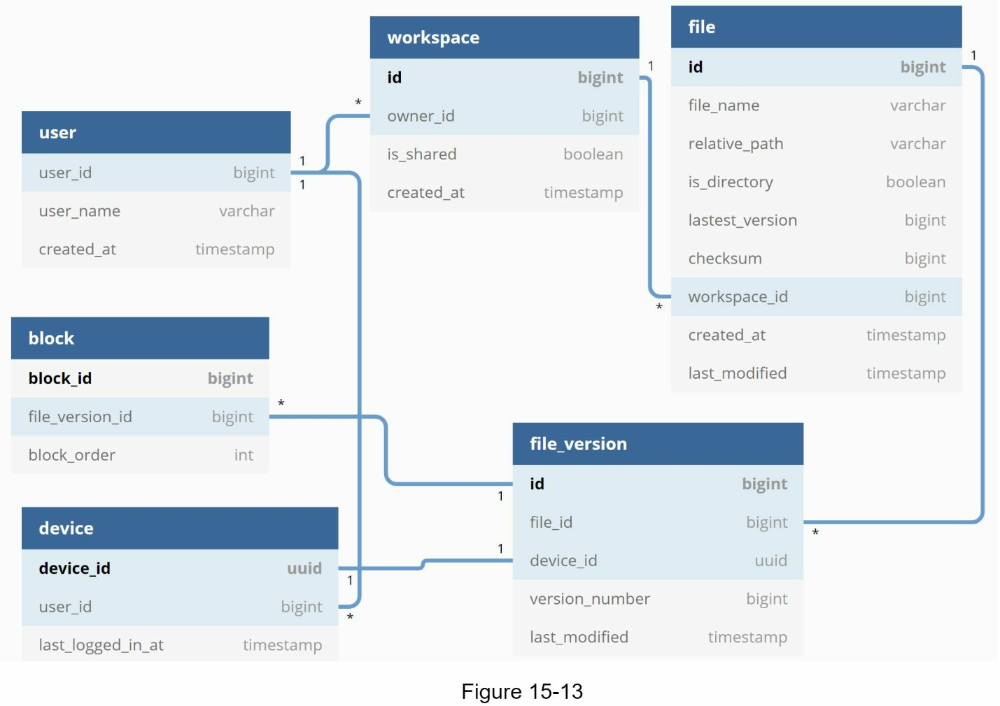
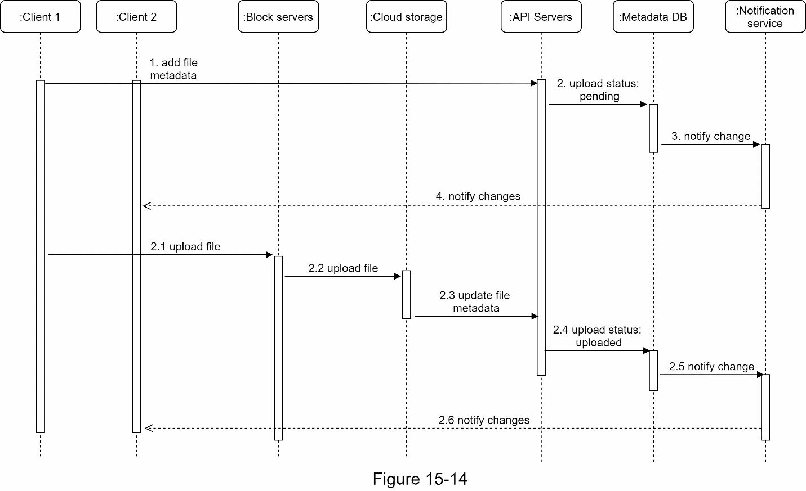
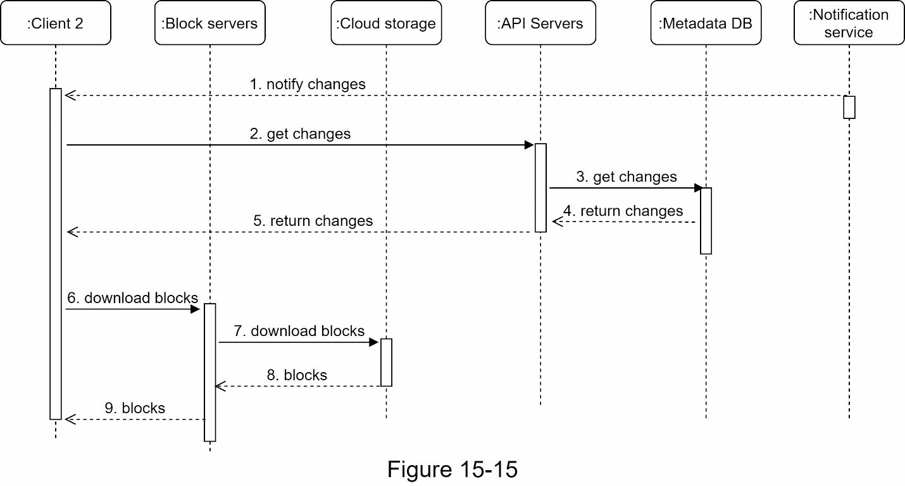

### Chapter 15: Design Google Drive - Summary

This chapter outlines the design for a file storage and synchronization service like Google Drive, focusing on a system that can scale to 10 million daily active users. The design process begins with a simple, single-server setup and iteratively evolves into a robust, distributed system.

The core features include file uploading/downloading, cross-device synchronization, revision history, and notifications for file changes. Key non-functional requirements are extreme reliability (no data loss), fast sync speed, efficient bandwidth usage, and high availability.

The final architecture is a sophisticated, decoupled system. Clients communicate with a set of stateless **API servers** for most operations, while large file transfers are handled by specialized **Block Servers**. These servers are responsible for chunking files into smaller blocks, applying delta sync logic (only uploading changed blocks), compression, and encryption. The actual file blocks are stored in a highly durable and scalable **cloud storage** solution like Amazon S3, with colder, infrequently accessed data moved to cheaper cold storage.

A relational database is chosen for **metadata** to ensure strong consistency, storing information about users, files, versions, and block locations. A **notification service**, using a long-polling mechanism, is a critical component that informs online clients of any file changes in near real-time, prompting them to sync the latest versions. The design also incorporates several optimizations to save storage space, such as data de-duplication and intelligent versioning strategies. A comprehensive failure-handling plan is detailed for each component to ensure the system remains highly available.

---

### 1. Requirements and Scope

*   **Core Features:**
    *   Add and download files.
    *   Sync files across multiple devices.
    *   See file revision history.
    *   Share files.
    *   Send notifications on file changes.
*   **Non-Functional Requirements:**
    *   **Reliability:** No data loss is acceptable.
    *   **Fast Sync Speed:** Changes must propagate quickly.
    *   **Bandwidth Efficiency:** Minimize network data transfer.
    *   **Scalability:** Handle large traffic volumes (10M DAU).
    *   **High Availability:** System must be fault-tolerant.
*   **Constraints:**
    *   Supports any file type.
    *   Files must be encrypted in storage.
    *   Max file size is 10 GB.

#### Back-of-the-Envelope Estimation
*   **DAU:** 10 million
*   **Users:** 50 million total
*   **Storage per user:** 10 GB
*   **Total storage:** 50M users * 10 GB = 500 Petabytes
*   **Uploads:** 10M DAU * 2 files/day = 20M files/day
*   **Upload QPS:** 20M / 86400s ≈ 240 QPS
*   **Peak QPS:** 480 QPS

---

### 2. High-Level Design and Evolution

The design starts with a single server and scales up.

#### Initial Single-Server Setup
A simple setup with an Apache web server, a MySQL database, and a local directory (`/drive`) for file storage. User files are organized in namespaces.

#### APIs
*   **Upload:** `https://api.example.com/files/upload?uploadType=resumable`
    *   Supports **simple uploads** for small files and **resumable uploads** for large files to handle network interruptions.
*   **Download:** `https://api.example.com/files/download`
    *   Params: `path`
*   **Get Revisions:** `https://api.example.com/files/list_revisions`
    *   Params: `path`, `limit`

#### Moving Away from a Single Server
The single-server model has obvious limitations (storage, single point of failure). The design evolves:
1.  **Database Sharding:** The database is sharded (e.g., by `user_id`) to handle more data.
    
2.  **Cloud Storage:** Files are moved to a highly durable object store like Amazon S3, which provides built-in replication and prevents data loss.
    
3.  **Decoupling Components:** Web servers, the metadata database, and file storage are separated into independent, scalable tiers. A load balancer is added in front of the web servers.

#### Handling Sync Conflicts
When two users edit the same file simultaneously, the first version to be processed wins. The second user receives a conflict and is shown both their local version and the server version, with an option to merge or overwrite.

#### Final High-Level Design

*   **Block Servers:** Handle the heavy lifting of the upload process: chunking files into blocks, compression, encryption, and implementing delta sync.
*   **Cloud Storage / Cold Storage:** Durable storage for file blocks. Infrequently accessed data is moved to cheaper cold storage.
*   **API Servers:** Stateless services that handle user authentication, metadata operations, etc.
*   **Metadata DB / Cache:** A relational database for storing file metadata, ensuring strong consistency. A cache layer provides fast access.
*   **Notification Service:** Uses long polling to send near real-time updates to clients about file changes.
*   **Offline Backup Queue:** Stores notifications for offline clients to sync when they reconnect.

---

### 3. Deep Dive

#### Block Servers
These servers optimize the upload process.
*   **Delta Sync:** When a file is modified, only the changed blocks are uploaded, not the entire file. This saves significant bandwidth.
*   **Compression:** Blocks are compressed before upload to further reduce size.
*   **Encryption:** Blocks are encrypted for security.

#### Metadata Database
A relational database is chosen to natively support ACID properties, ensuring strong consistency for file metadata.

*   **Key Tables:**
    *   `User`: User profile information.
    *   `Device`: Stores information about user devices and `push_id` for notifications.
    *   `File`: Contains metadata for the *latest* version of a file.
    *   `File_version`: An immutable, read-only table storing the revision history of all files.
    *   `Block`: Stores information about each unique, encrypted file block.

#### Upload Flow Sequence Diagram

The upload process consists of two parallel requests from the client:
1.  **Add File Metadata:** A quick request to the API server to create a metadata entry for the new file with a "pending" status. This triggers a notification to other clients that a sync is in progress.
2.  **Upload File Content:** A long-running request that sends the file to the Block Servers. They process the file (chunk, compress, encrypt) and upload the blocks to cloud storage. Once complete, a callback updates the file's status in the database to "uploaded," which triggers a final notification.

#### Download Flow
A client learns about file changes via the notification service (if online) or by checking with the server after coming online.

1.  The client is notified of a change.
2.  It requests the latest metadata from the API server.
3.  The client compares the new metadata with its local version to see which blocks it needs.
4.  It sends requests to the Block Servers to download only the required blocks.
5.  The client reconstructs the file locally.

#### Notification Service
*   **Long Polling vs. WebSocket:** While WebSocket is ideal for real-time bidirectional communication (like chat), notifications for file sync are less frequent and primarily one-way (server-to-client). **Long polling** is chosen as a simpler, effective solution.
*   **Mechanism:** The client opens a connection to the notification server, which holds it open until a file change event occurs. When an event happens, the server sends a response, closing the connection. The client then immediately reconnects to wait for the next event.

#### Storage Saving Techniques
1.  **Data De-duplication:** Eliminate redundant blocks. If two users upload the exact same file (or block), it's only stored once. Blocks are identified by their hash value.
2.  **Intelligent Versioning:** Limit the number of revisions stored per file and give more weight to recent versions to avoid storing thousands of minor edits.
3.  **Cold Storage:** Move file versions that haven't been accessed for a long time to a cheaper storage tier like Amazon S3 Glacier.

#### Failure Handling
A summary of the fault-tolerance strategy for each component.
| Component                 | Failure Handling Strategy                                   |
|---------------------------|-------------------------------------------------------------|
| **Load Balancer**         | Use a secondary load balancer in a failover configuration.  |
| **Block Server**          | Another server picks up the unfinished job.                 |
| **Cloud Storage**         | Rely on built-in cross-region replication.                  |
| **API Server**            | Stateless; load balancer redirects traffic to another server. |
| **Metadata Cache**        | Replicated; access another node and spin up a replacement.  |
| **Metadata DB (Master)**  | Promote a slave replica to become the new master.           |
| **Metadata DB (Slave)**   | Read from another replica; spin up a replacement.           |
| **Notification Server**   | Clients lose connection and must reconnect to a new server. |
| **Offline Backup Queue**  | Replicated; consumers re-subscribe to a backup queue.       |

---

### 4. Wrap-up and Further Considerations

*   **Alternative Design: Direct Upload:** The client could upload directly to cloud storage instead of going through Block Servers.
    *   **Pro:** Faster, as it's a single network hop.
    *   **Con:** Logic for chunking, compression, and encryption must be implemented and maintained on every client platform (iOS, Android, Web), which is complex and less secure.
*   **Presence Service:** The logic for tracking online/offline status could be extracted from the notification service into its own dedicated "presence service" to be used by other parts of the system.

Reference materials
[1] Google Drive: https://www.google.com/drive/
[2] Upload file data: https://developers.google.com/drive/api/v2/manage-uploads
[3] Amazon S3: https://aws.amazon.com/s3
[4] Differential Synchronization https://neil.fraser.name/writing/sync/
[5] Differential Synchronization youtube talk https://www.youtube.com/watch?
v=S2Hp_1jqpY8
[6] How We’ve Scaled Dropbox: https://youtu.be/PE4gwstWhmc
[7] Tridgell, A., & Mackerras, P. (1996). The rsync algorithm.
[8] Librsync. (n.d.). Retrieved April 18, 2015, from https://github.com/librsync/librsync
[9] ACID: https://en.wikipedia.org/wiki/ACID
[10] Dropbox security white paper:
https://www.dropbox.com/static/business/resources/Security_Whitepaper.pdf
[11] Amazon S3 Glacier: https://aws.amazon.com/glacier/faqs/