### Chapter 1: Scale From Zero to Millions of Users - Summary

This chapter provides a step-by-step guide on scaling a web application from a single server to a distributed system capable of handling millions of users. It starts with the simplest possible setup and progressively introduces key components and architectural patterns. The journey covers separating the web and data tiers, vertical vs. horizontal scaling, adding load balancers for availability, replicating databases for reliability, and using caching and CDNs to improve performance. The chapter emphasizes the importance of a stateless web tier for scalability and then discusses scaling to multiple data centers. Finally, it introduces advanced topics like message queues for decoupling services and database sharding for handling massive datasets. The core message is that scaling is an iterative process of identifying bottlenecks and applying the right architectural solutions.

---

### 1. Single Server Setup

The simplest approach where all components (web app, database, cache) reside on a single server.

*   **Request Flow:**
    1.  User enters a domain name (`api.mysite.com`).
    2.  DNS resolves the domain to an IP address (`15.125.23.214`).
    3.  An HTTP request is sent directly to that IP address.
    4.  The web server processes the request and returns a response (HTML, JSON).

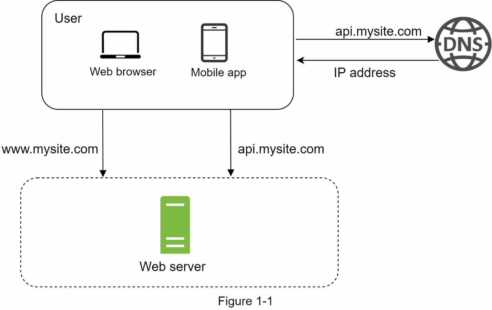
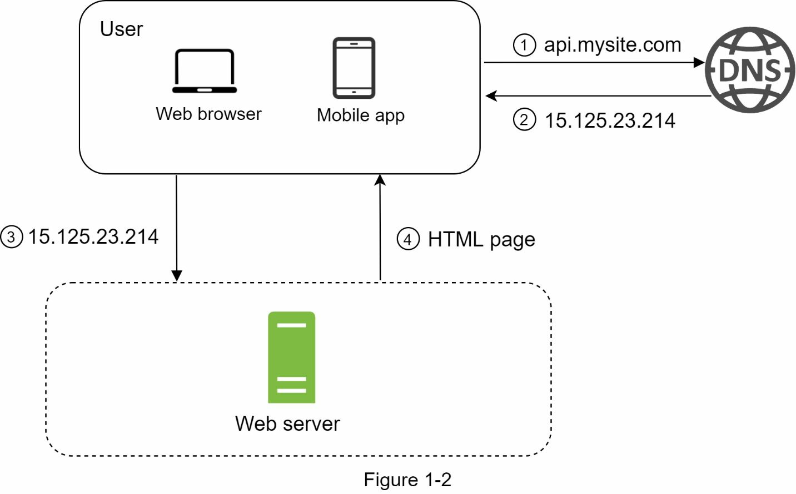

---

### 2. Separating the Database

As the user base grows, the first step is to separate the web server (web tier) from the database server (data tier). This allows them to be scaled independently.

**Relational vs. Non-Relational Databases:**
*   **Relational (SQL):** Traditional databases like MySQL, PostgreSQL. Store data in tables and rows, support JOIN operations. A good default choice.
*   **Non-Relational (NoSQL):** Databases like Cassandra, DynamoDB. Grouped into key-value, graph, column, and document stores. Generally do not support JOINs.
*   **When to use NoSQL:**
    *   Need for super-low latency.
    *   Data is unstructured.
    *   Need to store a massive amount of data.

---

### 3. Scaling: Vertical vs. Horizontal

*   **Vertical Scaling (Scale Up):** Adding more power (CPU, RAM) to an existing server.
    *   **Pros:** Simple.
    *   **Cons:** Has a hard hardware limit, creates a single point of failure (SPOF).
*   **Horizontal Scaling (Scale-Out):** Adding more servers to the resource pool.
    *   **Pros:** The standard for large-scale applications as it overcomes the limits of vertical scaling.

---

### 4. Load Balancer

A load balancer evenly distributes traffic among a pool of web servers, improving availability and reliability.

*   **Functionality:** Users connect to the load balancer's public IP. The load balancer then forwards requests to the web servers using private IPs.
*   **Benefits:**
    *   **High Availability:** If one web server fails, traffic is automatically routed to healthy servers.
    *   **Scalability:** To handle more traffic, you can simply add more web servers to the pool.

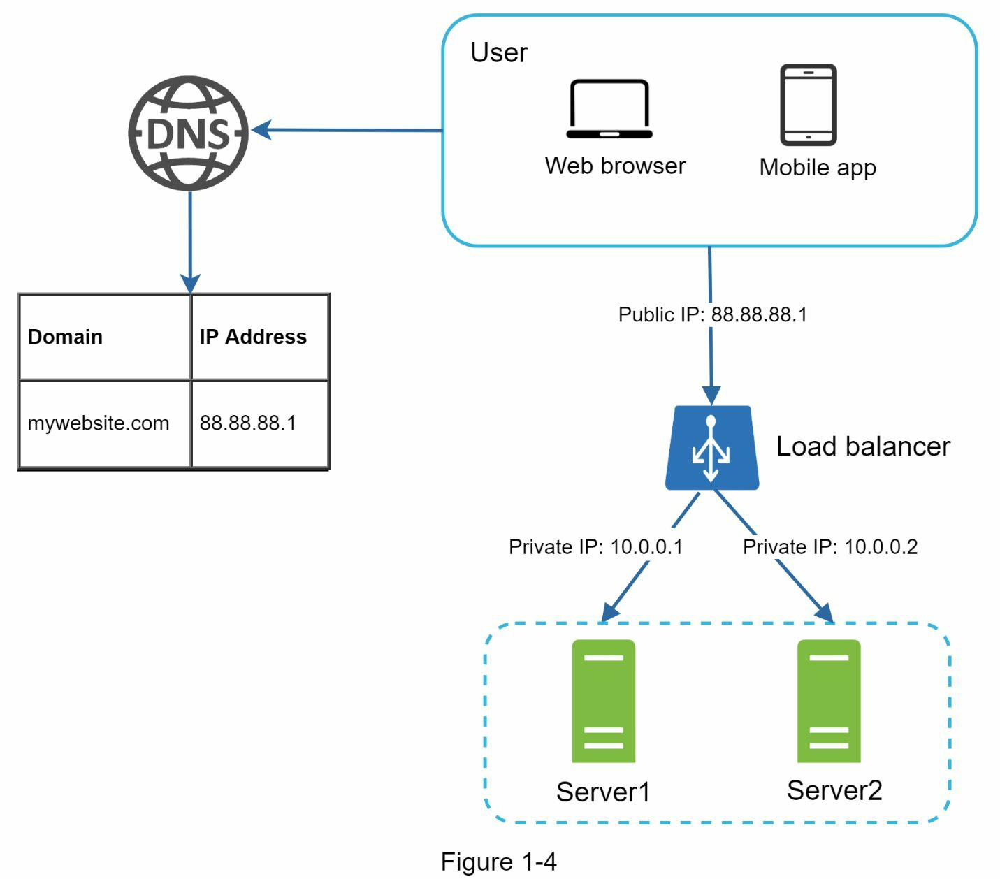

---

### 5. Database Replication

This technique involves creating copies of the database to improve performance, reliability, and availability.

*   **Master-Slave Model:**
    *   The **Master** database handles all write operations (INSERT, UPDATE, DELETE).
    *   **Slave** databases replicate data from the master and handle read operations.
    *   This improves performance as read and write queries are processed in parallel.
*   **Failover:**
    *   If a slave fails, reads are redirected to other slaves or the master.
    *   If the master fails, a slave is promoted to become the new master.

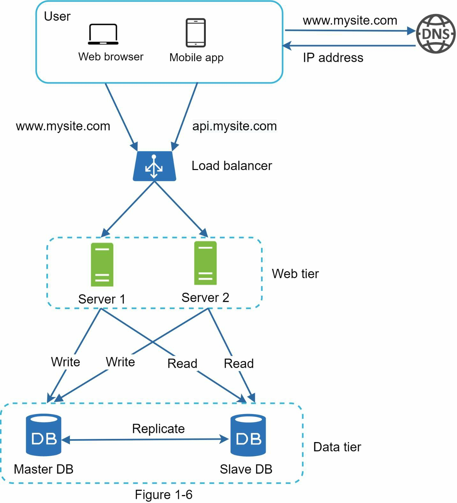

---

### 6. Cache

A cache is a temporary, in-memory data store that holds frequently accessed data or the results of expensive operations to serve subsequent requests faster.

*   **Benefits:**
    *   Improves application performance and response time.
    *   Reduces the load on the database.
*   **Read-through Cache Strategy:**
    1.  The web server checks the cache for the data first.
    2.  If data exists (cache hit), it's returned to the client.
    3.  If data doesn't exist (cache miss), the server queries the database, stores the result in the cache, and then returns it.

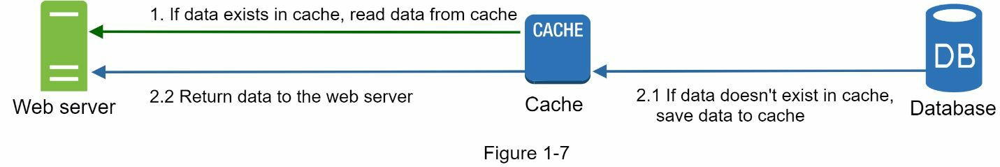

*   **Considerations:**
    *   **Expiration Policy:** Data should have a TTL (Time-to-Live) to avoid staleness.
    *   **Consistency:** Keeping cache and database in sync is a challenge.
    *   **Failure Mitigation:** Use multiple cache servers to avoid a single point of failure.
    *   **Eviction Policy:** When the cache is full, a policy like LRU (Least Recently Used) is needed to remove items.

---

### 7. Content Delivery Network (CDN)

A CDN is a network of geographically distributed servers that cache and deliver static content (images, videos, CSS, JS) to users from a location close to them.

*   **Benefit:** Dramatically reduces latency for users, as content travels a shorter physical distance.
*   **Workflow:**
    1.  User requests a static asset (e.g., `image.png`) from a CDN URL.
    2.  If the CDN edge server has the asset, it returns it.
    3.  If not, the CDN server fetches it from the origin server (your web server or S3), caches it, and then returns it. Subsequent requests are served from the cache.

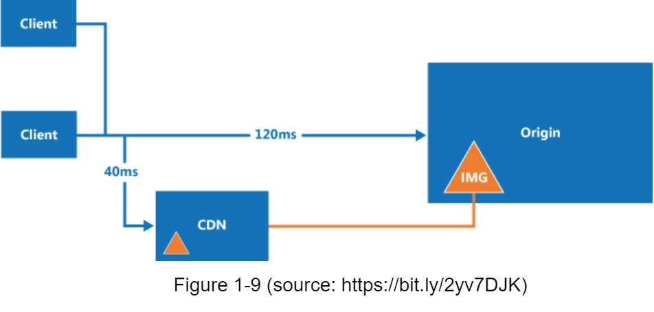
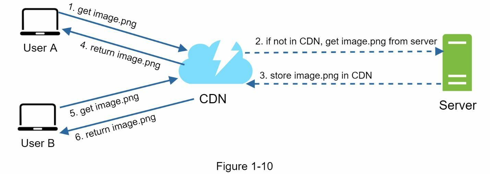
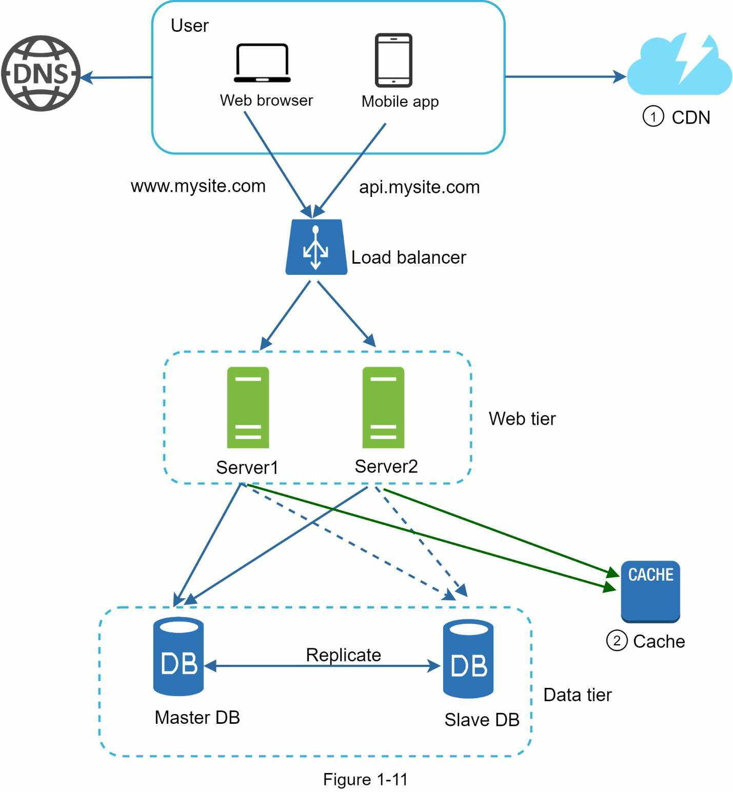

---

### 8. Stateless Web Tier

To scale the web tier horizontally, state (like user session data) must be moved out of the web servers.

*   **Stateful Architecture:** A server stores client session data locally. All requests from a user must be routed to the same server (using sticky sessions), which complicates scaling and failover.
    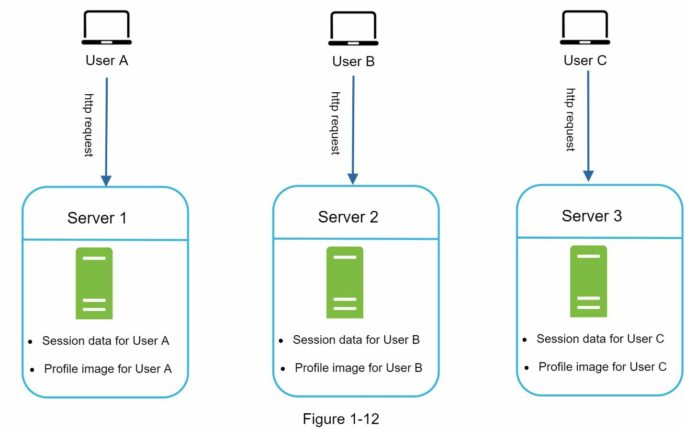
*   **Stateless Architecture:** Web servers do not store any session data. State is fetched from a shared data store (like a NoSQL database or Redis) on each request.
    *   **Benefit:** Any web server can handle any user's request, making it simple to scale by adding or removing servers based on load (auto-scaling).

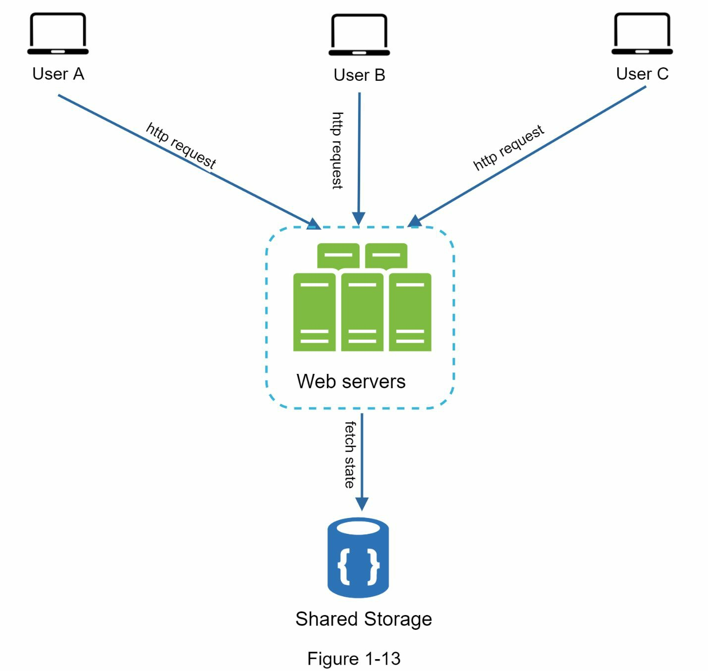
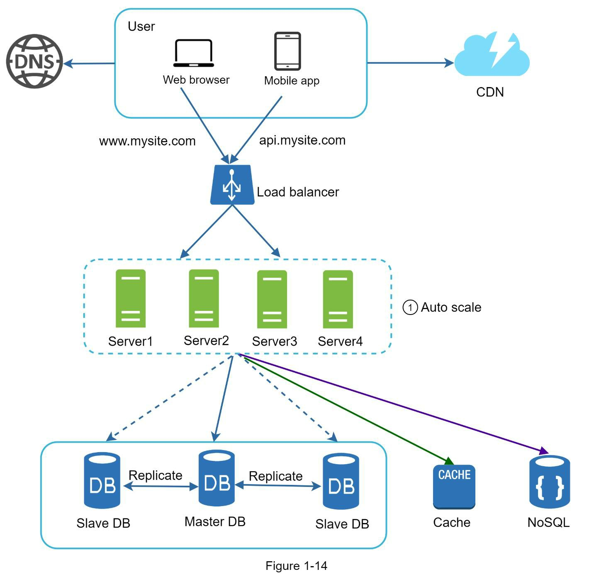

---

### 9. Data Centers

To provide a global service with high availability, applications are deployed across multiple data centers.

*   **GeoDNS:** A DNS service that resolves a domain to the IP address of the data center closest to the user's location, reducing latency.
*   **Failover:** In case of a data center outage, all traffic can be redirected to a healthy data center.
*   **Challenges:**
    *   **Traffic Redirection:** Requires tools like GeoDNS.
    *   **Data Synchronization:** Data must be replicated across all data centers.
    *   **Deployment:** Automated tools are needed to keep services consistent.

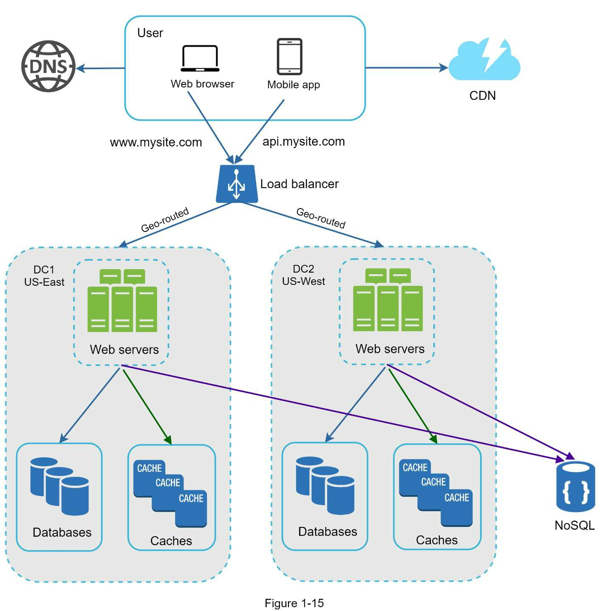
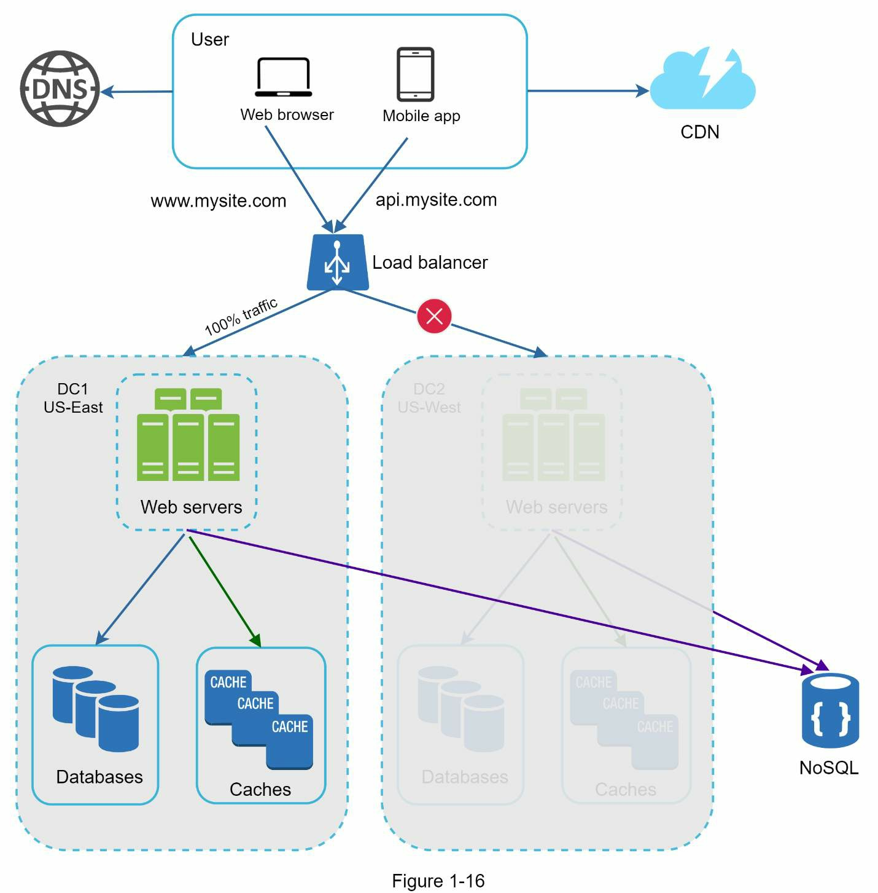

---

### 10. Message Queue

A message queue supports asynchronous communication by acting as a buffer between services.

*   **Architecture:** **Producers** create messages and publish them to the queue. **Consumers** connect to the queue, retrieve messages, and process them.
*   **Benefit:** Decouples services. The producer doesn't need to wait for the consumer, and they can be scaled independently. This improves reliability and scalability.
*   **Use Case:** A photo upload service where the web server (producer) places a "process image" job in the queue, and background workers (consumers) pick up jobs to do the heavy lifting (cropping, adding filters).

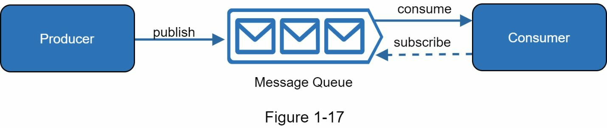
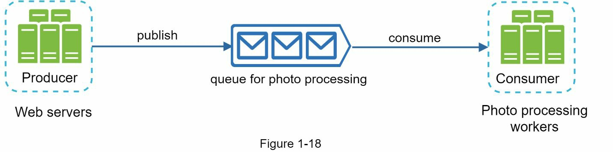
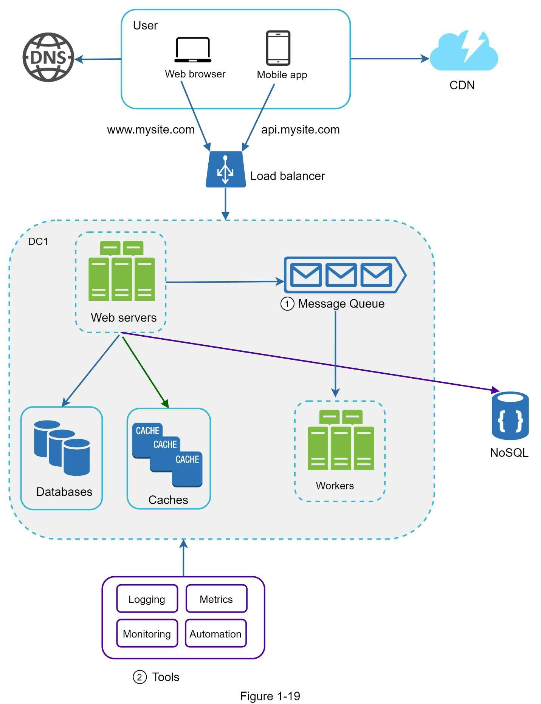

---

### 11. Database Scaling: Sharding

When a database becomes too large for a single server, it needs to be scaled horizontally.

*   **Sharding (Horizontal Scaling):** The practice of splitting a large database into smaller, more manageable parts called shards. Each shard has the same schema but contains a unique subset of the data.
*   **Sharding Key:** One or more columns used to determine which shard the data belongs to. A good sharding key distributes data evenly. For example, `user_id % 4` could route a user's data to one of four shards.
*   **Challenges:**
    *   **Resharding:** As data grows, you may need to add more shards and redistribute the data, which is a complex process.
    *   **Celebrity Problem (Hotspot):** If one shard contains a disproportionate amount of popular data (e.g., a celebrity's profile), it can become overloaded.
    *   **Joins:** Performing JOINs across different shards is difficult and often requires de-normalizing the data.

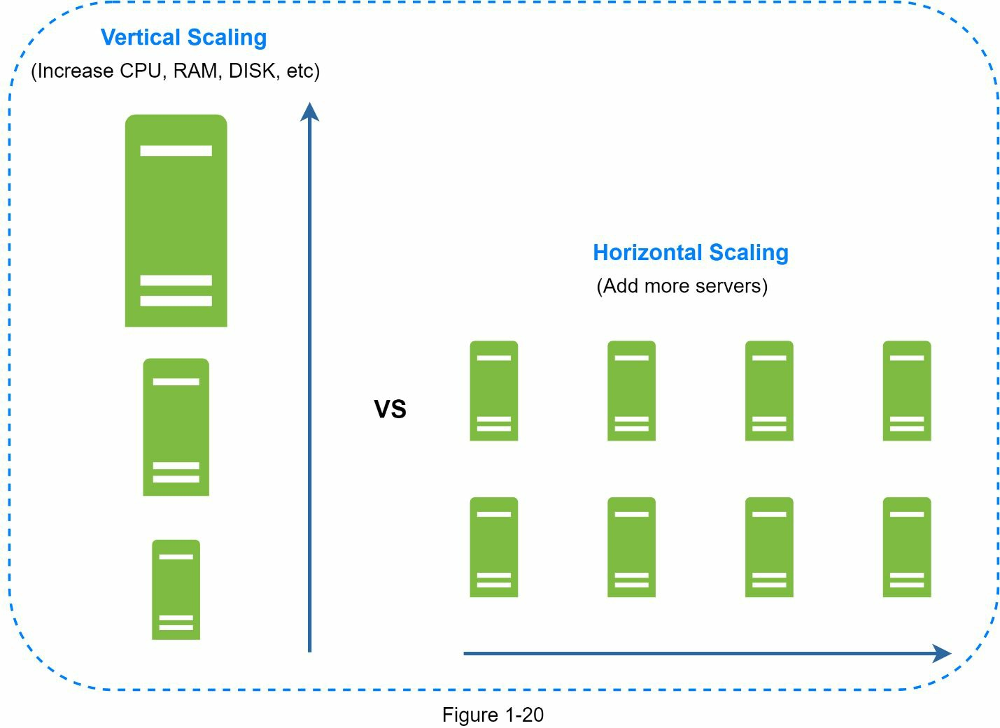
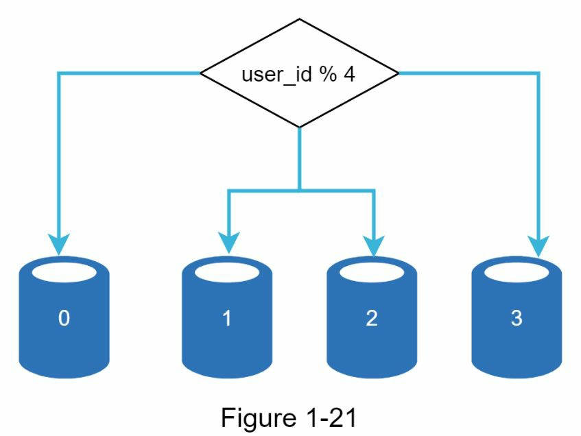
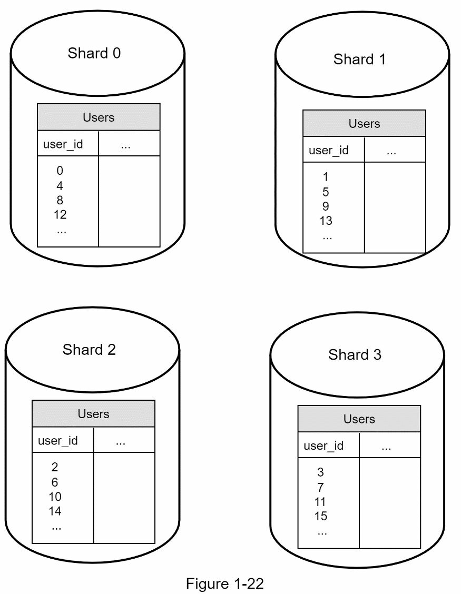

---

### 12. Final Architecture and Summary

The final architecture combines all the previously discussed components to create a resilient, performant, and scalable system.

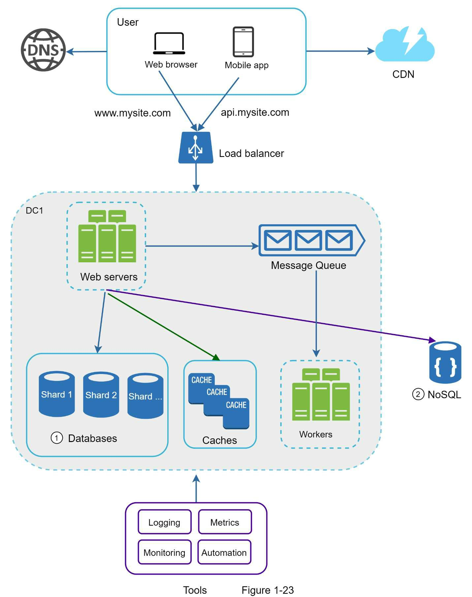

**Key Takeaways / Actionable Tips:**
> 1.  **Keep Web Tier Stateless:** This is the key to horizontal scaling and high availability.
> 2.  **Build Redundancy at Every Tier:** Eliminate single points of failure with load balancers, multiple servers, database replicas, and multiple data centers.
> 3.  **Cache Data Aggressively:** Use caching at every opportunity to improve performance and reduce the load on your database.
> 4.  **Support Multiple Data Centers:** Essential for providing a fast, global service and surviving regional outages.
> 5.  **Host Static Assets on a CDN:** Offload traffic from your servers and significantly reduce load times for users.
> 6.  **Scale Your Data Tier by Sharding:** When your database outgrows a single master, sharding is the path to virtually limitless scale.
> 7.  **Decouple Tiers with Message Queues:** Use asynchronous communication to improve reliability and allow services to scale independently.
> 8.  **Monitor Your System and Automate Everything:** You cannot manage a large-scale system without robust monitoring, metrics, and automated deployment pipelines.

Reference materials

[1] Hypertext Transfer Protocol: https://en.wikipedia.org/wiki/Hypertext_Transfer_Protocol

[2] Should you go Beyond Relational Databases?:
https://blog.teamtreehouse.com/should-you-go-beyond-relational-databases

[3] Replication: https://en.wikipedia.org/wiki/Replication_(computing)

[4] Multi-master replication:
https://en.wikipedia.org/wiki/Multi-master_replication

[5] NDB Cluster Replication: Multi-Master and Circular Replication:
https://dev.mysql.com/doc/refman/5.7/en/mysql-cluster-replication-multi-master.html

[6] Caching Strategies and How to Choose the Right One:
https://codeahoy.com/2017/08/11/caching-strategies-and-how-to-choose-the-right-one/

[7] R. Nishtala, "Facebook, Scaling Memcache at," 10th USENIX Symposium on Networked
Systems Design and Implementation (NSDI ’13).

[8] Single point of failure: https://en.wikipedia.org/wiki/
Single_point_of_failure

[9] Amazon CloudFront Dynamic Content Delivery:
https://aws.amazon.com/cloudfront/dynamic-content/

[10] Configure Sticky Sessions for Your Classic Load Balancer:
https://docs.aws.amazon.com/elasticloadbalancing/latest/classic/elb-sticky-sessions.html

[11] Active-Active for Multi-Regional Resiliency:
https://netflixtechblog.com/active-active-for-multi-regional-resiliency-c47719f6685b

[12] Amazon EC2 High Memory Instances:
https://aws.amazon.com/ec2/instance-types/high-memory/

[13] What it takes to run Stack Overflow:
http://nickcraver.com/blog/2013/11/22/what-it-takes-to-run-stack-overflow

[14] What The Heck Are You Actually Using NoSQL For:
http://highscalability.com/blog/2010/12/6/what-the-heck-are-you-actually-using-nosql-
for.html