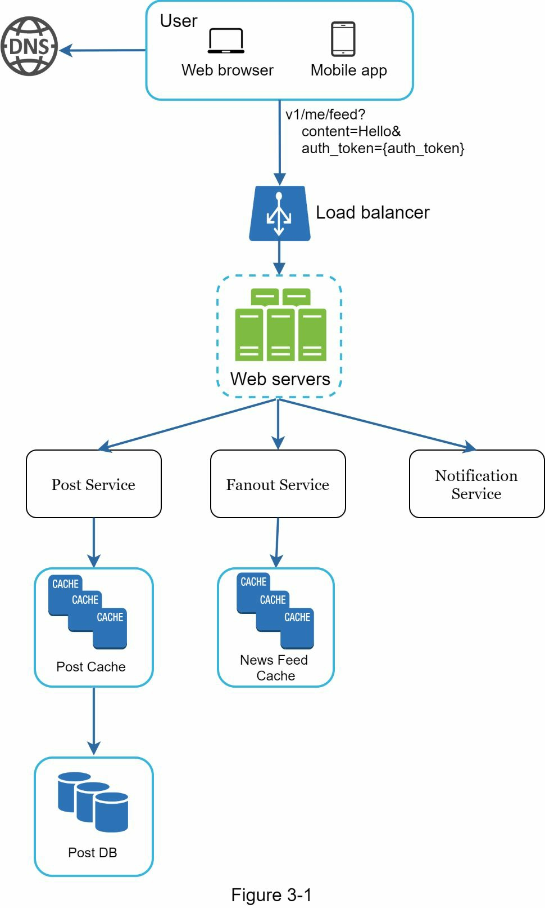
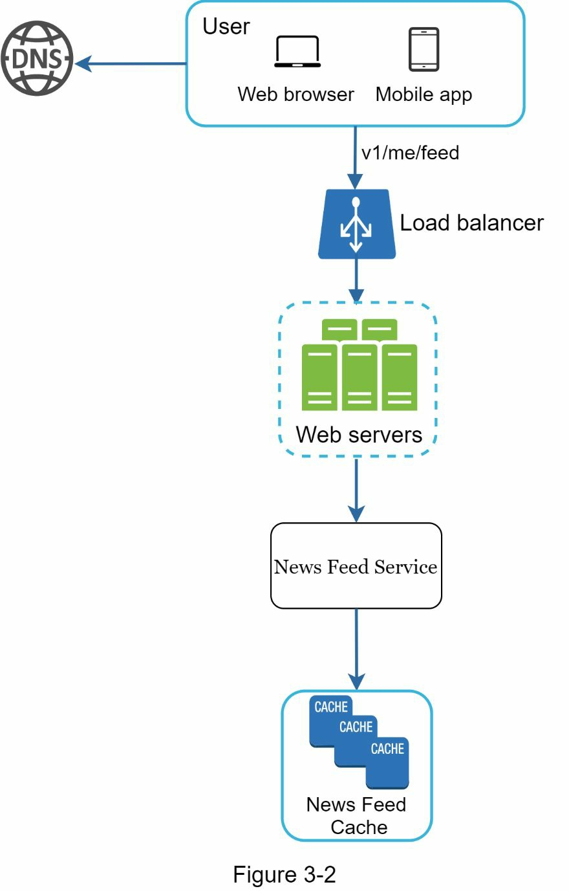
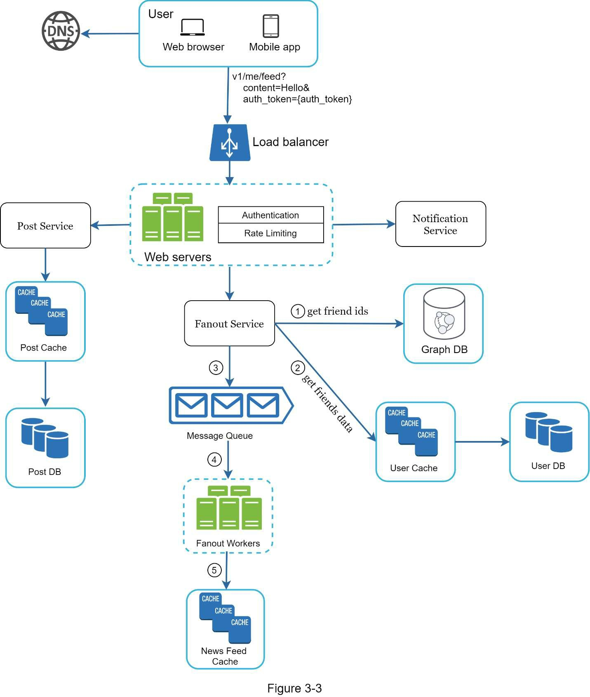
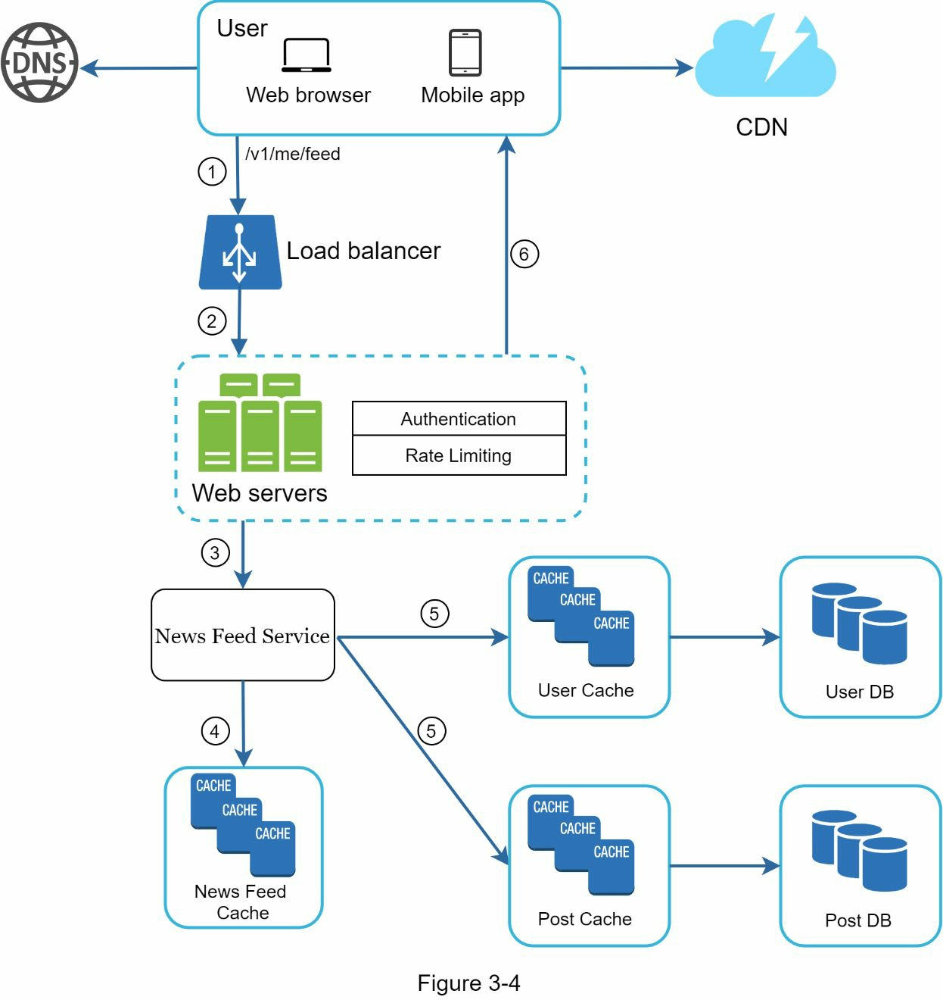

### Chapter 3: A Framework for System Design Interviews - Summary

This chapter provides a structured approach to navigating the intimidating and ambiguous nature of system design interviews. It reframes the interview not as a test for a single correct answer, but as a collaborative problem-solving session that simulates a real-world engineering scenario. The primary goal is to demonstrate one's design process, ability to handle ambiguity, defend choices, and collaborate constructively.

The interviewer is assessing a range of skills beyond pure technical design, including collaboration, asking clarifying questions, and avoiding red flags like over-engineering or stubbornness. The chapter introduces a simple and effective 4-step process designed to guide the candidate from initial ambiguity to a well-reasoned design, all while managing time effectively. The framework emphasizes understanding the problem first, sketching a high-level blueprint, diving deep into critical components, and wrapping up by discussing trade-offs, bottlenecks, and future scaling.

---

### The Goal of the System Design Interview

*   **It's a Simulation:** The interview simulates two colleagues collaborating on an ambiguous problem.
*   **Process Over Perfection:** The final design is less important than the process you take to get there.
*   **What the Interviewer is Looking For:**
    *   **Technical Skills:** Your ability to design a scalable, reliable system.
    *   **Collaboration:** How well you work with and respond to feedback from the interviewer.
    *   **Problem Solving:** How you handle ambiguity and clarify requirements.
    *   **Asking Good Questions:** This is a key skill interviewers look for.
*   **Red Flags to Avoid:**
    *   **Over-engineering:** Designing an overly complex solution for a simple problem.
    *   **Narrow-mindedness:** Not considering alternative approaches.
    *   **Stubbornness:** Being unwilling to accept feedback or adjust your design.

---

### A 4-Step Process for Effective System Design Interviews

#### Step 1: Understand the Problem and Establish Design Scope (3-10 mins)

This is the most critical step. **Do not jump into a solution.** A premature answer without understanding the requirements is a major red flag.

*   **Ask Clarifying Questions:** Your goal is to understand the exact requirements and constraints.
    *   What are the specific features we need to build?
    *   What is the scale (e.g., number of users, DAU)?
    *   What is the anticipated growth?
    *   What is the existing technology stack?
*   **Example: Clarifying a "News Feed System"**
    *   **Candidate:** Is it a mobile app, web app, or both? -> **Interviewer:** Both.
    *   **Candidate:** What are the most important features? -> **Interviewer:** Making a post and seeing friends' feeds.
    *   **Candidate:** How is the feed sorted? -> **Interviewer:** Reverse chronological order for simplicity.
    *   **Candidate:** How many friends can a user have? -> **Interviewer:** 5000.
    *   **Candidate:** What is the traffic volume? -> **Interviewer:** 10 million DAU.
    *   **Candidate:** Can the feed contain media? -> **Interviewer:** Yes, images and videos.

#### Step 2: Propose High-Level Design and Get Buy-in (10-15 mins)

Create a high-level blueprint of the design and collaborate with the interviewer to agree on the approach.

*   **Draw a Diagram:** Sketch the key components on the whiteboard (Clients, APIs, Web Servers, Data Stores, Cache, CDN, Message Queue, etc.).
*   **Do Back-of-the-Envelope Calculations:** Quickly estimate storage, QPS, bandwidth, etc., to see if your blueprint can handle the required scale.
*   **Walk Through Use Cases:** Explain how the system handles a few concrete examples (e.g., user A posts, and user B sees it).
*   **Example: High-Level Design for a News Feed System**
    *   The design is split into two main flows:
        1.  **Feed Publishing:** A user makes a post, which is written to the database/cache and distributed to friends' feeds.
        2.  **News Feed Building:** The feed is constructed by aggregating posts from a user's friends.

*   **Description:** This diagram shows the "write path." A user creates a post, which is handled by a web server, persisted in a database and cache, and then fanned out to friends' news feeds via a fanout service and notification service.

*   **Description:** This diagram shows the "read path." A user requests their feed, and a web server calls a news feed service to fetch the pre-computed feed directly from a cache for fast retrieval.

#### Step 3: Design Deep Dive (10-25 mins)

With the high-level design agreed upon, work with the interviewer to identify and explore the most critical components in detail.

*   **Prioritize:** You don't have time to detail everything. Focus on the most interesting or challenging parts of the system.
    *   For a URL shortener, this might be the hash generation algorithm.
    *   For a chat system, it might be the real-time messaging layer and presence system.
*   **Manage Your Time:** Don't get lost in low-level details that don't demonstrate your core design skills (e.g., explaining a specific ranking algorithm in minute detail).
*   **Example: Deep Dive for a News Feed System**
    *   The interviewer might ask you to elaborate on the two core flows. You would then draw more detailed diagrams for feed publishing and retrieval, explaining the role of specific databases, caches, and services.

*   **Description:** A more detailed view of the write path, showing the specific interactions with a Post DB/Cache, a Social Graph DB/Cache, and the message queue that feeds the fanout workers.

*   **Description:** A more detailed view of the read path, showing the "hydration" process where the news feed service gets a list of post IDs from the cache and then fetches the full post and user data from their respective caches before returning the final feed.

#### Step 4: Wrap Up (3-5 mins)

Use the final minutes to summarize your design and discuss potential extensions and bottlenecks.

*   **Identify Bottlenecks:** Discuss potential system limitations (e.g., "The database could become a bottleneck under heavy write load") and suggest improvements (e.g., "We could mitigate this with read replicas or sharding").
*   **Discuss Operational Issues:** Briefly mention monitoring, metrics, logging, and how the system would be deployed.
*   **Future Scaling:** How would your design change to support 10x the users?
*   **Recap Your Design:** Briefly summarize the key components and choices you made.

---

### Dos and Don'ts

| Dos                                                              | Don'ts                                                               |
|------------------------------------------------------------------|----------------------------------------------------------------------|
| **Always ask for clarification.**                                | **Don't jump to a solution immediately.**                            |
| **Understand the requirements.**                                 | **Don't assume your assumptions are correct.**                       |
| **Communicate your thought process.**                            | **Don't think in silence.**                                          |
| **Suggest multiple approaches and discuss trade-offs.**            | **Don't go into too much detail at the start.** Start high-level.      |
| **Collaborate with the interviewer like a teammate.**            | **Don't hesitate to ask for hints if you get stuck.**                |
| **Design the most critical components first in the deep dive.**    | **Don't think the interview is over until the interviewer says so.** |
| **Never give up.**                                               |                                                                      |
