### Chapter 4: Design a Rate Limiter - Summary

This chapter provides a comprehensive guide to designing a server-side API rate limiter, a critical component for protecting services from overload and abuse. The design process starts by establishing clear requirements: the system must accurately limit traffic, have low latency, be memory-efficient, work in a distributed environment, and be highly fault-tolerant.

The chapter explores various algorithms, each with distinct trade-offs. The **Token Bucket** algorithm is highlighted as a popular and flexible choice, allowing for bursts of traffic. Other algorithms like **Leaking Bucket** (for stable outflow), **Fixed Window Counter** (simple but flawed), **Sliding Window Log** (accurate but memory-intensive), and **Sliding Window Counter** (a balanced hybrid) are also detailed.

The high-level architecture places the rate limiter as a middleware or within an API gateway. It uses a centralized, in-memory data store like **Redis** to store counters for its speed and support for atomic operations (INCR) and automatic key expiration (EXPIRE).

The deep dive addresses key challenges in a large-scale, distributed environment. It covers how to manage and store rate-limiting rules, how to handle throttled requests by returning a `429 Too Many Requests` status code along with informative headers (`X-Ratelimit-*`), and how to solve concurrency issues like **race conditions** and **synchronization** across multiple rate limiter instances. The chapter concludes with performance optimizations, such as using a multi-data center setup and eventual consistency, and emphasizes the importance of monitoring to ensure the rate limiter's effectiveness.

---

### 1. Why Use a Rate Limiter?

*   **Prevent Resource Starvation from DoS Attacks:** Protects against malicious or unintentional denial-of-service attacks by blocking excessive requests from a single source.
*   **Reduce Cost:** Prevents financial drain from overuse of paid third-party APIs and allows for more efficient server resource allocation.
*   **Prevent Server Overload:** Filters out excess requests from misbehaving clients or bots, ensuring the service remains available for legitimate users.

---

### 2. Requirements and Scope

*   **Functional:**
    *   Accurately limit excessive requests based on flexible rules (e.g., by IP, user ID, API endpoint).
    *   Works in a distributed environment (across multiple servers).
    *   Inform throttled users with clear exceptions/messages.
*   **Non-Functional:**
    *   **Low Latency:** The rate limiter must not add significant overhead to API requests.
    *   **Memory Efficient:** Use as little memory as possible.
    *   **High Fault Tolerance:** A failure in the rate limiter should not bring down the entire system.

---

### 3. High-Level Design

#### Where to Put the Rate Limiter?

*   **Client-side:** Unreliable, as the client can be easily manipulated.
*   **Server-side:** A valid option, embedding the logic directly in the API servers.
    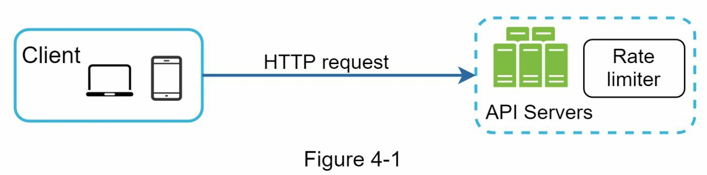
*   **Middleware / API Gateway (Chosen Approach):** The rate limiter is a separate service that sits between the client and the API servers, acting as a gatekeeper. This is a clean, decoupled approach.
    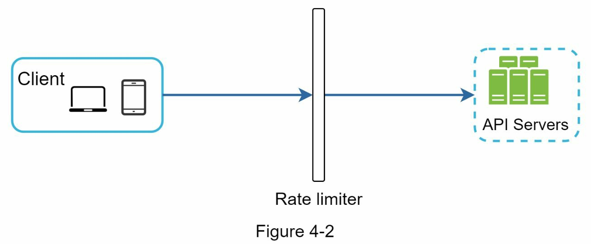

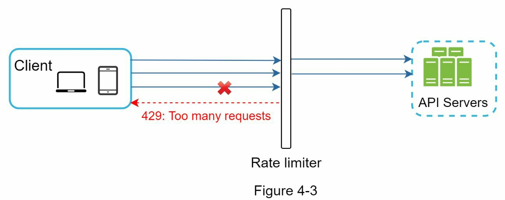
*   **Description:** The client sends three requests in quick succession. The Rate Limiter Middleware, which has a rule of "2 requests per second," allows the first two to pass through to the API server. It intercepts and blocks the third request, immediately returning an `HTTP 429 (Too Many Requests)` error to the client without ever touching the API server.

---

### 4. Algorithms for Rate Limiting

#### Token Bucket
This is a simple, memory-efficient, and widely used algorithm that allows for bursts of traffic.

*   **Mechanism:**
    1.  A bucket with a fixed capacity is created.
    2.  Tokens are added to the bucket at a constant rate (the refill rate) until it's full.
    3.  Each incoming request consumes one token. If a token is available, the request is processed. If not, the request is dropped.
*   **Parameters:** Bucket size and refill rate.

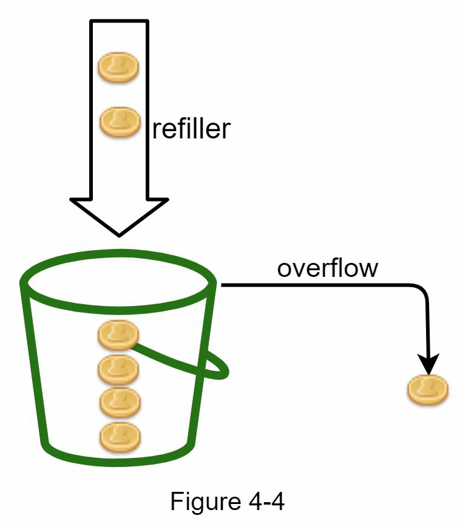
*   **Description:** This illustrates the token generation process. The bucket has a capacity of 4. A refiller adds 2 tokens every second. If the bucket already has 3 tokens, only 1 more can be added before it's full. If it's full, any new tokens are discarded.

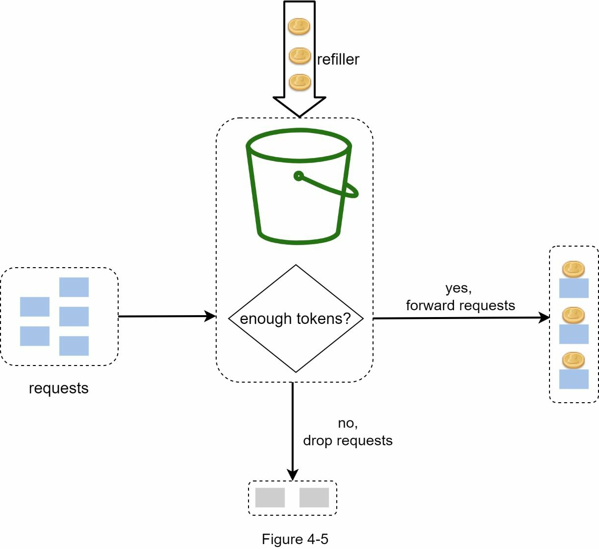
*   **Description:** When a request arrives, the system checks the bucket. If at least one token is present, the request consumes a token and is allowed to proceed. If the bucket is empty, the request is rejected.

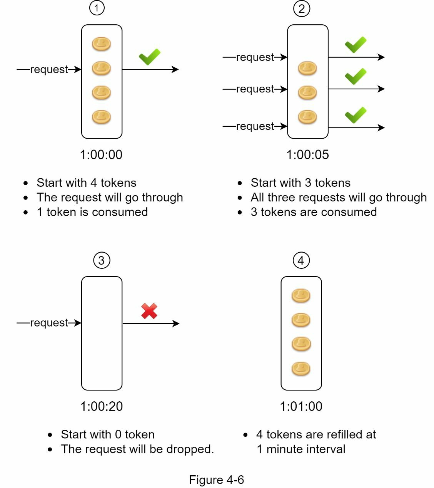
*   **Description:** A complete example showing tokens being consumed by incoming requests and being refilled periodically. This demonstrates how the bucket can handle a burst of requests as long as it has tokens, and then must wait for the refill process to handle more.

#### Leaking Bucket
This algorithm processes requests at a fixed, constant rate.

*   **Mechanism:**
    1.  Requests are placed into a FIFO (First-In-First-Out) queue.
    2.  If the queue is full, new requests are dropped.
    3.  Requests are pulled from the queue and processed at a constant rate.
*   **Parameters:** Bucket size (queue size) and outflow rate.

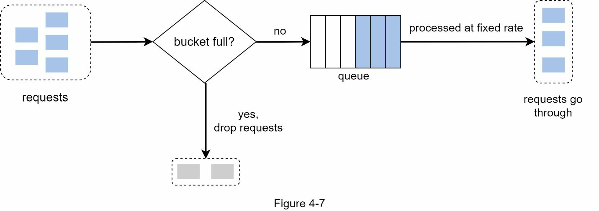
*   **Description:** Requests arrive at a variable rate and are placed in a queue. The system processes requests from the queue at a fixed rate (e.g., 1 request per second). This smooths out bursts of traffic into a steady stream.

#### Fixed Window Counter
A simple algorithm that counts requests within a fixed time window.

*   **Mechanism:**
    1.  The timeline is divided into fixed windows (e.g., one minute).
    2.  Each window has a counter. Each request increments the counter.
    3.  If the counter exceeds a threshold, requests are dropped until the next window begins.
*   **Major Flaw:** A burst of traffic at the edge of a window can allow more than the rate limit.

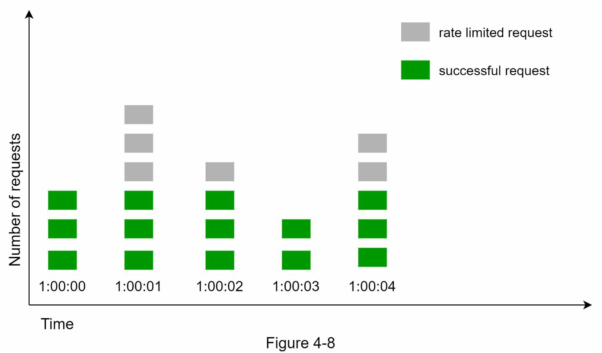
*   **Description:** With a limit of 3 requests/sec, the first second (0-1s) accepts 3 requests and drops the 4th. The counter resets at 1s, allowing 3 more requests in the next window (1-2s).

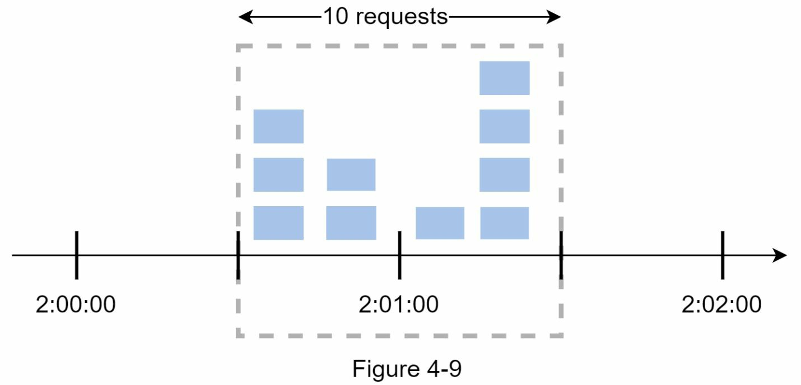
*   **Description:** With a limit of 5 requests/min, a user sends 5 requests at 2:00:30 and another 5 at 2:01:30. Both sets are allowed because they fall into different one-minute windows. However, within the 60-second period from 2:00:30 to 2:01:30, 10 requests were processed, violating the intended rate.

#### Sliding Window Log
This algorithm is highly accurate but uses more memory.

*   **Mechanism:**
    1.  The timestamp of each request is stored in a log (e.g., a Redis sorted set).
    2.  When a new request arrives, all timestamps older than the current window are removed.
    3.  If the size of the log is below the limit, the new request's timestamp is added, and the request is accepted. Otherwise, it's rejected.

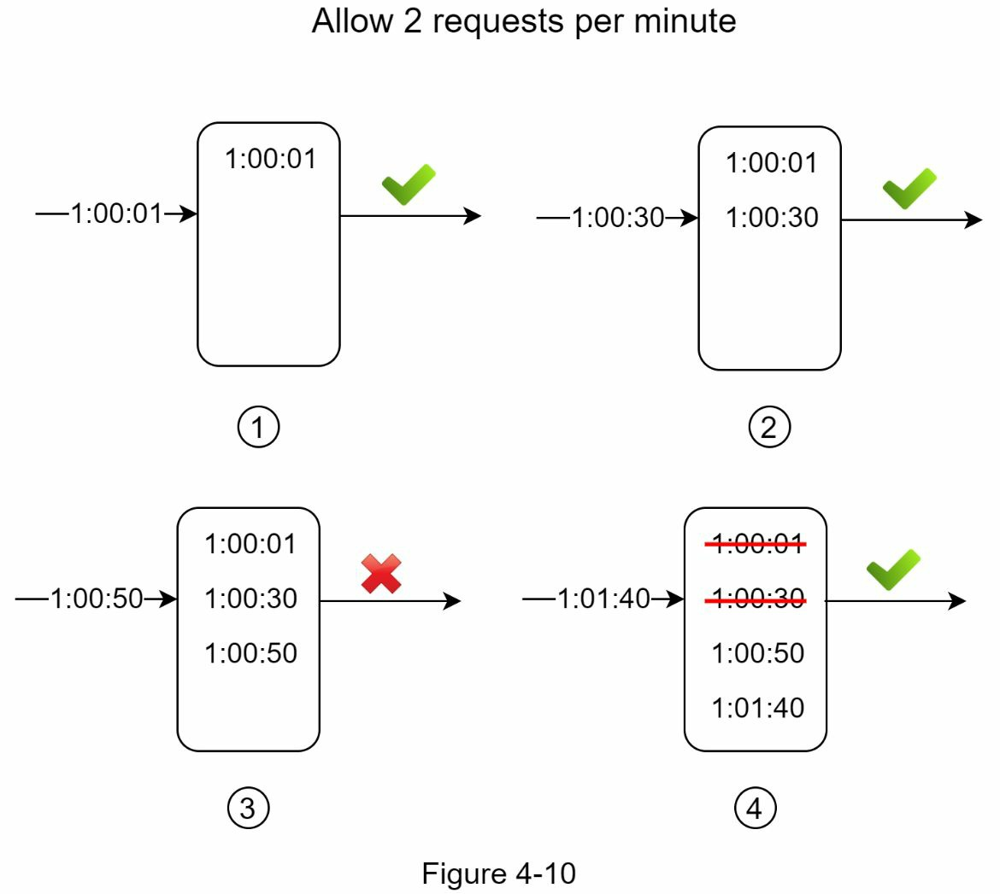
*   **Description:** With a limit of 2 requests/min, the request at 1:01:40 arrives. The system first purges logs older than the window (older than 1:00:40), removing timestamps at 1:00:01 and 1:00:30. The log size is now 1. The new request is added, making the log size 2, which is within the limit, so it's accepted.

#### Sliding Window Counter
A hybrid approach that is memory-efficient and smooths out bursts.

*   **Mechanism:** It approximates the request rate by using the count from the previous window and the current window.
*   **Formula:** `current window count + (previous window count * overlap percentage)`

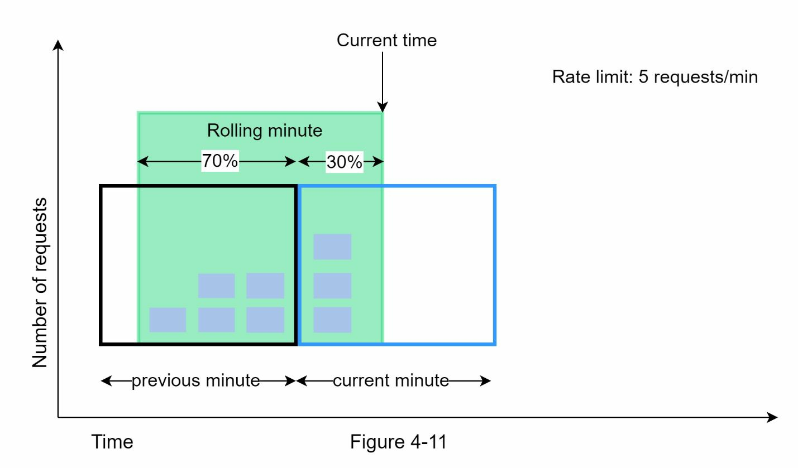
*   **Description:** With a limit of 7 requests/min, a request arrives 70% of the way through the current minute. The previous minute had 5 requests, and the current minute has had 3 so far. The estimated rate is `3 + (5 * (1 - 0.7)) = 4.5`. This is below the limit of 7, so the request is allowed.

---

### 5. Deep Dive

#### High-Level Architecture
A centralized cache like Redis is used to store the counters for the rate limiter.

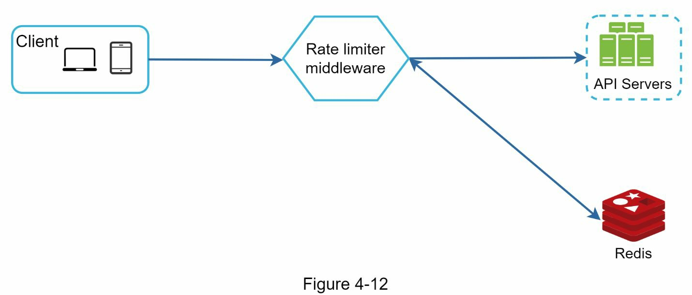
*   **Description:**
    1. A client request hits the Rate Limiter middleware first.
    2. The middleware fetches the current counter for the client from a Redis cache.
    3. It checks if the count is below the limit.
    4. If yes, it increments the counter in Redis, forwards the request to the API server, and returns the server's response.
    5. If no, it rejects the request immediately.

#### Detailed Design

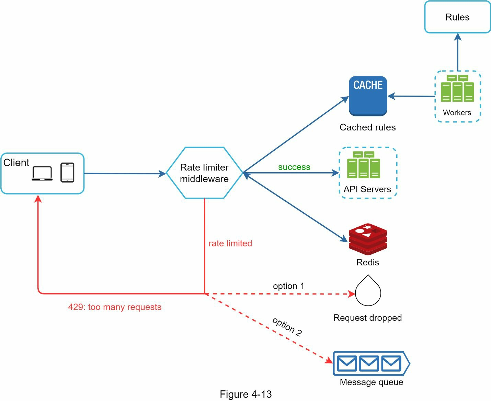
*   **Description:** This design shows how rules and data flow through the system.
    *   Rate limiting rules are defined on disk.
    *   **Workers** periodically load these rules into a **Rule Cache** for fast access.
    *   The **Rate Limiter** middleware receives a request. It loads the relevant rules from the cache.
    *   It then communicates with **Redis** to get the current counter for the user/IP.
    *   Based on the rules and the counter, it either forwards the request to the **API Servers** or rejects it. Rejected requests can optionally be sent to a **Queue** for later processing.

#### Challenges in a Distributed Environment

*   **Race Condition:** Without atomic operations, two concurrent requests might both read the same counter value, both increment it, and both write back, resulting in a miscount.
    *   **Solution:** Use atomic operations like Redis Lua scripts or the `INCR` command, which guarantee that the read-increment-write cycle is a single, indivisible operation.
    

*   **Synchronization:** If there are multiple rate limiter nodes, they must share state. A user's requests might hit different nodes, and without a shared counter, the rate limit would not be enforced correctly.
    *   **Solution:** Use a centralized data store like Redis that all rate limiter nodes communicate with.
    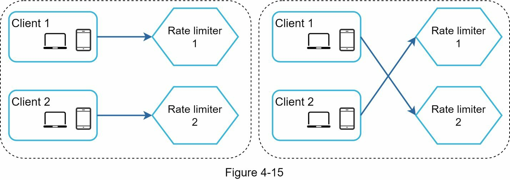
    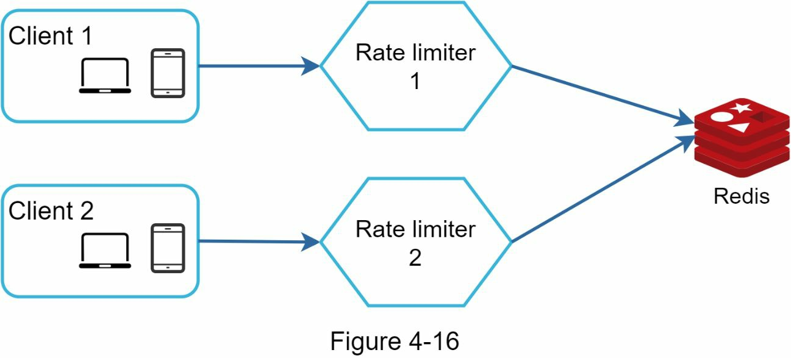

#### HTTP Response Headers
Inform the client about their current rate limit status.
*   `X-Ratelimit-Limit`: The total number of requests allowed in the time window.
*   `X-Ratelimit-Remaining`: The number of requests still available in the current window.
*   `X-Ratelimit-Retry-After`: The number of seconds the client should wait before making another request.

---

### 6. Wrap-up and Further Considerations

*   **Hard vs. Soft Rate Limiting:**
    *   **Hard:** Strictly forbid requests over the limit.
    *   **Soft:** Allow requests to exceed the limit for a short burst.
*   **Rate Limiting at Different Layers:** Rate limiting can be applied at different network layers (e.g., Layer 3/IP level with `iptables` vs. Layer 7/Application level).
*   **Client-side Best Practices:** Clients should cache responses, respect the rate limits, and implement a proper backoff strategy for retries.
