### Chapter 5: Design Consistent Hashing - Summary

This chapter provides an in-depth explanation of consistent hashing, a crucial technique for distributing data or requests evenly and efficiently across a cluster of servers. It begins by highlighting the fundamental flaw of the traditional `hash(key) % N` approach: when the number of servers (`N`) changes, nearly all keys are remapped to different servers, leading to catastrophic cache misses or massive data reshuffling.

**Consistent hashing** solves this rehashing problem. The core idea is to map both servers and keys onto an abstract circle called a **hash ring**. To find which server a key belongs to, you move clockwise around the ring from the key's position until you encounter a server. This elegant design ensures that when a server is added or removed, only a small, adjacent fraction of keys needs to be remapped, minimizing disruption.

The chapter then addresses two key problems with the basic approach: non-uniform server distribution (some servers get much larger partitions of the ring than others) and non-uniform key distribution. Both problems are solved by introducing the concept of **virtual nodes**. Instead of mapping a physical server to a single point on the ring, it is mapped to hundreds or thousands of virtual nodes. This creates a much finer-grained and more statistically balanced distribution of both partitions and keys, ensuring no single server becomes a hotspot.

Finally, the chapter explains how to identify the exact range of keys that need to be redistributed when a server is added or removed. Consistent hashing is a foundational concept in distributed systems, used by major technologies like Amazon's DynamoDB, Apache Cassandra, and Akamai's CDN to achieve horizontal scalability.

---

### 1. The Rehashing Problem

A common, naive approach to distributing keys across `N` servers is to use the formula: `server_index = hash(key) % N`.

*   **The Problem:** This works fine as long as `N` is constant. However, if a server is added or removed, `N` changes. This change in the divisor causes almost **all keys** to be remapped to different servers.

*   **Example:**
    *   Initially, we have 4 servers. A key with `hash(key) = 17` would be on `17 % 4 = server 1`.
    *   If server 1 goes offline, we have 3 servers. The same key is now on `17 % 3 = server 2`.
    *   This causes a storm of cache misses, as clients look for data on the wrong servers, overwhelming the origin database.

| Key  | Hash | Server (N=4) | Server (N=3) |
|------|------|--------------|--------------|
| key0 | 12   | 0            | 0            |
| key1 | 17   | 1            | 2            |
| key2 | 23   | 3            | 2            |
| key3 | 25   | 1            | 1            |
| key4 | 34   | 2            | 1            |
| key5 | 47   | 3            | 2            |
| key6 | 51   | 3            | 0            |
| key7 | 66   | 2            | 0            |
*Table 5-1 & 5-2 Combined: Shows how server assignments change when N changes from 4 to 3.*

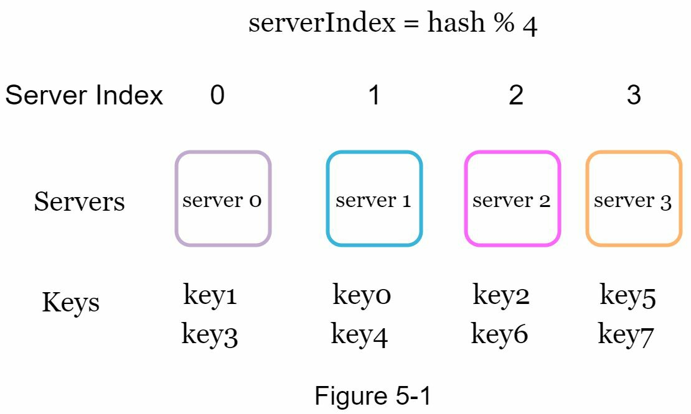
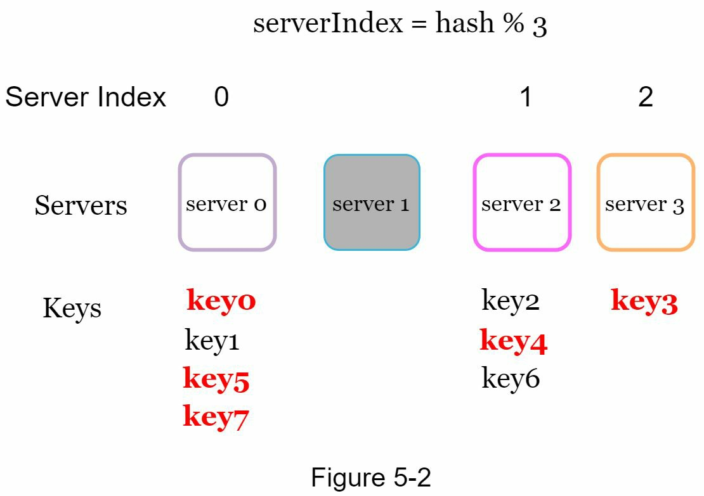

---

### 2. Consistent Hashing

Consistent hashing is a hashing technique where, when the number of servers changes, only a small fraction of keys (`k/n` on average) need to be remapped.

#### The Hash Ring

The core concept is to map both servers and keys onto a conceptual circle called a hash ring.
1.  **Hash Space:** A hash function (like SHA-1) produces a very large range of values (e.g., 0 to 2^160 - 1). This is the hash space.
    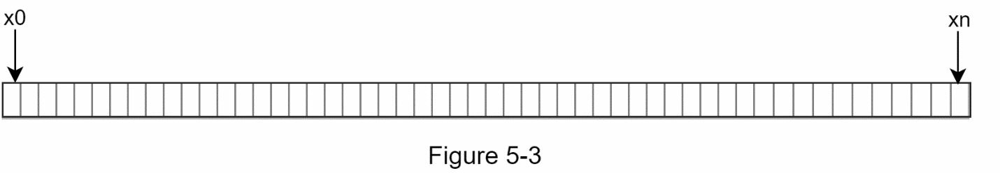
2.  **Hash Ring:** This space is visualized as a circle by connecting the start and end points.
    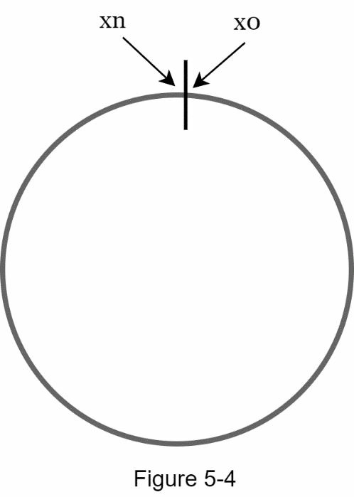
3.  **Map Servers:** Servers are placed on the ring by hashing their identifier (e.g., IP address or name).
    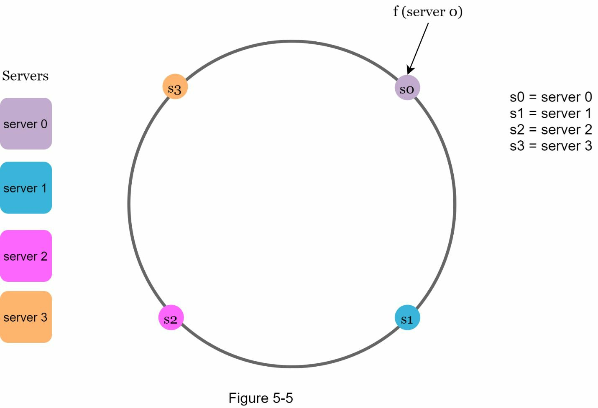
4.  **Map Keys:** Keys are also placed on the ring using the same hash function.
    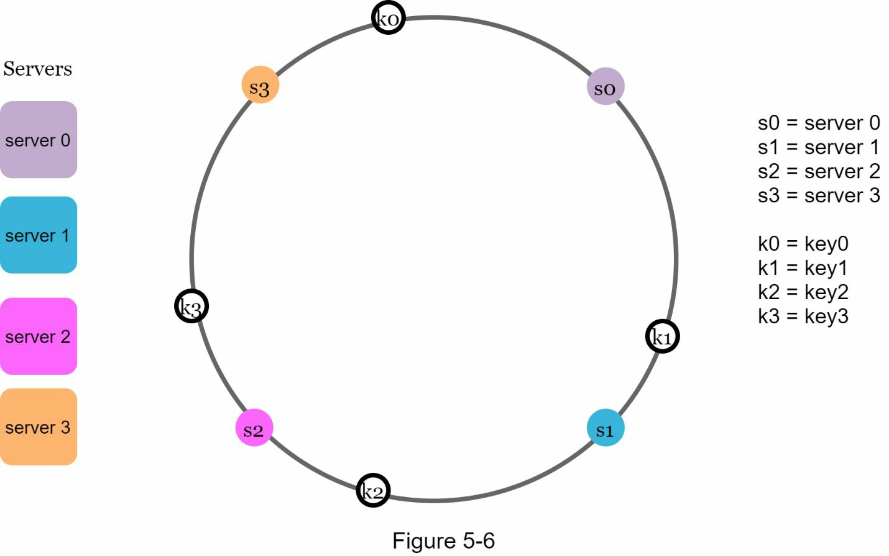

#### Server Lookup
To determine which server a key belongs to, start at the key's position on the ring and move **clockwise** until you find the first server.

*   **Description:** Following the clockwise rule, `key0` belongs to `server 0`, `key1` to `server 1`, and so on.

#### Server Addition and Removal

*   **Adding a Server:** When a new server is added, it takes ownership of the keys that are now clockwise from it, but were previously owned by the next server on the ring. Only a small fraction of keys are affected.
    
    *   **Description:** When `server 4` is added, it is placed on the ring between `key0` and `server 0`. Now, `key0`'s clockwise search lands on `server 4` instead of `server 0`. `key0` is the only key that needs to be moved. `k1`, `k2`, and `k3` are unaffected.

*   **Removing a Server:** When a server is removed, the keys it owned are transferred to the next server in the clockwise direction. Again, only a small fraction of keys are affected.
    
    *   **Description:** When `server 1` is removed, its key, `key1`, must be remapped. The clockwise search from `key1` now finds `server 2`. The ownership of `key1` is transferred from `server 1` to `server 2`. All other keys are unaffected.

---

### 3. Problems and Refinements: Virtual Nodes

The basic approach has two major problems:
1.  **Uneven Partition Sizes:** When a server is removed, its successor inherits its entire partition, which can lead to a very uneven load distribution.
    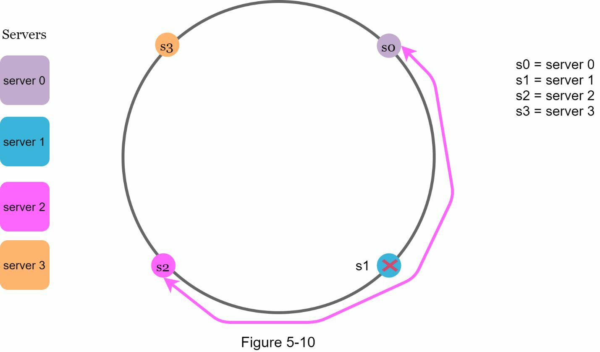
2.  **Non-uniform Key Distribution:** Random placement can lead to "hotspots" where one server gets a disproportionate number of keys by chance.
    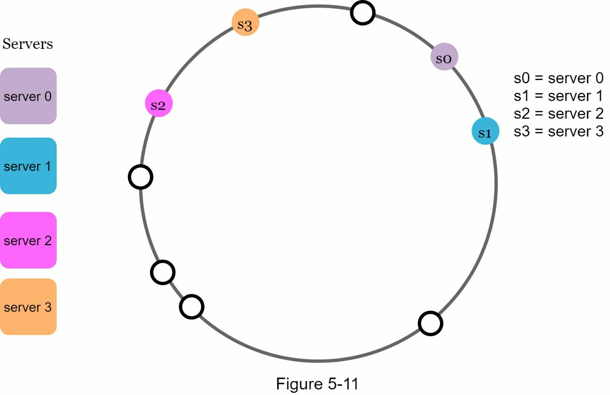

#### Solution: Virtual Nodes

Instead of mapping one physical server to a single point on the ring, we map it to many points. Each of these points is a **virtual node**.

*   **How it works:** Each server is represented by a large number of virtual nodes (e.g., 200-400), each placed randomly on the ring. A key is still assigned to the first server it encounters clockwise, but now it finds a virtual node.
*   **Benefits:**
    *   **Balanced Load:** As the number of virtual nodes increases, the key distribution becomes statistically much more even, solving both the partition size and key distribution problems.
    *   **Smooth Rebalancing:** When a server is added or removed, the load is evenly distributed across many other servers, as its virtual nodes were scattered all over the ring.

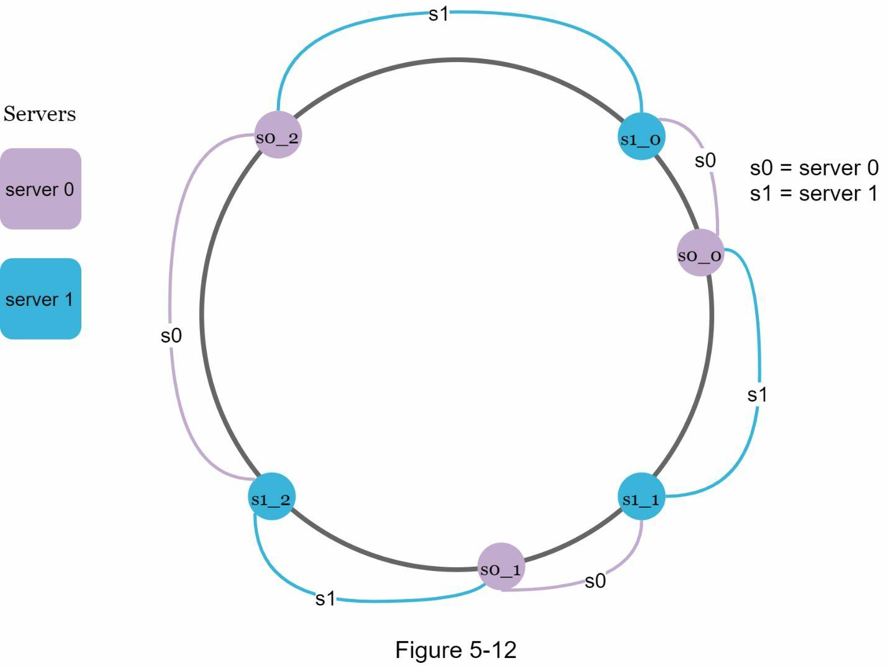
*   **Description:** `server 0` and `server 1` are each represented by 3 virtual nodes (`s0_0`, `s0_1`, `s0_2` and `s1_0`, `s1_1`, `s1_2`). This breaks the ring into many smaller, more evenly sized partitions.

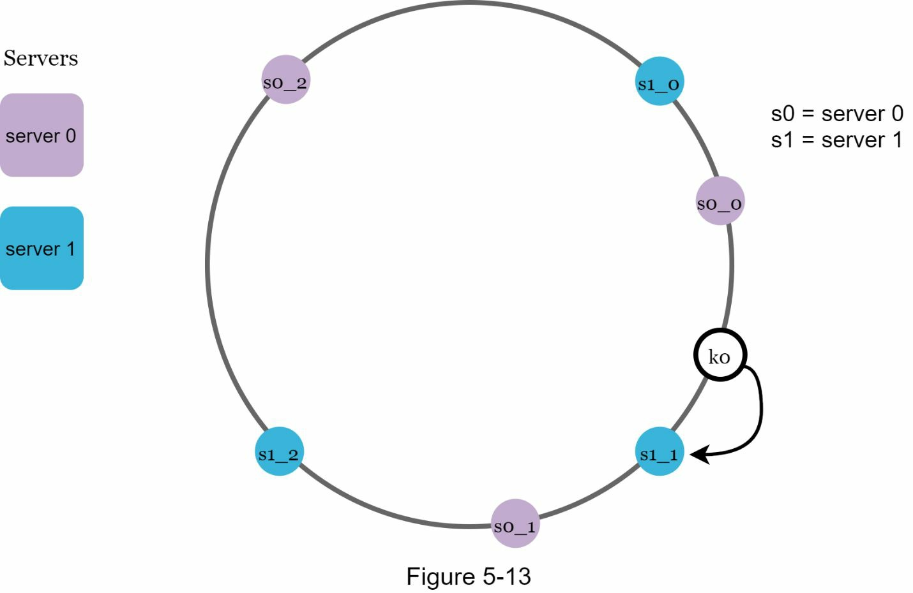
*   **Description:** To find the server for `k0`, we move clockwise and find the virtual node `s1_1`. Since `s1_1` points to the physical `server 1`, `k0` is stored on `server 1`.

---

### 4. Finding Affected Keys for Redistribution

When a server is added or removed, we need to know exactly which keys to move.

*   **When adding a server (s4):** The affected keys are in the range on the ring starting from the new server's position (`s4`) and moving **anticlockwise** until the first server (`s3`) is found. All keys in this `(s3, s4]` range must be moved from `s0` to `s4`.
    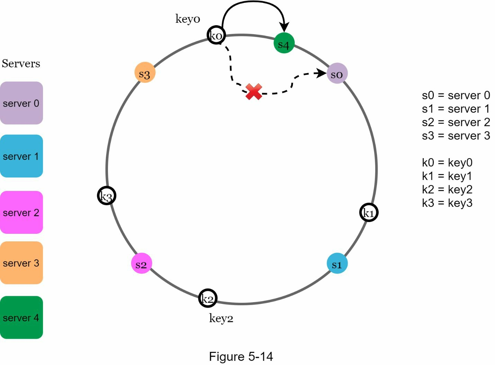

*   **When removing a server (s1):** The affected keys are the ones that were owned by `s1`. This range starts from the removed server's position (`s1`) and moves **anticlockwise** until the first server (`s0`) is found. All keys in this `(s0, s1]` range must be moved from the now-gone `s1` to its clockwise successor, `s2`.
    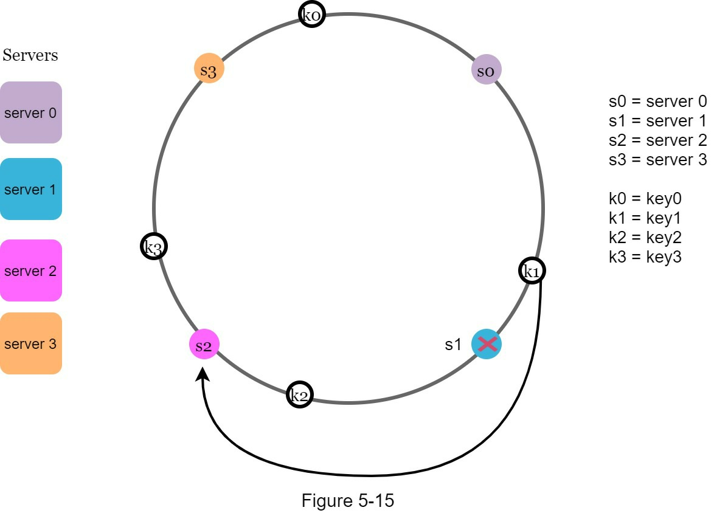

---

### 5. Wrap Up

*   **Benefits of Consistent Hashing:**
    *   Minimizes key redistribution during scaling events.
    *   Facilitates horizontal scaling with even data distribution.
    *   Helps mitigate hotspots by preventing a single server from getting a disproportionate load.
*   **Real-World Use Cases:**
    *   Amazon DynamoDB (Partitioning)
    *   Apache Cassandra (Data Partitioning)
    *   Discord (Chat Service)
    *   Akamai CDN
    *   Google Maglev Load Balancer
