### Chapter 6: Design a Key-Value Store - Summary

This chapter walks through the design of a distributed key-value store, a fundamental component in modern scalable systems. It begins by establishing the design goals: support for massive datasets, high availability and scalability, low latency, and tunable consistency. The core of the chapter focuses on the **CAP theorem**, which dictates that a distributed system must trade off between Consistency, Availability, and Partition Tolerance. Since network partitions are a given, the design must choose between being a CP (consistent and partition-tolerant) or AP (available and partition-tolerant) system. This design opts for an AP system with eventual consistency, similar to Amazon's Dynamo and Cassandra.

To achieve scalability and even data distribution, the system uses **consistent hashing** for data partitioning. High availability is achieved by **replicating** data across N servers, preferably in different data centers.

Consistency is managed through a **quorum consensus** protocol (N, W, R), which allows for tuning the trade-off between read/write latency and consistency level. The problem of data inconsistency arising from concurrent writes is handled through a sophisticated versioning system using **vector clocks**. Vector clocks allow the system to track the causal history of data modifications, detect conflicts, and delegate the resolution logic to the client.

Failure handling is a critical aspect. Failures are detected using a decentralized **gossip protocol**. Temporary failures are managed with **sloppy quorum** and **hinted handoff** to maintain availability, while permanent failures are resolved using an **anti-entropy** protocol with **Merkle trees** to efficiently synchronize replicas.

Finally, the chapter outlines the system architecture, which is fully decentralized with no single point of failure. It details the **write path** (commit log -> memtable -> SSTable) for durability and performance, and the **read path**, which uses **Bloom filters** to efficiently query SSTables on disk when data is not found in the in-memory cache.

---

### 1. Understand the Problem and Establish Design Scope

A key-value store is a non-relational database that stores data as `(key, value)` pairs.

*   **Key:** A unique identifier (plain text or hashed). Shorter keys are better for performance.
*   **Value:** Can be a string, list, object, etc. Often treated as an opaque blob.
*   **APIs:** `put(key, value)` and `get(key)`.

#### Design Goals:
*   **Key-Value Pair Size:** Small (< 10 KB).
*   **Scalability:** Ability to store large amounts of data and scale automatically.
*   **Availability:** The system should always be responsive, even during partial failures.
*   **Consistency:** Tunable consistency level.
*   **Latency:** Low latency for reads and writes.

---

### 2. CAP Theorem

The CAP theorem states that it is impossible for a distributed system to simultaneously provide more than two of the following three guarantees:

*   **Consistency:** All clients see the same data at the same time, no matter which node they connect to.
*   **Availability:** Every request receives a response, without guarantee that it contains the most recent version of the information.
*   **Partition Tolerance:** The system continues to operate despite an arbitrary number of messages being dropped (or delayed) by the network between nodes.

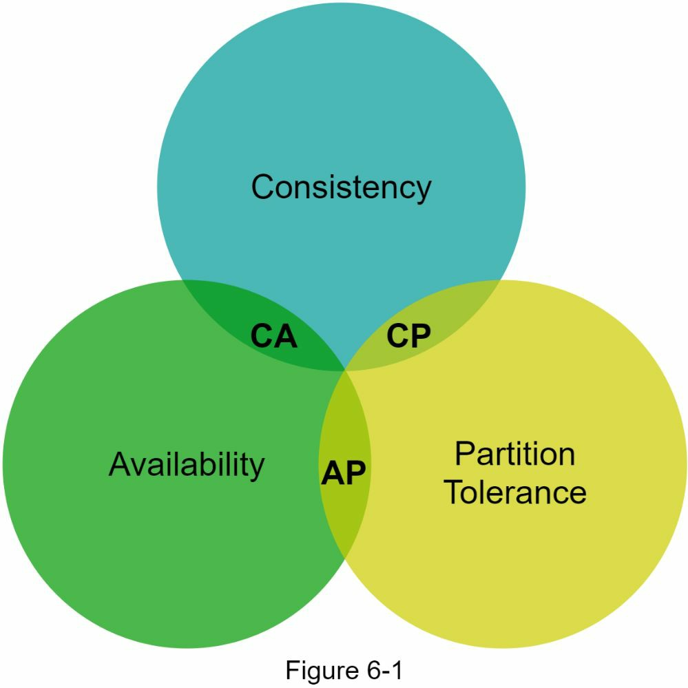

Since network partitions are unavoidable in any real-world distributed system, the choice is always between Consistency and Availability.
*   **CP System (Consistency, Partition Tolerance):** Sacrifices availability. When a partition occurs, the system may block write operations to prevent data inconsistency. Example: Banking systems.
*   **AP System (Availability, Partition Tolerance):** Sacrifices consistency. The system remains available under partitions but may return stale data. This is the model chosen for this design.

---

### 3. System Components

#### Data Partition
To store large datasets, data is partitioned across multiple servers. **Consistent Hashing** is the ideal technique for this.

*   **Mechanism:** Servers are placed on a hash ring. A key is stored on the first server encountered when moving clockwise from the key's hashed position.
*   **Advantages:**
    *   **Automatic Scaling:** Servers can be added and removed with minimal data reshuffling.
    *   **Heterogeneity:** Higher-capacity servers can be assigned more virtual nodes to handle a proportionally larger share of the data.

#### Data Replication
To achieve high availability and durability, data is replicated across `N` servers.

*   **Mechanism:** After a key is mapped to a position on the ring, the system walks clockwise and selects the first `N` unique physical servers to store the replicas.
*   **Reliability:** For better fault tolerance, these `N` replicas should be placed in distinct data centers.

#### Consistency
With replicated data, we need a mechanism to manage consistency. **Quorum Consensus** is used.

*   **Definitions:**
    *   `N`: The number of replicas.
    *   `W`: The write quorum. For a write to be successful, it must be acknowledged by `W` replicas.
    *   `R`: The read quorum. For a read to be successful, it must receive responses from `R` replicas.
*   **Strong Consistency:** Strong consistency is guaranteed if **`W + R > N`**. This ensures that the read and write sets must overlap on at least one node, guaranteeing the reader gets the latest version.
*   **Tunability:**
    *   `R=1, W=N`: Fast reads, slow writes.
    *   `W=1, R=N`: Fast writes, slow reads.
    *   `W=R=2, N=3`: A common, balanced configuration for strong consistency.
    *   `W+R <= N`: Weaker consistency, but lower latency.

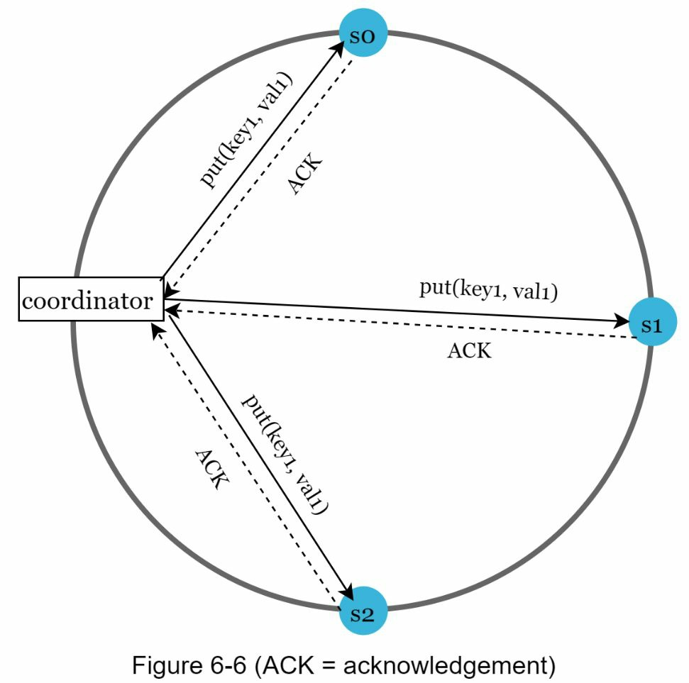

#### Inconsistency Resolution: Versioning with Vector Clocks
Eventual consistency models can lead to conflicts if two clients write to the same key concurrently. **Versioning** is used to treat every modification as a new, immutable version of the data. **Vector Clocks** are used to detect and resolve these conflicts.

*   **Vector Clock:** A `[server_id, version_counter]` pair associated with a piece of data. It tracks the causal history of an object across different servers.
*   **Mechanism:**
    1.  When a client writes data `D` to server `Sx`, the version is updated (e.g., `D1([Sx, 1])`).
    2.  If another client reads `D1`, modifies it to `D2`, and writes back to `Sx`, the clock becomes `D2([Sx, 2])`.
    3.  If another client reads `D2` and writes `D3` to a different server `Sy`, the clock merges the history: `D3([Sx, 2], [Sy, 1])`.
*   **Conflict Detection:** A conflict occurs if one version's clock is not a clear ancestor of another. For instance, if another client concurrently updated `D2` to `D4` on server `Sz`, its clock would be `D4([Sx, 2], [Sz, 1])`. Comparing `D3` and `D4`, neither is an ancestor of the other, so a conflict is detected.
*   **Conflict Resolution:** The conflicting versions (`D3` and `D4`) are sent back to the client, which is responsible for merging the data and writing back a new version (`D5`) that reconciles the history.

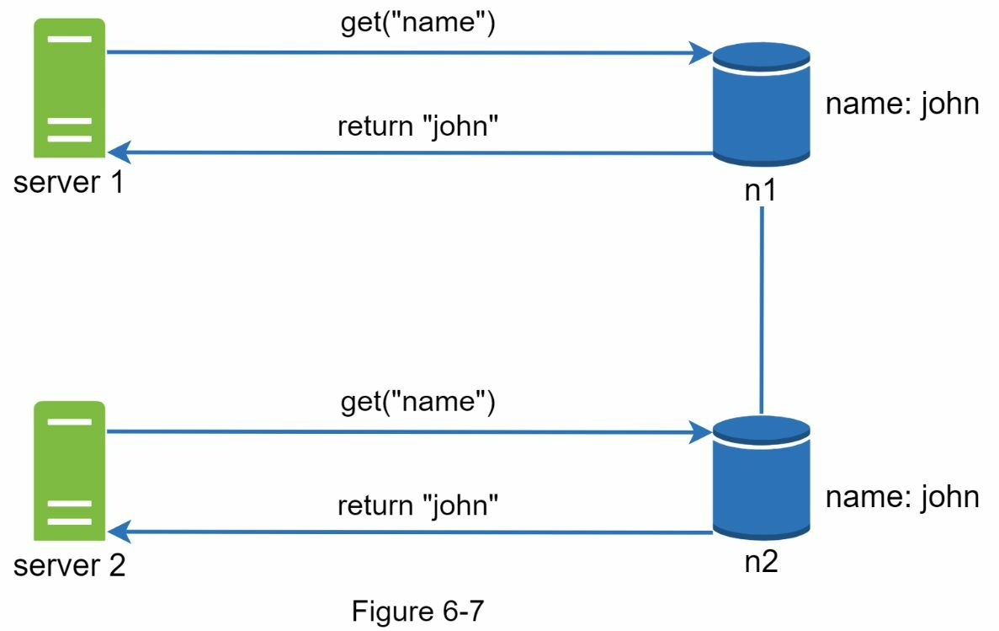
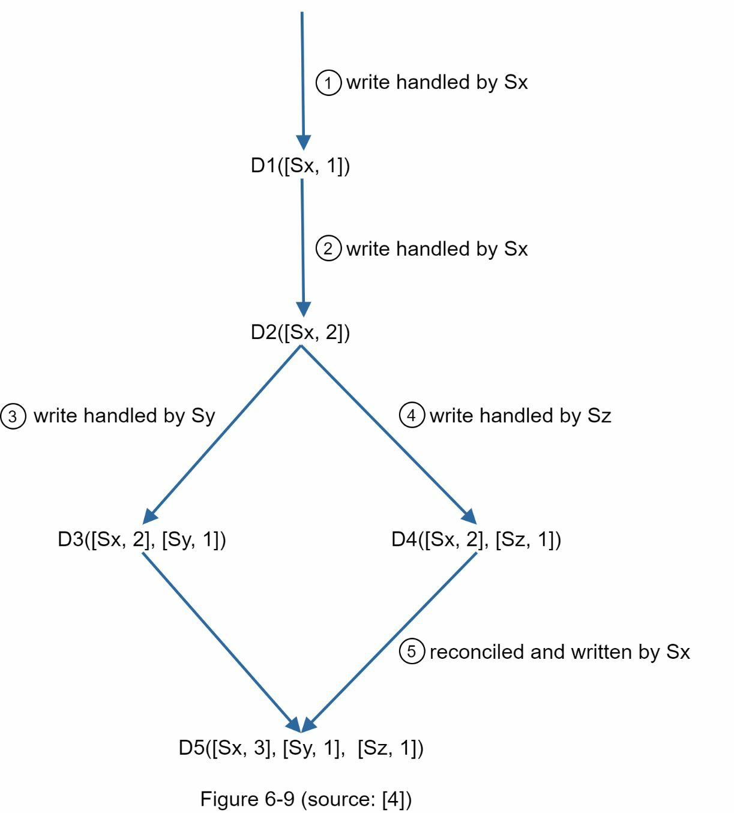

#### Handling Failures

##### Failure Detection
A decentralized **Gossip Protocol** is used to detect server failures.
*   **Mechanism:** Each node maintains a membership list with heartbeat counters. Nodes periodically send their heartbeats to a random set of other nodes. If a node's heartbeat doesn't increase for a specified time, it's marked as down by its peers.

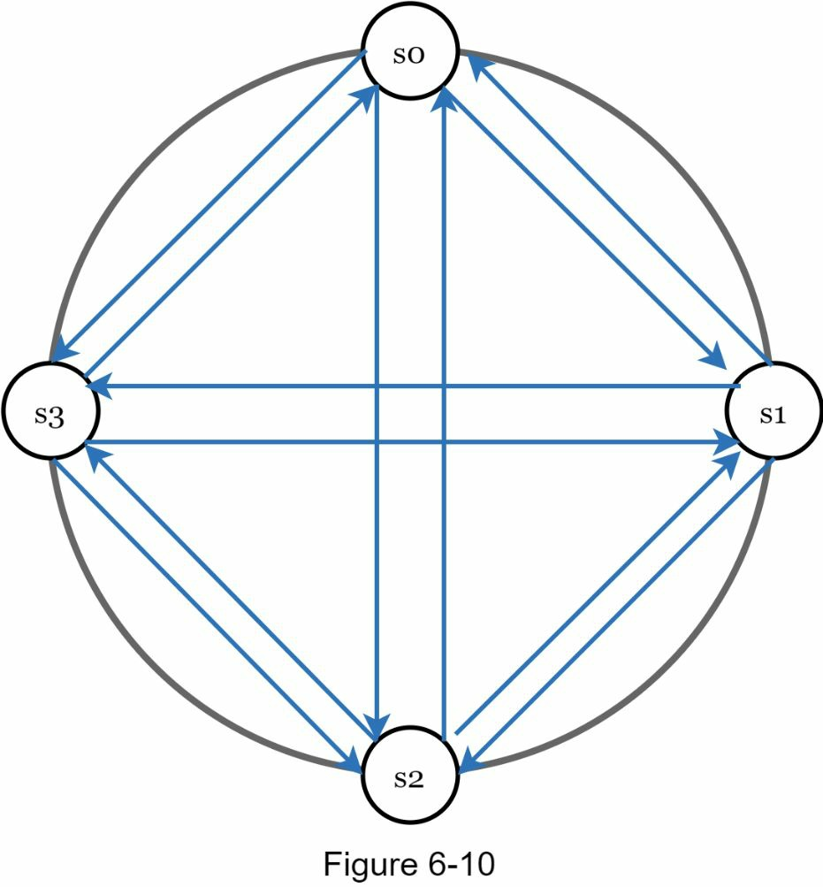
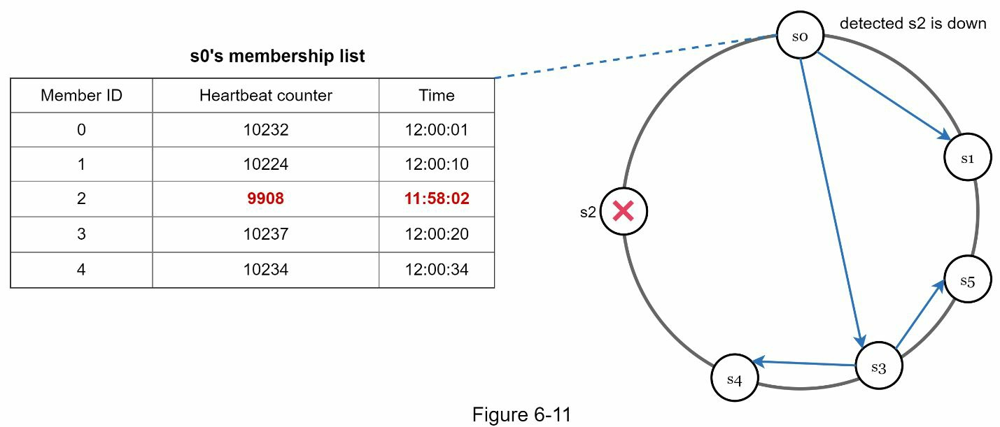

##### Handling Temporary Failures
To maintain availability when nodes are temporarily down, the system uses:
*   **Sloppy Quorum:** The system sends writes to the first `W` *healthy* servers it finds on the ring, not necessarily the designated coordinators.
*   **Hinted Handoff:** The healthy server that accepts the write will store a "hint" that the data belongs to the offline server. When the offline server comes back online, the data is handed back to it.

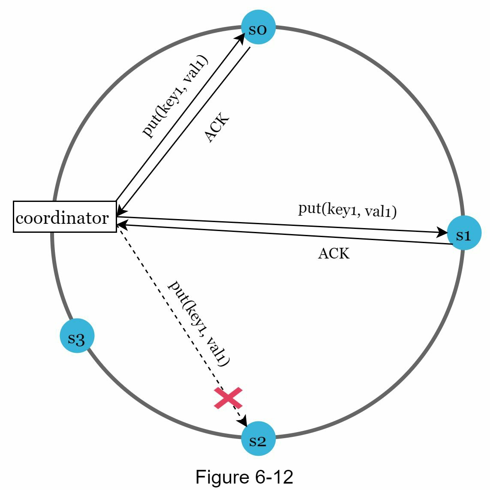

##### Handling Permanent Failures
To repair permanently failed nodes, an **anti-entropy** protocol is used to sync replicas. This is made efficient with **Merkle Trees**.
*   **Merkle Tree:** A hash tree where each leaf is a hash of a key-value pair, and each internal node is a hash of its children.
*   **Mechanism:**
    1.  Replicas build Merkle trees over their key ranges.
    2.  The system compares the root hashes. If they match, the data is in sync.
    3.  If they don't match, the system recursively traverses down the tree, comparing child hashes to find the exact keys that are inconsistent, minimizing the amount of data that needs to be transferred for synchronization.

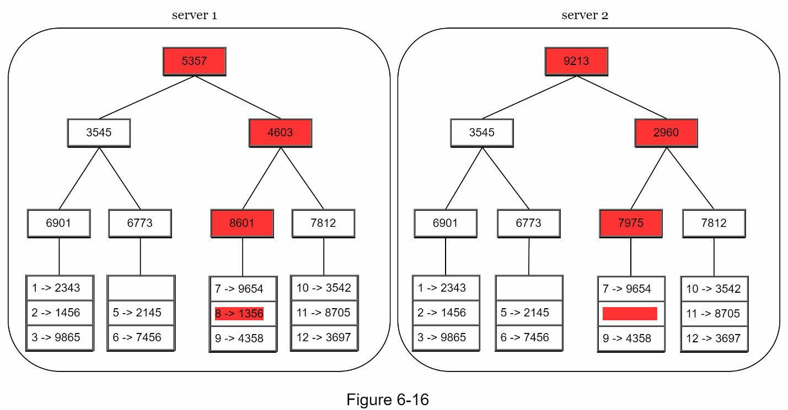

---

### 4. System Architecture

The system is fully decentralized, with no single point of failure. Each node has the same set of responsibilities. A **coordinator** node is chosen to manage a client request, but this role can be taken by any node.

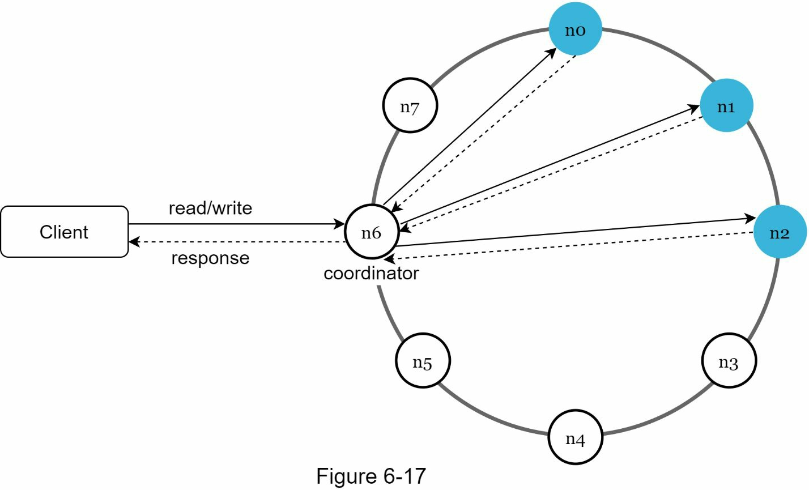
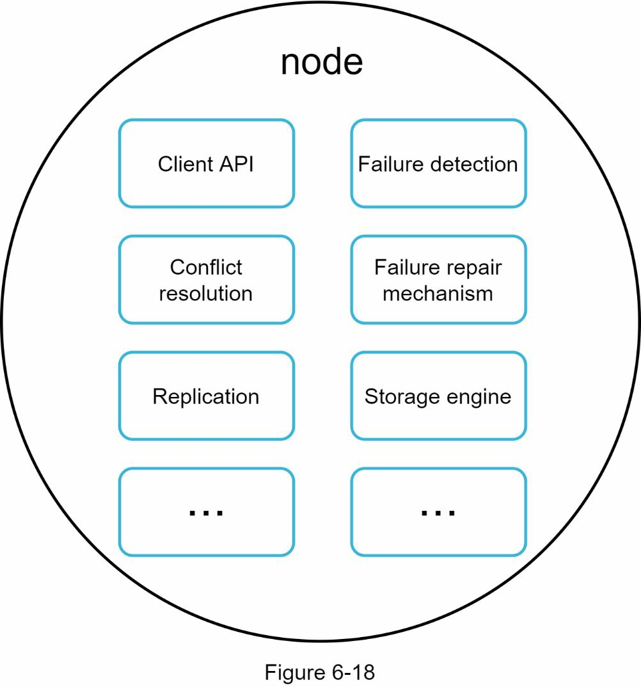

#### Write Path
1.  **Commit Log:** The write is first appended to a commit log on disk for durability. This is a fast, sequential write.
2.  **Memcache (Memtable):** The data is then written to an in-memory data structure (like a balanced binary tree or skip list).
3.  **SSTable:** When the memtable becomes full, it is flushed to a **Sorted String Table (SSTable)** file on disk. SSTables are immutable.

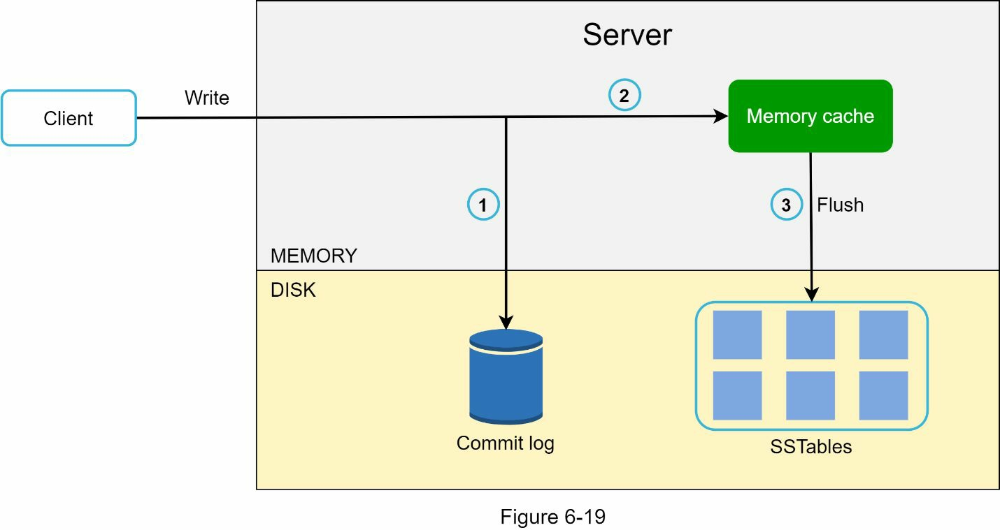

#### Read Path
1.  **Check Memcache:** The system first checks the in-memory memtable. If the data is present, it's returned.
2.  **Check Bloom Filter:** If not in memory, the system consults a series of **Bloom filters**. A Bloom filter is a probabilistic data structure that can quickly tell if an SSTable *might* contain the key, helping to avoid unnecessary disk reads.
3.  **Read SSTables:** The system reads the SSTable(s) identified by the Bloom filter to retrieve the data.
4.  **Return to Client:** The found data is returned to the client.

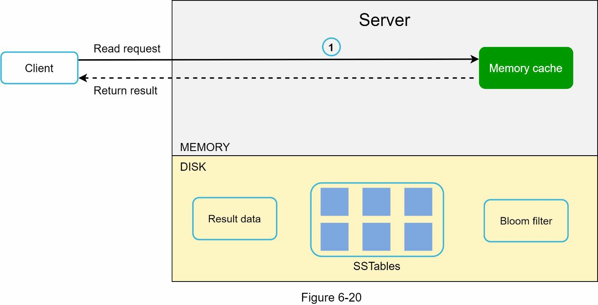
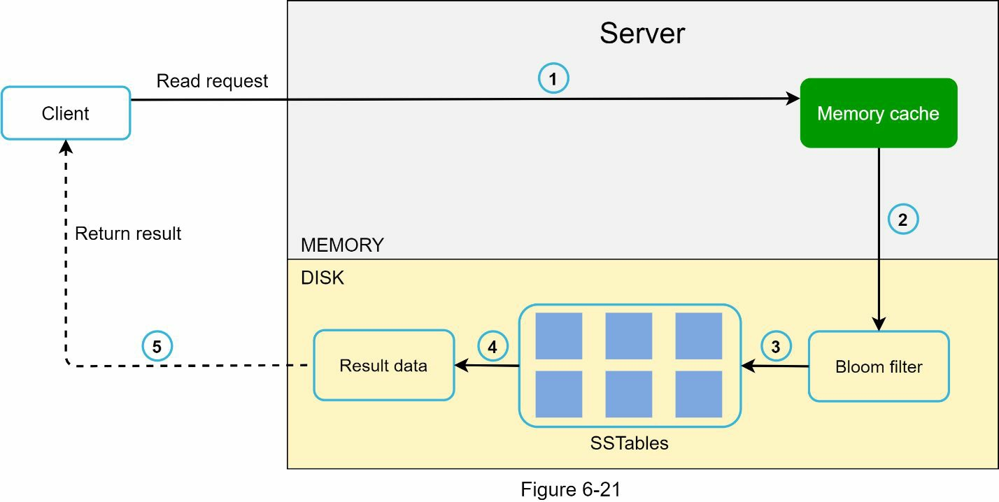

---

### 5. Summary Table

| Feature                        | Technique Used                                               |
| ------------------------------ | ------------------------------------------------------------ |
| **Data Partition**             | Consistent Hashing                                           |
| **High Availability**          | Data Replication in multiple data centers                    |
| **Consistency**                | Quorum Consensus (N, W, R configuration)                     |
| **Inconsistency Resolution**   | Vector Clocks                                                |
| **Handling Temporary Failures**| Sloppy Quorum and Hinted Handoff                             |
| **Handling Permanent Failures**| Anti-entropy protocol with Merkle Trees                      |
| **Handling Data Center Outage**| Replication across multiple data centers                     |
| **Write Efficiency**           | Append-only commit log, flushing memtable to SSTable         |
| **Read Efficiency**            | Bloom Filters to avoid unnecessary disk reads                |
