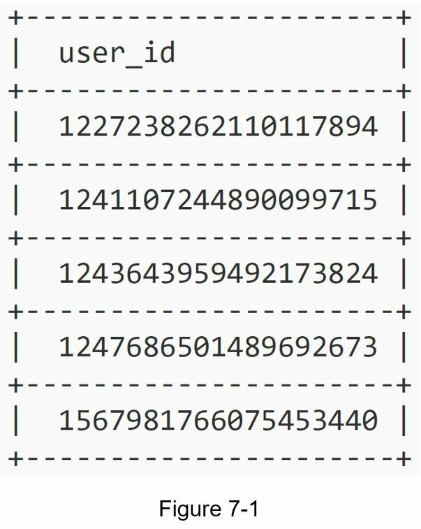
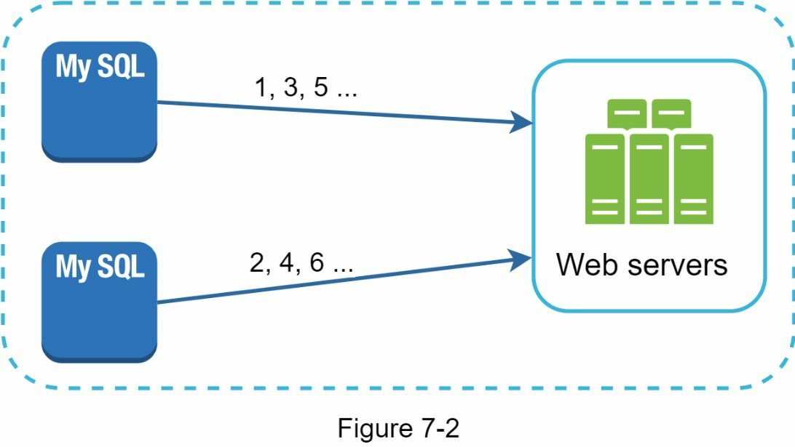
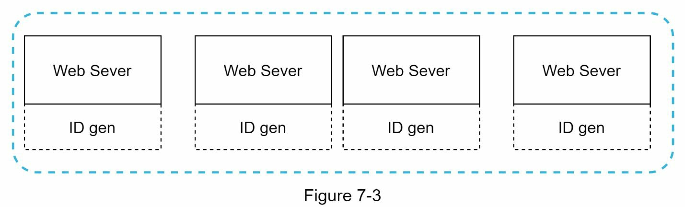
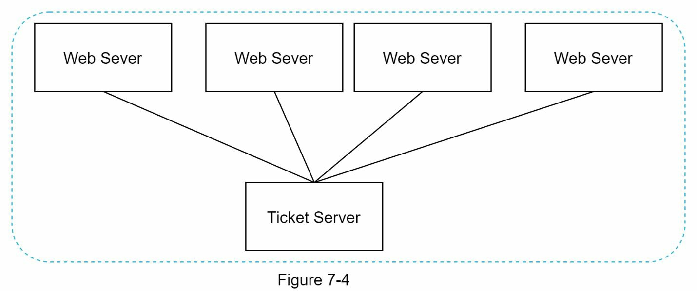
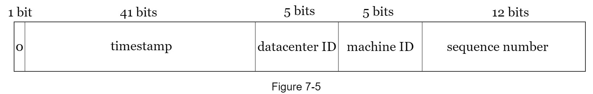
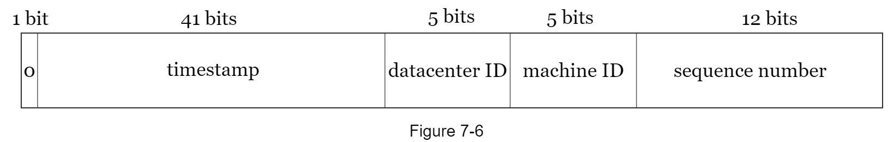
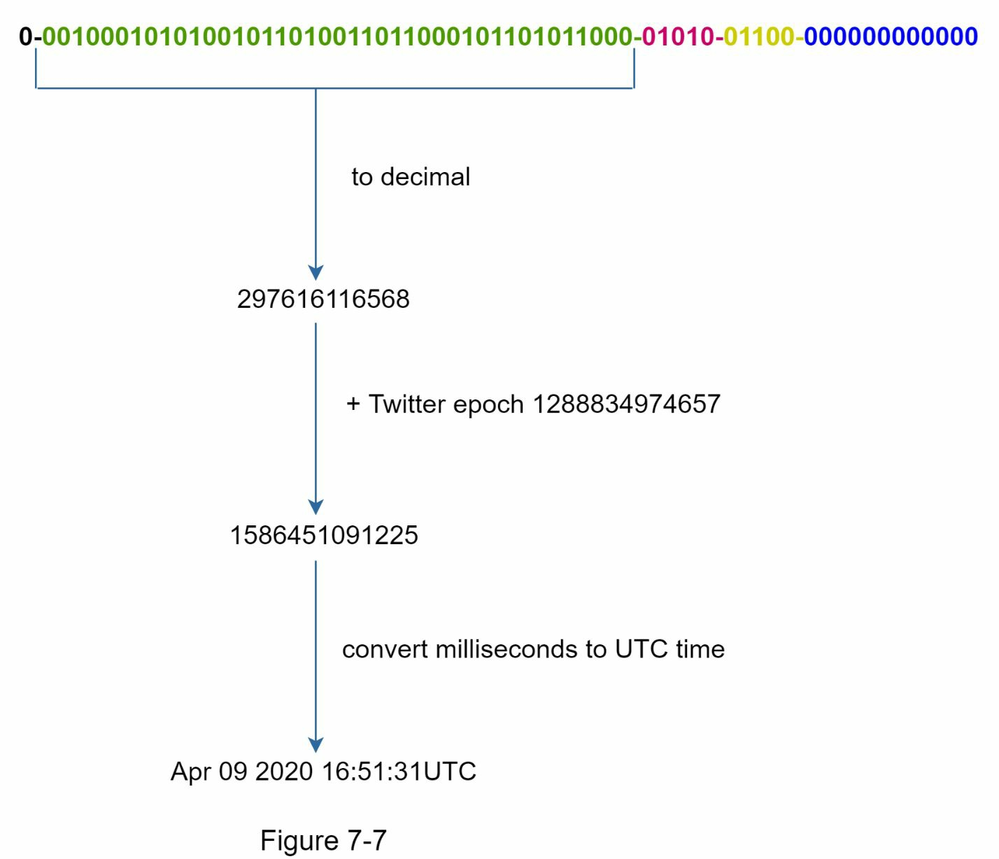

### Chapter 7: Design a Unique ID Generator in Distributed Systems - Summary

This chapter tackles the challenge of generating unique, sortable 64-bit numerical IDs in a large-scale distributed environment. It begins by explaining why traditional database `auto_increment` features are insufficient for distributed systems. The chapter then systematically evaluates several common approaches: **multi-master replication**, **UUIDs**, and a centralized **ticket server**, outlining the pros and cons of each and showing why they fail to meet the specific requirements of being both sortable and 64-bit.

The core of the chapter is a deep dive into an approach inspired by **Twitter's Snowflake ID generator**. This design uses a "divide and conquer" strategy, composing a 64-bit ID from several distinct sections:
*   A **sign bit** (1 bit)
*   A **timestamp** (41 bits), which makes the IDs roughly sortable by time.
*   A **datacenter ID** (5 bits)
*   A **machine ID** (5 bits)
*   A **sequence number** (12 bits), which handles multiple ID requests within the same millisecond on the same machine.

This composite structure guarantees uniqueness across different datacenters and machines, ensures that IDs are time-sortable, and allows for extremely high throughput (over 4000 IDs per millisecond per machine). The chapter concludes by discussing important operational considerations like clock synchronization (NTP), the possibility of tuning section lengths for different use cases, and the need for high availability.

---

### 1. Understanding the Problem and Establishing Design Scope

The goal is to design a system that generates unique identifiers within a distributed environment. Traditional single-server database solutions like `auto_increment` are not viable due to scaling limitations and coordination challenges.

#### Requirements
*   **Unique:** IDs must be unique across the entire system.
*   **Numerical:** IDs must consist of numbers only.
*   **64-bit:** The ID should fit within a 64-bit integer type.
*   **Sortable by Date:** IDs generated later should be greater than IDs generated earlier.
*   **High Throughput:** The system must be able to generate over 10,000 IDs per second.

---

### 2. High-Level Design Options

Several approaches can be considered for generating distributed IDs.

#### Option 1: Multi-Master Replication
This approach uses the `auto_increment` feature of databases but modifies the increment step. If there are `k` database servers, each server increments its sequence by `k`.

*   **Pros:**
    *   Scales with the number of database servers.
*   **Cons:**
    *   Difficult to scale across multiple data centers.
    *   IDs are not time-sortable across different servers.
    *   Adding or removing servers is complex and can be disruptive.

#### Option 2: Universally Unique Identifier (UUID)
A UUID is a 128-bit number that is guaranteed to be unique with an extremely low probability of collision. Each server can generate UUIDs independently.

*   **Pros:**
    *   Simple to generate with no server coordination.
    *   Easy to scale as ID generation is decentralized.
*   **Cons:**
    *   **128 bits long**, which violates the 64-bit requirement.
    *   **Not sortable by time.**
    *   Can contain non-numeric characters.

#### Option 3: Ticket Server
This model uses a centralized, single database server whose only job is to issue unique, auto-incrementing IDs.

*   **Pros:**
    *   Generates numeric, sequential IDs.
    *   Simple to implement for small- to medium-scale systems.
*   **Cons:**
    *   **Single Point of Failure (SPOF).** If the ticket server goes down, no new IDs can be generated. (Redundancy can be added, but this introduces synchronization complexity).

#### Option 4: Twitter Snowflake Approach
This approach meets all the requirements by dividing the 64-bit ID into several logical sections.

*   **Sign bit (1 bit):** Always 0. Reserved for future use.
*   **Timestamp (41 bits):** Milliseconds since a custom epoch time. This is the key to making IDs sortable.
*   **Datacenter ID (5 bits):** Allows for 2^5 = 32 unique datacenters.
*   **Machine ID (5 bits):** Allows for 2^5 = 32 unique machines per datacenter.
*   **Sequence Number (12 bits):** A counter that increments for each ID generated on a single machine within the same millisecond. It resets to 0 every millisecond. This allows for 2^12 = 4096 IDs per millisecond per machine.

---

### 3. Design Deep Dive: The Snowflake Approach

This decentralized approach is scalable and resilient. Datacenter and machine IDs are configured at startup and remain fixed.

#### Timestamp
The 41-bit timestamp is the largest and most significant part of the ID.
*   It does not store the full Unix timestamp but rather the number of milliseconds that have elapsed since a custom epoch. Using a recent epoch (e.g., the service's launch date) delays the overflow time.
*   A 41-bit space for milliseconds allows the system to generate IDs for approximately **69 years**.
    *   `2^41 - 1` milliseconds ≈ 69.7 years.
*   After 69 years, a new epoch must be chosen, or the ID structure must be revised.

#### Sequence Number
The 12-bit sequence number ensures uniqueness for requests that arrive within the same millisecond on the same machine.
*   It allows for **4096 unique IDs** (`2^12`) per machine per millisecond.
*   If the system receives more than 4096 requests in a millisecond on one machine (a very rare event), it must wait until the next millisecond to generate the next ID.

---

### 4. Wrap Up and Additional Considerations

The Twitter Snowflake approach is chosen because it satisfies all the initial requirements: it's unique, 64-bit, numerical, time-sortable, and highly scalable.

#### Additional Talking Points:
*   **Clock Synchronization:** The design assumes all ID generator nodes are time-synchronized. If a machine's clock runs backward, it could generate duplicate IDs. **Network Time Protocol (NTP)** is essential to keep clocks in sync across the cluster.
*   **Section Length Tuning:** The bit allocation can be tuned. For example, an application with lower concurrency but a longer expected lifespan could allocate more bits to the timestamp and fewer to the sequence number.
*   **High Availability:** Since the ID generator is a mission-critical service, it must be highly available. The Snowflake design is inherently distributed, avoiding a single point of failure.

Reference materials
[1] Universally unique identifier: https://en.wikipedia.org/wiki/Universally_unique_identifier
[2] Ticket Servers: Distributed Unique Primary Keys on the Cheap:
https://code.flickr.net/2010/02/08/ticket-servers-distributed-unique-primary-keys-on-the-
cheap/
[3] Announcing Snowflake: https://blog.twitter.com/engineering/en_us/a/2010/announcing-
snowflake.html
[4] Network time protocol: https://en.wikipedia.org/wiki/Network_Time_Protocol
