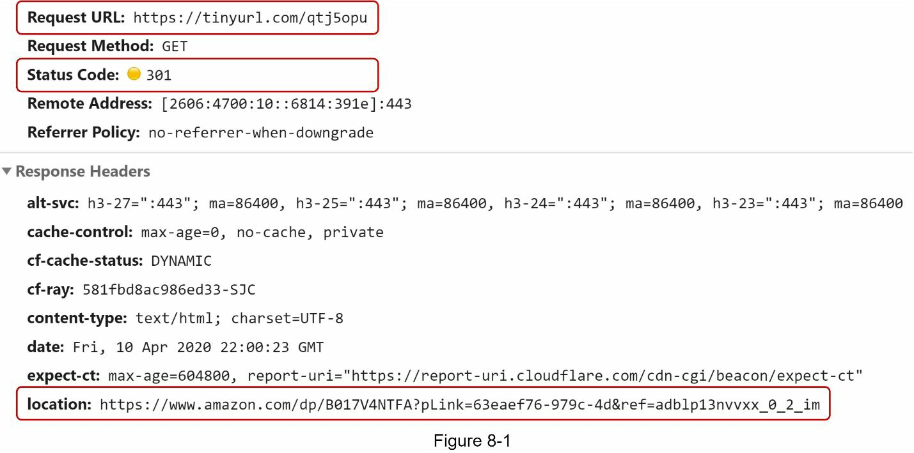
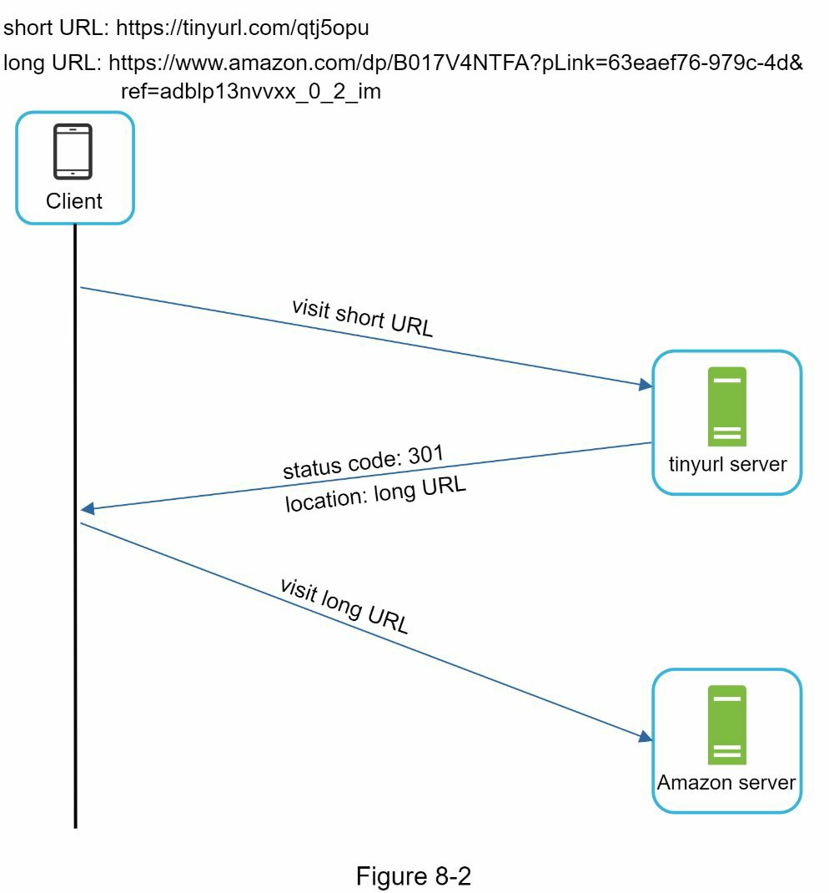
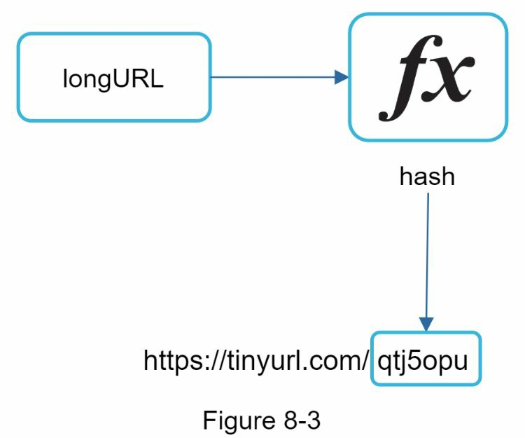
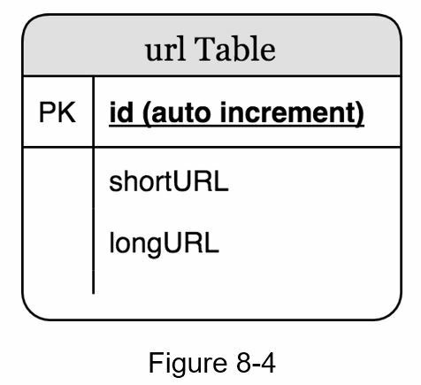
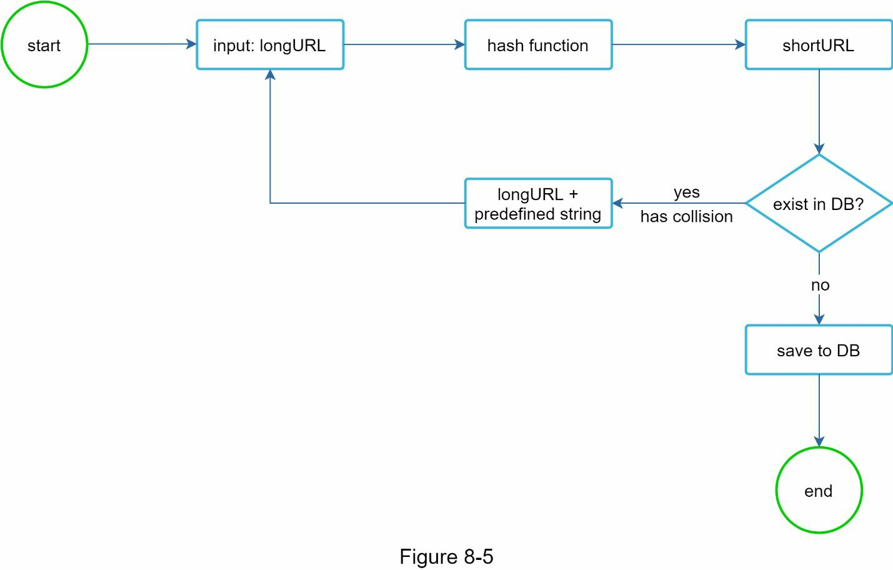
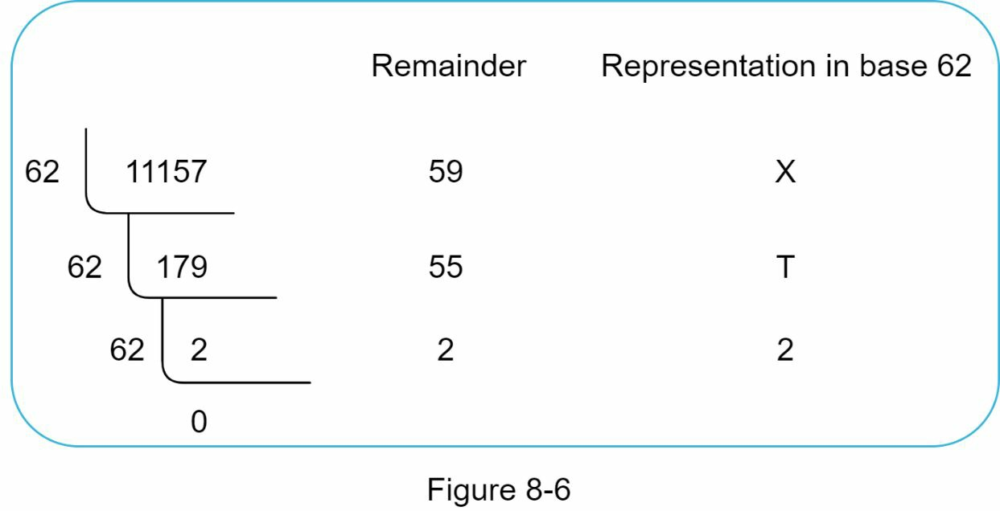
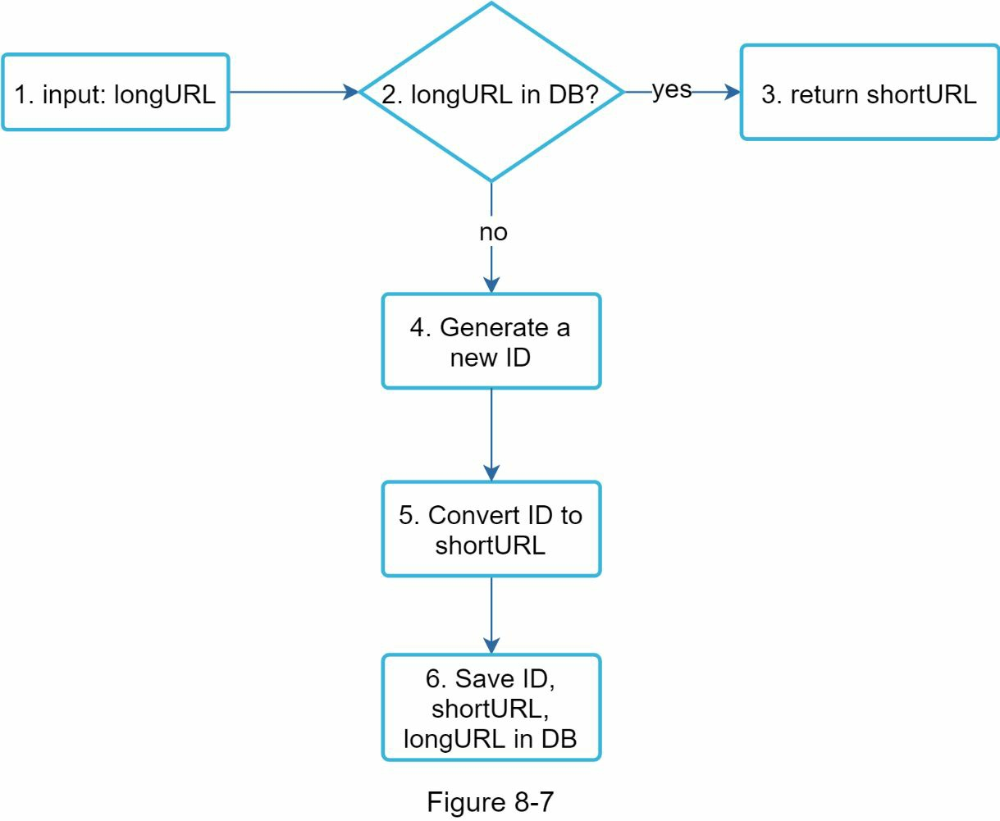
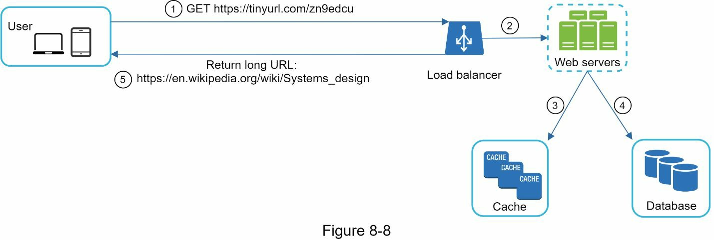

### Chapter 8: Design a URL Shortener - Summary

This chapter details the design of a URL shortening service like TinyURL. The process begins with establishing clear requirements: the service must handle 100 million new URLs per day, support a 10:1 read-to-write ratio, and store up to 365 billion records over 10 years, all while keeping the shortened URLs as short as possible.

The high-level design defines two primary API endpoints: a `POST` request to shorten a URL and a `GET` request to handle redirection. A key decision in the redirection logic is the choice between a `301 (Permanent)` redirect, which is better for reducing server load, and a `302 (Temporary)` redirect, which is superior for gathering analytics.

The core of the design is the method for generating the short URL. After evaluating a simple hash-and-truncate method (which suffers from collisions), the chapter settles on a more robust and scalable solution: **Base 62 conversion**. This approach relies on a distributed unique ID generator (as designed in Chapter 7) to produce a unique 64-bit integer for each new long URL. This integer is then converted into a short, 7-character string using a Base 62 character set (`[0-9, a-z, A-Z]`). This method is mathematically guaranteed to be unique and avoids the database lookup overhead of collision resolution.

The deep dive also covers the data model (a simple relational table with `id`, `shortURL`, and `longURL`), the detailed read/write paths, and critical optimizations. Since reads are far more frequent than writes, a **cache** is placed in front of the database to handle redirection requests with low latency. The final architecture is stateless, scalable, and considers important real-world issues like rate limiting and database sharding.

---

### 1. Understand the Problem and Establish Design Scope

The primary goal is to design a service that converts a long URL into a much shorter alias and redirects users from the short URL to the original one.

#### Basic Use Cases:
1.  **URL Shortening:** `POST /api/v1/data/shorten`
2.  **URL Redirecting:** `GET /api/v1/{shortUrl}`

#### Back-of-the-Envelope Estimation:
*   **Write Operations:** 100 million URLs/day => **~1160 writes/sec**
*   **Read Operations (10:1 ratio):** ~1160 * 10 => **~11,600 reads/sec**
*   **Total URLs (10 years):** 100 million * 365 * 10 => **365 billion**
*   **Storage (10 years, avg 100 bytes/URL):** 365 billion * 100 bytes => **~36.5 TB**

---

### 2. High-Level Design

#### URL Redirecting
When a user accesses a short URL, the server's primary job is to issue an HTTP redirect to the corresponding long URL.

*   **301 vs. 302 Redirect:**
    *   **301 (Permanent):** Tells the browser that the URL has permanently moved. The browser caches this and future requests go directly to the long URL, **reducing load on our service**.
    *   **302 (Temporary):** Tells the browser the move is temporary. Every request comes back to our service, which is necessary for **tracking clicks and gathering analytics**. The choice depends on the business goal.

#### URL Shortening
The core task is to create a mapping from a long URL to a unique, short `hashValue`.

---

### 3. Design Deep Dive

#### Data Model
While an in-memory hash map is intuitive, it's not scalable. A relational database is a better choice for persistent storage. The schema can be very simple.

*   **Table:** `urls`
*   **Columns:**
    *   `id` (BIGINT, PRIMARY KEY)
    *   `shortURL` (VARCHAR)
    *   `longURL` (VARCHAR)

#### Hash Function Design

##### Step 1: Determine Length of `hashValue`
*   The character set is `[0-9, a-z, A-Z]`, which contains **62** possible characters.
*   We need to find the smallest `n` such that `62^n >= 365 billion`.
*   As shown in the table, `n=7` provides ~3.5 trillion combinations, which is sufficient. The length of the `hashValue` will be **7**.

| Length (n) | Max URLs |
|------------|------------------|
| 1          | 62               |
| ...        | ...              |
| 6          | ~56.8 billion    |
| **7**      | **~3.5 trillion**|
*Table 8-1: Number of URLs supported vs. length of hashValue*

##### Step 2: Choose Hashing Approach

**Approach A: Hash + Collision Resolution**
1.  Take a standard hash (e.g., MD5) of the long URL.
2.  Truncate the hash to the first 7 characters.
3.  Check if this 7-character string already exists in the database.
4.  If it exists (a collision), append a predefined string and repeat until a unique value is found.
*   **Problem:** This requires a database lookup for every write, which is inefficient. A **Bloom filter** could optimize this check, but it's still complex.

**Approach B: Base 62 Conversion (Chosen Design)**
This method avoids collisions by design.
1.  For each new long URL, generate a globally **unique ID** using a distributed ID generator (from Chapter 7). This ID will be our database primary key.
2.  Convert this ID from base 10 to **base 62**. The resulting string is our `shortURL`.
*   **Example:** Convert ID `11157` to base 62.
    *   11157 / 62 = 179 remainder 59 ('X')
    *   179 / 62 = 2 remainder 55 ('T')
    *   2 / 62 = 0 remainder 2 ('2')
    *   Reading remainders bottom-up gives `2TX`. The short URL is `tinyurl.com/2TX`.

| Feature         | Hash + Collision Resolution | Base 62 Conversion           |
|-----------------|-----------------------------|------------------------------|
| **Uniqueness**  | Not guaranteed, requires resolution | Guaranteed by unique ID      |
| **Length**      | Fixed (7 characters)        | Varies, grows with ID        |
| **Simplicity**  | Complex, requires DB lookups | Simpler, deterministic       |
| **Scalability** | Less scalable               | Highly scalable              |
*Table 8-3: Comparison of the two approaches*

#### URL Shortening Flow (Deep Dive)
The flow uses the Base 62 conversion method.

1.  Client sends a `longURL`.
2.  The system checks if the `longURL` already exists in the database.
3.  **If YES:** Return the existing `shortURL`.
4.  **If NO:**
    a. Get a new, globally unique ID from the **Unique ID Generator**.
    b. Convert this ID to a `shortURL` using **Base 62 conversion**.
    c. Save the `(ID, shortURL, longURL)` triplet to the database.
    d. Return the new `shortURL` to the client.

| id                | shortURL | longURL                                     |
|-------------------|----------|---------------------------------------------|
| 2009215674938     | zn9edcu  | https://en.wikipedia.org/wiki/Systems_design|
*Table 8-4: Example database entry*

#### URL Redirecting Flow (Deep Dive)
Because reads are much more frequent than writes, a cache is essential for performance.

1.  User clicks a short URL link. The request hits the load balancer.
2.  The web server first checks a **cache** (e.g., Redis, Memcached) for the `shortURL`.
3.  **If Cache Hit:** The `longURL` is found in the cache. It is returned to the user for redirection.
4.  **If Cache Miss:**
    a. The server queries the **database** for the `shortURL`.
    b. If the `shortURL` is not in the database, it's an invalid link.
    c. If found, the server updates the **cache** with the `<shortURL, longURL>` pair.
    d. The `longURL` is returned to the user for redirection.

---

### 4. Wrap Up and Additional Considerations

*   **Rate Limiter:** To prevent abuse, the system should implement rate limiting based on IP address or other criteria. (See Chapter 4).
*   **Scaling:**
    *   **Web Tier:** Stateless, so can be easily scaled by adding more servers.
    *   **Database Tier:** Can be scaled using replication and sharding.
*   **Analytics:** If analytics are important, use `302` redirects and build a data pipeline to process click data.
*   **Availability, Consistency, Reliability:** These are crucial. The system should be designed with redundancy and fault tolerance in mind. (See Chapter 1).

Reference materials
[1] A RESTful Tutorial: https://www.restapitutorial.com/index.html
[2] Bloom filter: https://en.wikipedia.org/wiki/Bloom_filter
