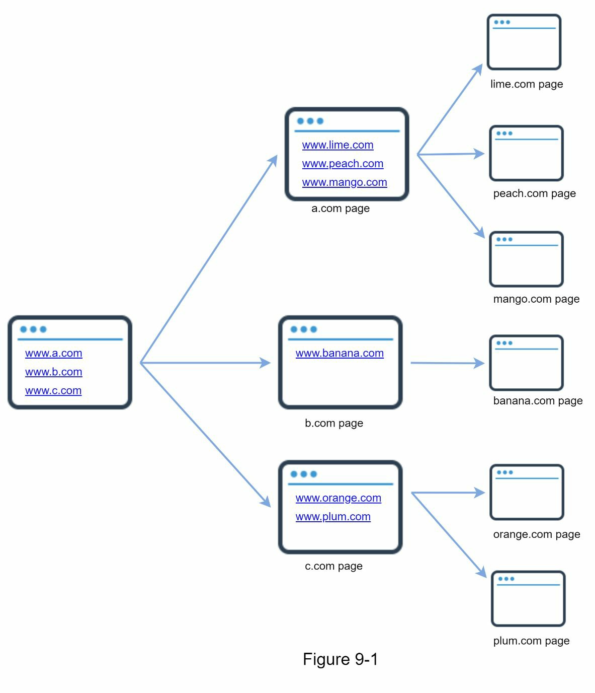
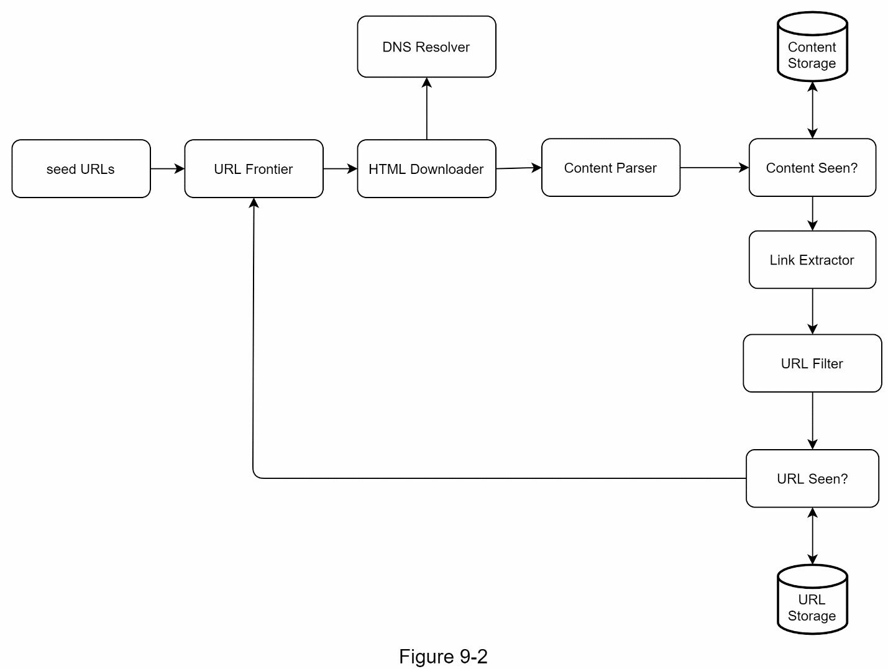
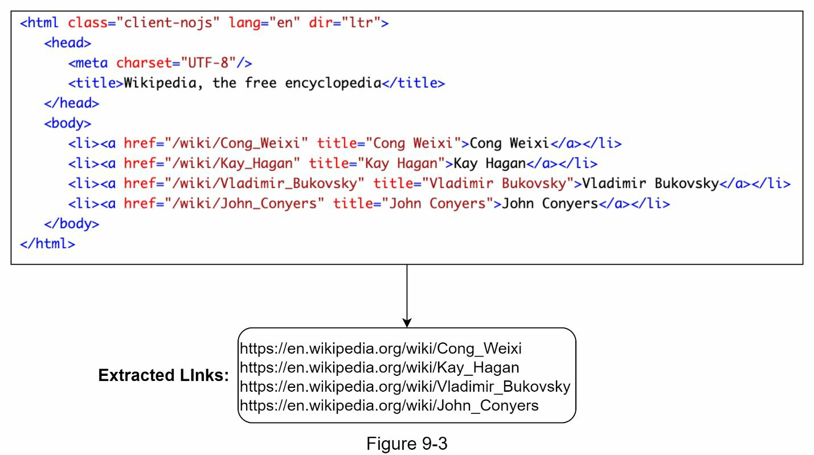
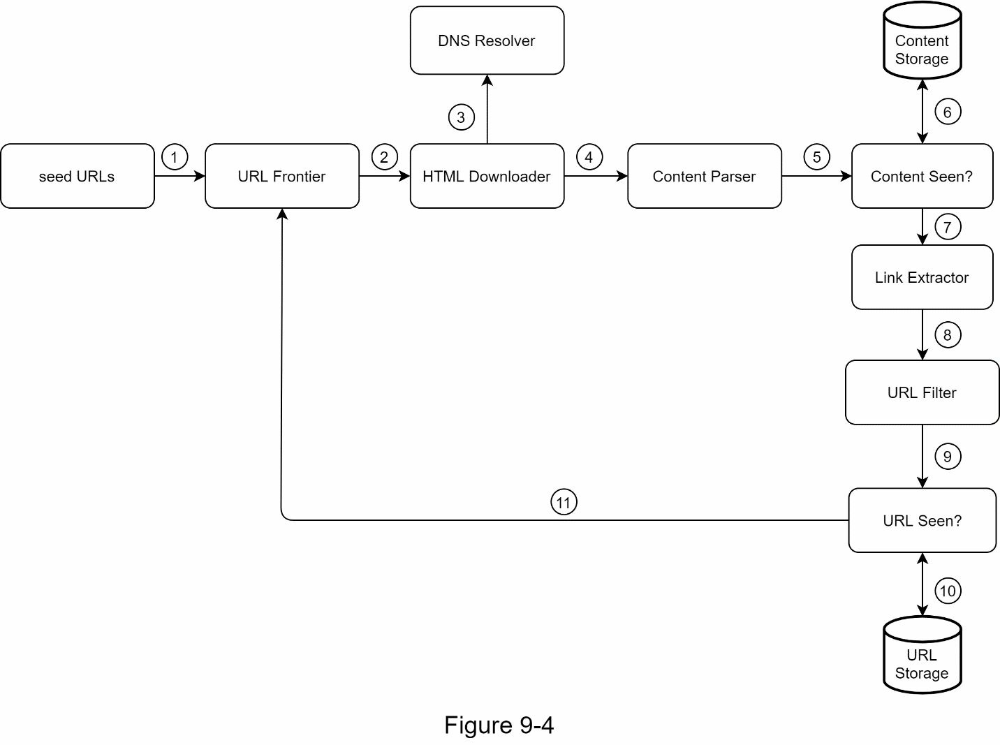
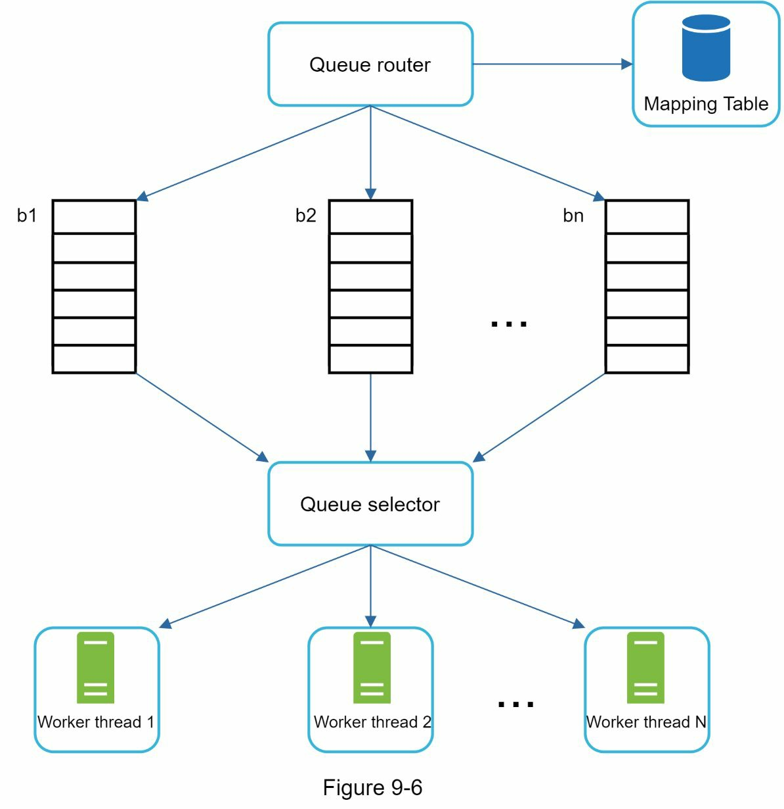
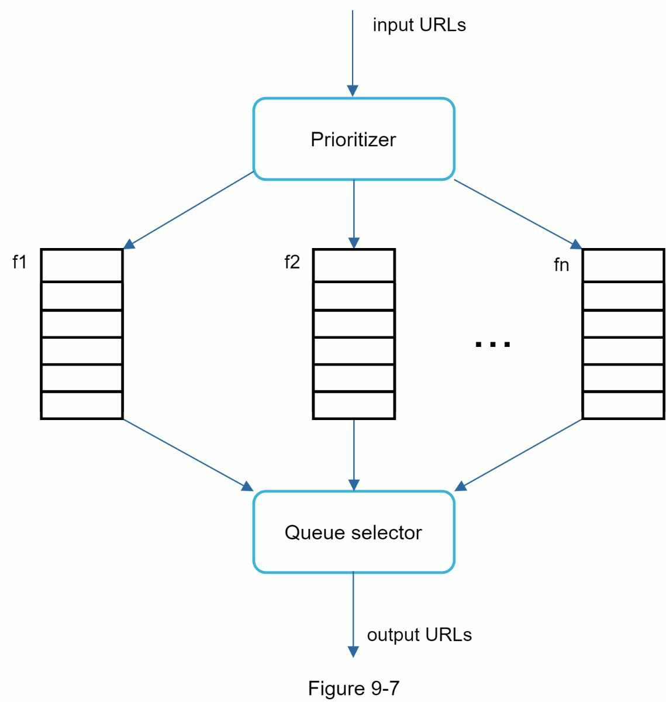
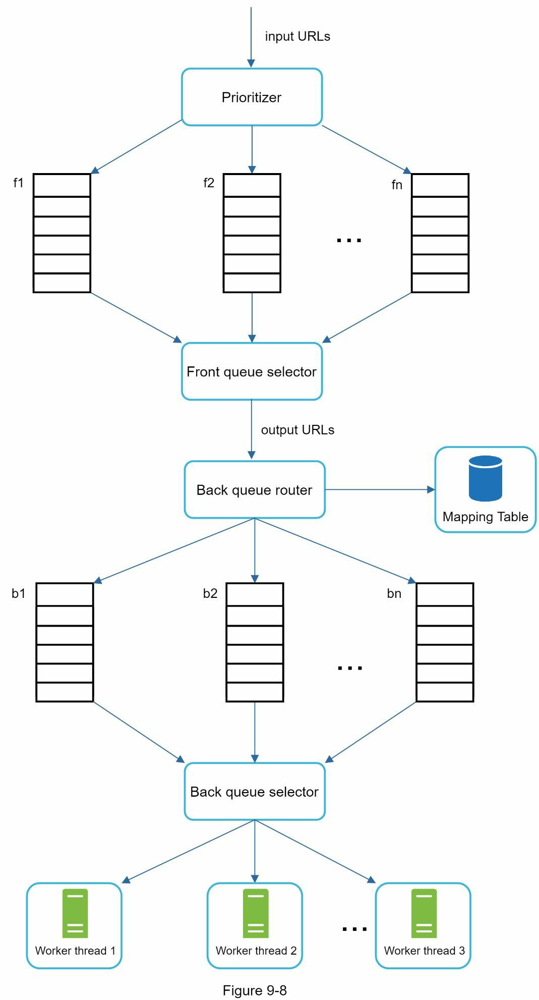
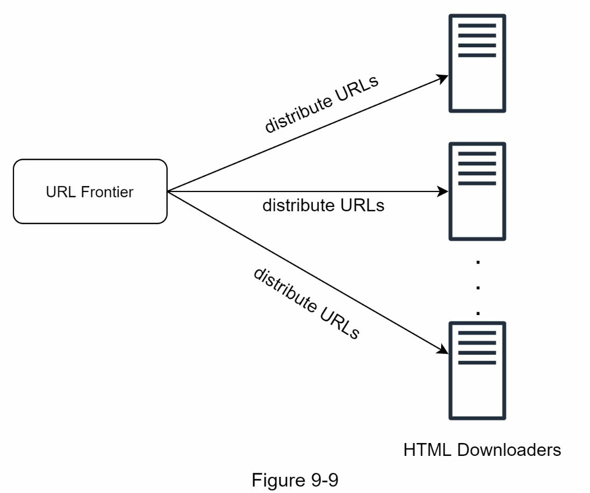
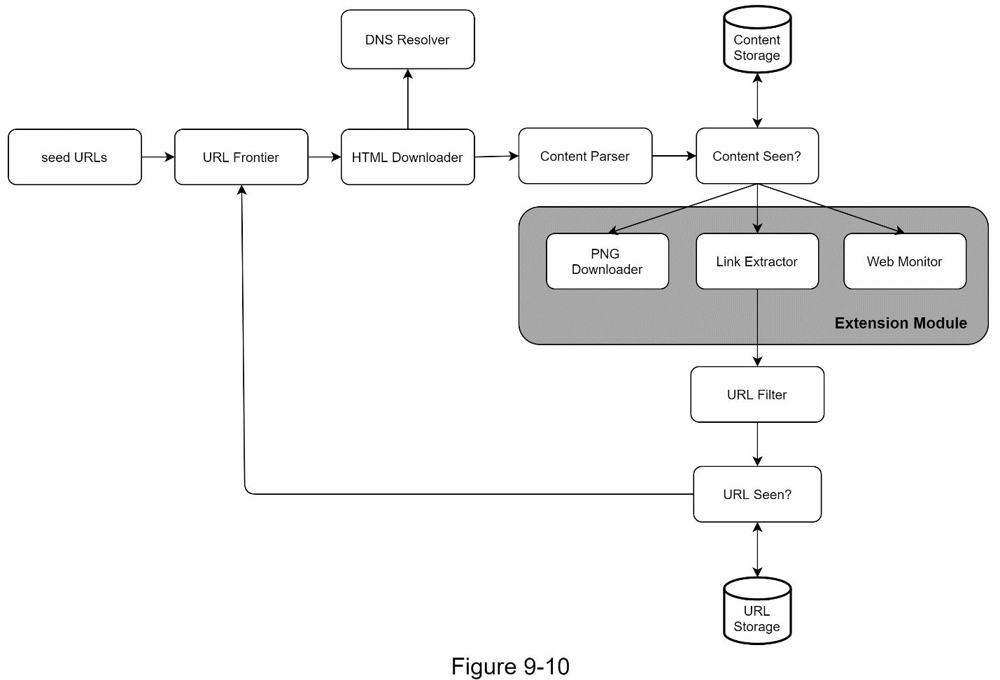

### Chapter 9: Design a Web Crawler - Summary

This chapter details the design of a large-scale, distributed web crawler for the purpose of search engine indexing. It begins by establishing the immense scale of the task: crawling 1 billion HTML pages per month, resulting in approximately 30 PB of storage over five years. The design must be scalable, robust, polite, and extensible.

The high-level architecture is a sophisticated pipeline. The process starts with a set of **Seed URLs** fed into a **URL Frontier**, which manages the queue of URLs to be crawled. **HTML Downloader** modules fetch pages, using a **DNS Resolver** to find IP addresses. The downloaded content is then passed through a pipeline: a **Content Parser** validates the HTML, a **"Content Seen?"** module uses hashing to detect and discard duplicate content, and a **URL Extractor** pulls out new links. These new links are filtered and checked against a **"URL Seen?"** data structure (implemented with a Bloom filter) to prevent reprocessing, before being added back to the URL Frontier.

The deep dive focuses on several critical components. Instead of a simple FIFO queue, the **URL Frontier** is an advanced component designed to manage **politeness** (by using separate queues per host to avoid overwhelming servers), **priority** (prioritizing high-value pages like homepages over forum posts), and **freshness** (recrawling pages based on their update history).

Performance and robustness are key. The design employs **distributed crawling**, **DNS caching**, **geographic locality**, and **short timeouts** to improve speed. Robustness is achieved through **consistent hashing** for load distribution, saving crawl states to disk, and comprehensive exception handling. Finally, the chapter addresses challenges like avoiding spider traps, filtering data noise, and the necessity of server-side rendering to handle JavaScript-heavy websites.

---

### 1. Understand the Problem and Establish Design Scope

A web crawler (or spider) is a bot that systematically browses the web, typically for search engine indexing.

#### Requirements & Scope:
*   **Purpose:** Search engine indexing.
*   **Scale:** Crawl **1 billion** HTML pages per month.
*   **Content Type:** HTML only.
*   **Updates:** Must handle new and updated pages.
*   **Storage:** Store crawled HTML for up to 5 years.
*   **Duplicates:** Duplicate content should be identified and ignored.

#### Key Characteristics of a Good Crawler:
*   **Scalability:** Must be highly parallel to handle the vastness of the web.
*   **Robustness:** Must be resilient to bad HTML, unresponsive servers, and malicious traps.
*   **Politeness:** Must not overload websites with too many rapid requests.
*   **Extensibility:** Must be easy to add support for new content types (e.g., images, PDFs) in the future.

#### Back-of-the-Envelope Estimation:
*   **QPS:** 1 billion pages / 30 days / 24 hours / 3600s ≈ **400 pages/sec**.
*   **Peak QPS:** 2 * 400 = **800 pages/sec**.
*   **Monthly Storage:** 1 billion pages * 500 KB/page = **500 TB**.
*   **Total Storage (5 years):** 500 TB/month * 12 months * 5 years = **30 PB**.

---

### 2. High-Level Design

The system is designed as a pipeline of specialized components that process URLs and content.

#### Component Breakdown:
1.  **Seed URLs:** The starting list of URLs for the crawler. Creative selection (e.g., based on geography or topic) is needed to ensure broad coverage.
2.  **URL Frontier:** Stores the URLs that are yet to be downloaded. It's more complex than a simple FIFO queue.
3.  **HTML Downloader:** Fetches the web page content for a given URL.
4.  **DNS Resolver:** Translates a hostname (e.g., `wikipedia.org`) into an IP address. This is a potential bottleneck.
5.  **Content Parser:** Parses the downloaded HTML to ensure it's well-formed.
6.  **Content Seen?:** A data structure that checks if the content of a page has been seen before (even at a different URL) to avoid storing duplicates. This is typically done by comparing hashes of the content.
7.  **Content Storage:** A large-scale storage system (e.g., a distributed file system) to store the HTML content.
8.  **URL Extractor:** Parses the HTML to find all the hyperlinks (`<a>` tags).
    
9.  **URL Filter:** Filters out URLs that should not be crawled (e.g., blacklisted sites, specific file types).
10. **URL Seen?:** A data structure (like a Bloom filter or hash set) that checks if a URL has already been added to the Frontier or has been processed before, preventing loops and redundant work.
11. **URL Storage:** Stores all URLs that have been visited.

#### Web Crawler Workflow

1.  **Seed URLs** are added to the **URL Frontier**.
2.  The **HTML Downloader** gets a batch of URLs from the Frontier.
3.  The downloader uses the **DNS Resolver** to get IPs and downloads the pages.
4.  The **Content Parser** validates the HTML.
5.  The content is passed to the **"Content Seen?"** module.
6.  If the content is new, it's sent to the **URL Extractor**. If it's a duplicate, it's discarded.
7.  The **URL Extractor** extracts all links from the HTML.
8.  The links are passed through the **URL Filter**.
9.  Each filtered link is checked by the **"URL Seen?"** module.
10. If the URL is new, it's added to the **URL Frontier** for future crawling.

---

### 3. Design Deep Dive

#### Crawl Strategy: BFS vs. DFS
The web can be modeled as a graph. While DFS is a valid traversal, its recursion depth can be unbounded, making it unsuitable. **BFS is the preferred strategy**, but a simple FIFO queue implementation has problems.

#### URL Frontier (In-Depth)
This is the most critical component, managing politeness, priority, and freshness.

*   **Politeness:** To avoid overwhelming a single server, the crawler must limit the rate of requests to the same host. This is achieved by having many separate queues, where each queue is responsible for only one hostname. A worker thread is assigned to a single host queue at a time and introduces a delay between downloads.
    

*   **Priority:** Not all pages are equally important. A **Prioritizer** component assigns a priority to URLs (based on PageRank, update frequency, etc.). The Frontier uses multiple queues, each corresponding to a priority level, and the queue selector is biased to pick from higher-priority queues more often.
    

*   **Combined Design:** The final URL Frontier design combines these concepts. URLs are first prioritized into "front queues" and then routed by hostname into "back queues" for polite downloading.
    

*   **Freshness:** The crawler must periodically recrawl pages. The Frontier manages this by adding old URLs back into the queues, prioritizing pages that are known to update more frequently.

*   **Storage:** The Frontier can contain hundreds of millions of URLs. It uses a hybrid storage approach: most URLs are kept on disk, with in-memory buffers for active enqueue/dequeue operations to minimize I/O bottlenecks.

#### HTML Downloader

*   **Robots.txt:** The downloader must respect the Robots Exclusion Protocol. Before crawling any page on a site, it must first fetch and parse the `robots.txt` file (e.g., `amazon.com/robots.txt`) to see which paths are disallowed. These rules should be cached.
*   **Performance Optimizations:**
    1.  **Distributed Crawl:** The work is distributed across many servers, each responsible for a subset of the URL space.
        
    2.  **Cache DNS Resolver:** DNS lookups are slow. A local DNS cache is crucial to avoid this bottleneck.
    3.  **Locality:** Place crawler servers geographically close to the websites they are crawling to reduce latency.
    4.  **Short Timeouts:** A crawler should not wait indefinitely for a slow server.

#### Robustness and Extensibility
*   **Robustness:**
    *   **Consistent Hashing:** Used to distribute load among downloader servers.
    *   **Stateful Recovery:** Crawl states are periodically saved to disk so a crawl can be resumed after a crash.
    *   **Exception Handling:** Gracefully handle errors like invalid HTML or network failures.
*   **Extensibility:** The system should be modular. To support a new content type (e.g., PNG images), a new `PNG Downloader` module can be plugged into the architecture.
    

#### Handling Problematic Content
*   **Redundant Content:** Use hashing (checksums) to detect and discard duplicate content.
*   **Spider Traps:** These are infinite loops in a website's link structure (e.g., an infinitely deep calendar). They can be partially mitigated by setting a max URL length, but manual detection and blacklisting of trapped sites are often required.
*   **Data Noise:** Filter out low-value content like ads and spam.

---

### 4. Wrap Up and Additional Considerations

*   **Server-Side Rendering:** Many modern websites use JavaScript to render content and links. The crawler must be able to execute JavaScript (like a headless browser) to discover these links.
*   **Anti-Spam:** An anti-spam component is needed to detect and filter out low-quality or malicious pages.
*   **Data Layer Scaling:** The content and URL storage systems will need database replication and sharding to scale.
*   **Horizontal Scaling:** The downloader tier is stateless and can be scaled horizontally by adding more servers.
