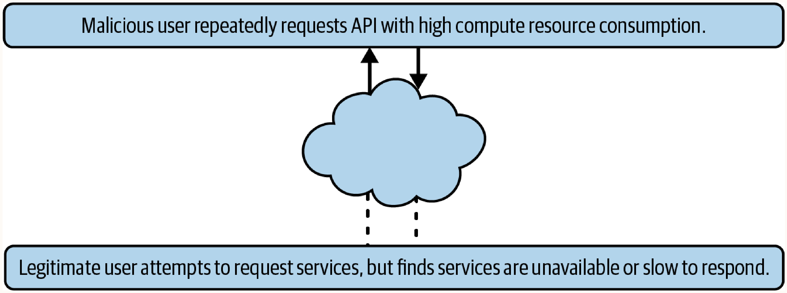
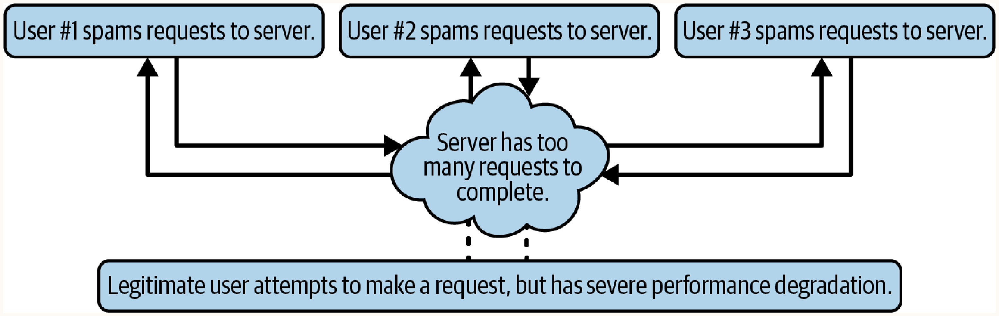

# Chapter 14: Denial of Service

## Regex DoS
**How it works:** Exploiting poorly constructed "greedy" regular expressions. Malicious regexes cause excessive backtracking when evaluating failing inputs, exponentially increasing evaluation time and consuming CPU resources.
**When to use:** Targeting inputs validated by vulnerable regex patterns or when user-supplied regexes are permitted. 

```javascript
// Malicious regex example
const regex = /^((ab)*)+$/;
// Input 'ababababababababa' forces exhaustive backtracking
```

**Key characteristic:** Most malicious regexes use the plus `+` operator, which creates "greedy" operations that test for one or more matches and exhaustively backtrack upon failure. Open Source Software (OSS) is often particularly vulnerable.

## Logical DoS Vulnerabilities
**How it works:** Draining server resources by abusing legitimate, resource-intensive application features. Attackers identify operations taking significant time and trigger them repeatedly.
**When to use:** Targeting unoptimized or rate-unlimited endpoints performing heavy processing.



Resource-intensive operations to target:
- Synchronous operations
- Database writes
- Drive writes
- SQL joins
- File backups
- Looping logical operations

**Testing Methodology:**
- Time requests from start to finish using browser developer tools.
- Test for synchronous operations by making the same request multiple times simultaneously; staggered responses indicate synchronous processing. Average out request times to account for traffic spikes.
- Analyze how requests scale. For example, a `GET /metadata/:userid` endpoint might take 120ms for a new account but 1,870ms for a power user with thousands of photos. Creating a power user account and repeatedly hitting this endpoint can cause a logical DoS.

## Distributed DoS (DDoS)
**How it works:** Utilizing botnets (compromised networked devices) to send massive volumes of traffic to a target, typically at the network level (e.g., UDP traffic), drowning out legitimate requests.
**When to use:** Volumetric attacks aimed at exhausting server bandwidth or connection limits.



## Advanced DoS

### YoYo Attacks
**How it works:** Flooding an application to trigger cloud autoscalers to increase hardware resources, abruptly halting traffic to cause a scale-down, and repeating. 
**When to use:** To degrade user experience during hardware reallocation and artificially inflate cloud hosting costs.

### Compression Attacks
**How it works:** Uploading carefully crafted, malformed files (e.g., videos or images) that exploit parsing bugs (like integer overflows) in server-side compression/optimization tools (e.g., FFMPEG, ImageMagick), leading to excessive CPU/RAM consumption or process crashes.
**When to use:** Targeting web applications relying on third-party libraries to process user-submitted media.
**Example:** CVE-2021-38094 in FFMPEG (v4.1) where malformed video data triggered an integer overflow in the `filter_sobel()` function within `libavfilter/vf_convolution.c`, causing severe CPU/memory consumption.

### Proxy-Based DoS
**How it works:** Using intermediaries with massive computing power, such as search engine crawlers, to bombard a target. Attackers trick crawlers into indexing infinite new subdomains proxying the target site.
**When to use:** To obscure the attacker's origin and leverage massive external resources at zero cost to the attacker.

## General Tips
- **Data Leakage:** While DoS typically causes interruption, some DoS attacks can also cause errors that leak sensitive data. Always monitor logs and error messages during a DoS test.
- **Testing:** DoS vulnerabilities should ideally be tested in local development environments to avoid degrading the experience of real users.
