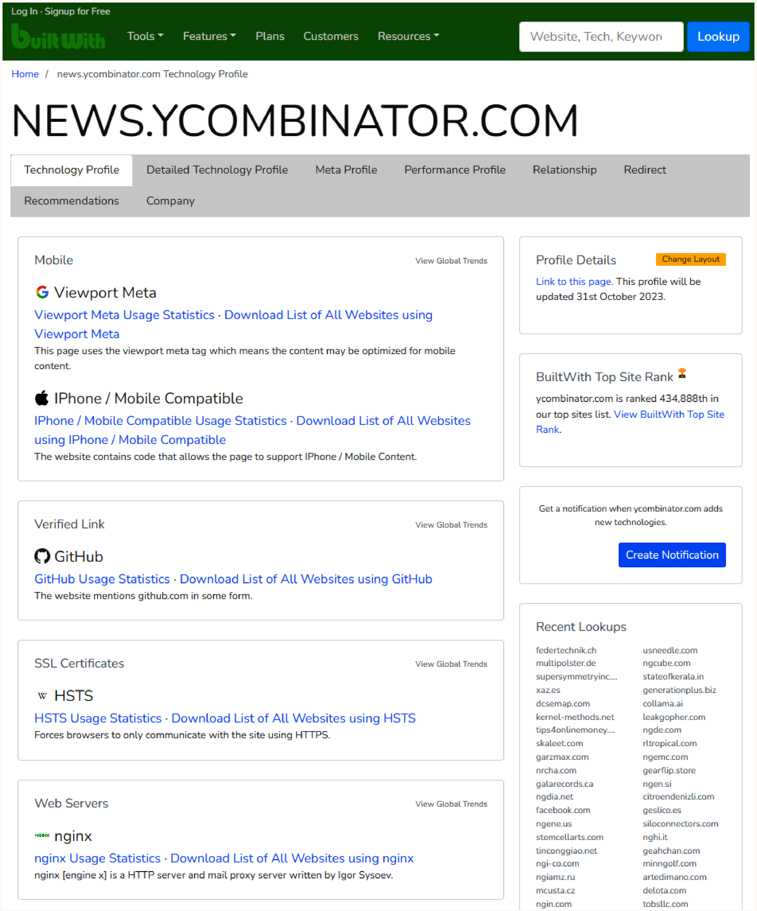
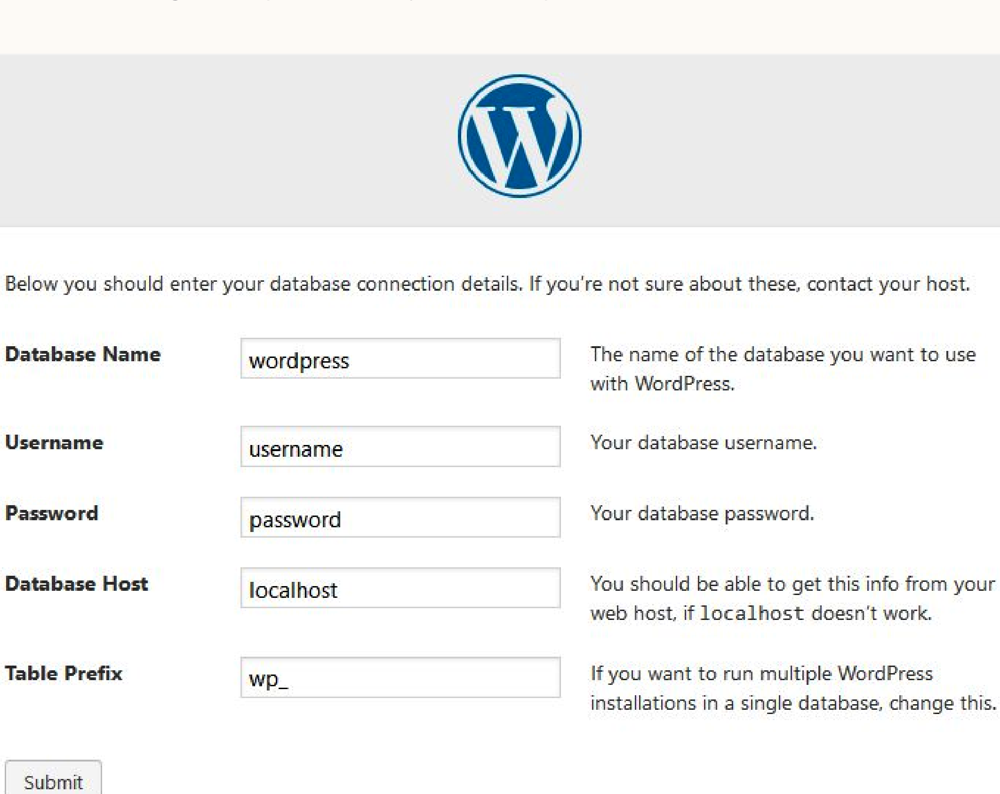
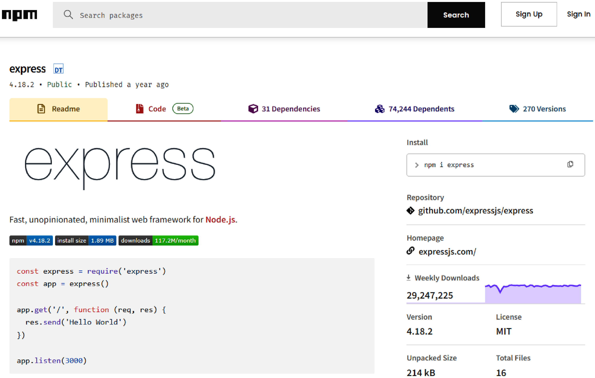
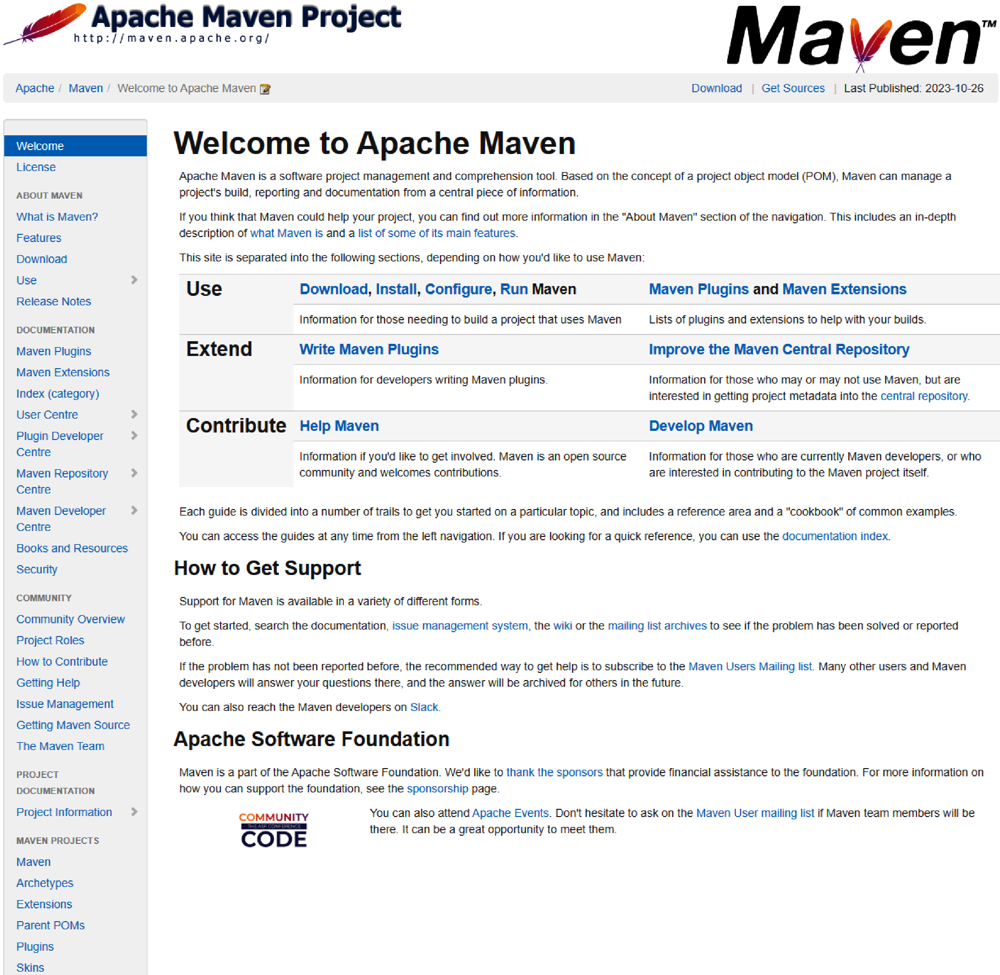
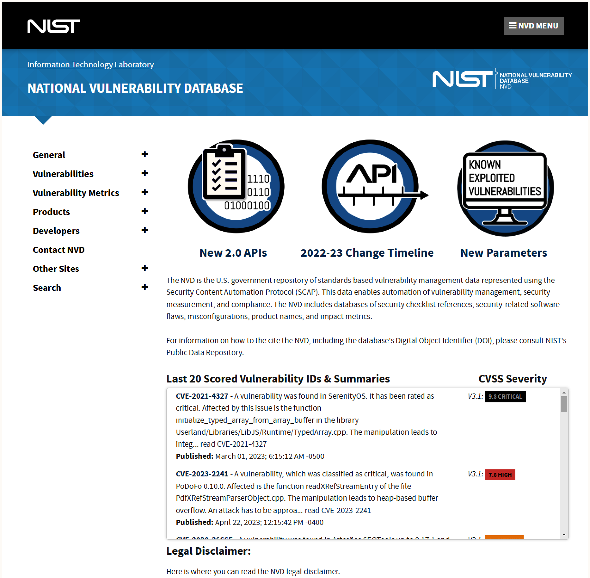

# Chapter 17. Exploiting Third-Party Dependencies

Modern software is heavily built on top of Open Source Software (OSS). While convenient, this reliance introduces significant security risks because OSS codebases often lack the stringent security auditing of proprietary code. A chain is only as strong as its weakest link, making OSS integrations prime targets for exploitation.

Reconnaissance tools like BuiltWith can fingerprint web applications to determine their underlying technology stack.

## Methods of Integration

Integrating OSS into a web application dictates the type of data moving between the two, the method of movement, and the granted privilege level.

*   **Centralized Integration:** Direct integration into the core application code.
*   **Decentralized Integration:** Running OSS code on its own server and communicating via an API (one-way).

### Branches and Forks

Most OSS uses Git-based distributed version control.
*   **Branches:** Developers create branches against the main software to make modifications. **Risk:** Accidentally pulling unreviewed code from the main branch into production.
*   **Forks:** New repositories starting at the last commit of the main branch. **Benefit:** Offers greater separation with isolated permissions and Git hooks. **Con:** Merging upstream updates becomes complex over time.

### Self-Hosted Application Integrations

Prepackaged OSS applications often use simple setup installers.

*   **How it works:** Developers distribute a script that automatically configures databases and generates files based on UI input (e.g., WordPress one-click installation).
*   **When to use:** Deploying standalone platforms like CMSs.
*   **Security Risk:** Highly risky. Vulnerabilities are difficult to trace without reverse engineering the setup script. The scripts typically require elevated privileges, creating potential vectors for backdoor Remote Code Execution (RCE). Use should be avoided or heavily scrutinized.

### Source Code Integration

Code-level integration involving copying/pasting OSS code and its dependencies into a proprietary application.

*   **How it works:** Directly integrating OSS source files into the main application's codebase.
*   **When to use:** Ideal for short utilities or helper functions (50–100 lines).
*   **Security Risk:** Problematic for large packages. Insecure upstream changes can be accidentally integrated, and tracking/pulling upstream security patches is difficult and time-consuming.

### Package Managers

Intermediary applications that download and configure required dependencies from reliable sources.

*   **How it works:** Resolves complicated integration details, reduces repository size, and pulls in specific required dependencies (and recursively, their child dependencies).
*   **When to use:** Essential for large enterprise software with numerous dependencies to save bandwidth and build time.
*   **Security Risk:** Susceptible to compromised maintainer credentials, malicious subdependencies, or code obfuscation techniques.

**JavaScript (npm)**
npm powers the majority of JS web applications, resolving recursive child dependencies at build time via `package.json` and `package.lock`.
*   **Risks:** Historically targeted due to loose security mechanisms (e.g., `left-pad` breaking builds, `eslint-scope` credential theft, `event-stream` relying on `flatmap-stream` malicious Bitcoin wallet stealer dependency).

**Java (Maven)**
Maven is the most popular Java package manager, usually integrated into the build pipeline.
*   **Differences:** Predates Git, so its dependency management relies less on Git-provided functions compared to npm, though the functional outcome is similar.

**Other Languages**
C#, C, C++, and most other mainstream languages have similar package managers (e.g., NuGet, Conan, Spack). Attacking via a package manager often requires a combination of social engineering and code obfuscation to hide the malicious code.

## Common Vulnerabilities and Exposures (CVE) Database

The fastest method for exploiting third-party dependencies is identifying unpatched, known vulnerabilities.

*   **How it works:** Utilizing public databases like the National Vulnerability Database (NVD) or Mitre’s CVE database. These platforms provide reproduction steps and threat ratings.
*   **When to use:** Most effective against major, widely-used dependencies (e.g., WordPress, Bootstrap, JQuery) which undergo heavy scrutiny by researchers. Less effective for obscure, low-usage packages. For context, JQuery is used on over 10 million websites and has over 18,000 forks, making it highly scrutinized and a prime target for CVEs.
*   **Reconnaissance Requirement:** Attackers must first identify the target's dependencies, versions, and configurations before leveraging CVE details.

## Summary
Third-party dependencies offer an easy-to-overlook security gap. Due to less rigid review processes compared to first-party code, they are often a highly effective starting point for web application exploitation following thorough reconnaissance.
