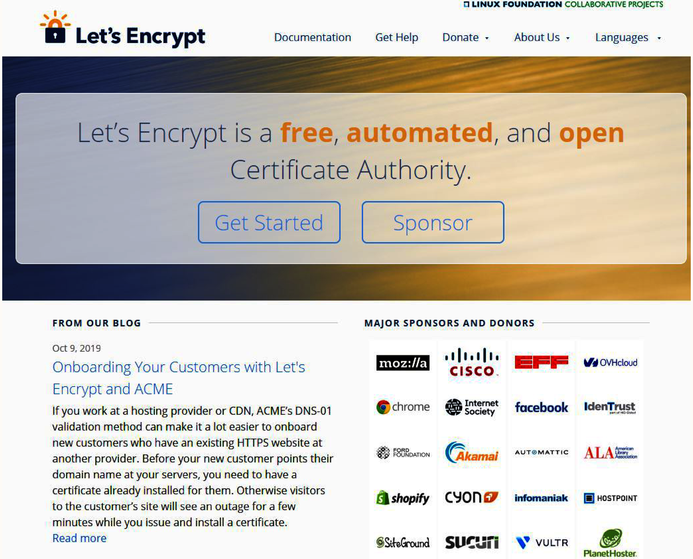
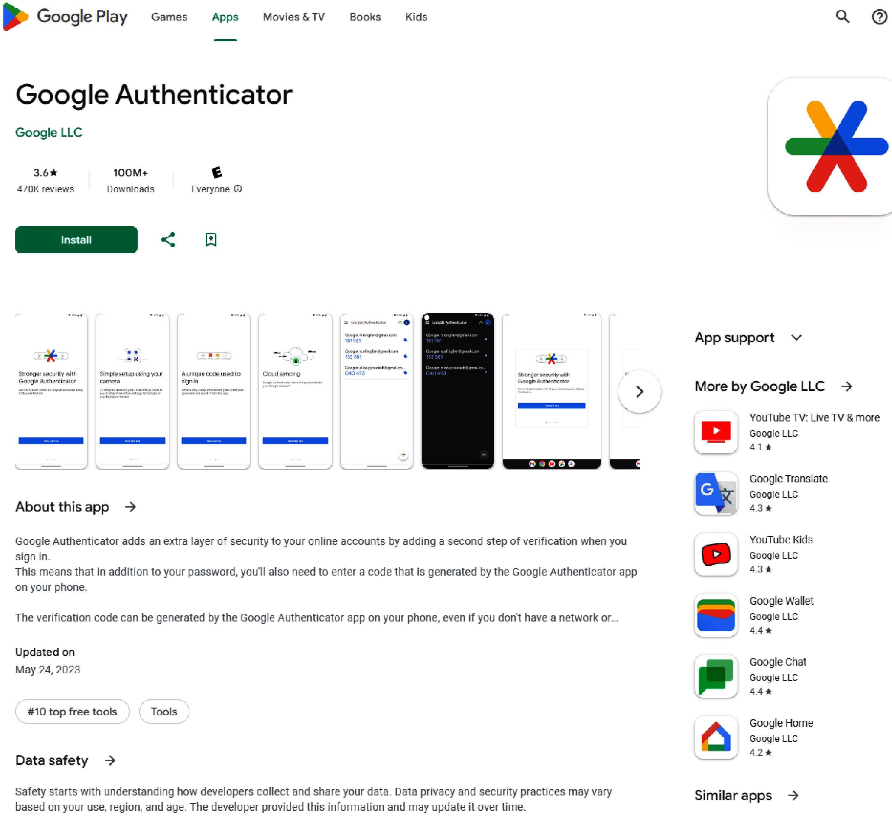
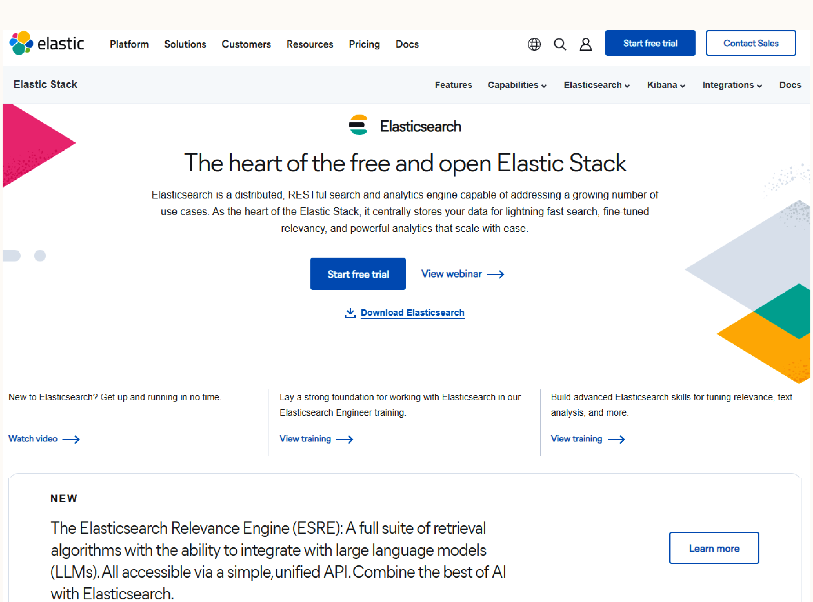

# Chapter 21: Secure Application Architecture

## Feature Requirements & Risk Analysis
Evaluating business requirements during the architecture phase is critical for identifying potential security vulnerabilities early. The NIST states that fixing flaws in the design phase is 30–60 times cheaper than in production.

> [!TIP]
> **Security and R&D Integration**: Organizations should build communication pathways between security and R&D/engineering teams into the development process. Features cannot be properly analyzed in a silo.

Key risk areas typically include:
- **Authentication & Authorization**: Handling sessions, logins, cookies, and data storage.
- **Personal Data**: Regulatory compliance and data handling.
- **Search Engines**: Data syncing, caching, and database separation.

## Data in Transit
All sensitive data (e.g., credentials, financial info) must be encrypted in transit to mitigate man-in-the-middle (MITM) attacks.

### Transport Layer Security (TLS)
- **How it works**: Cryptographic protocol defined by RFC 2246 (1999) that encrypts network communication. It supersedes SSL (Secure Sockets Layer), which has architectural flaws and vulnerabilities, and cannot interpolate with older versions of SSL. HTTPS ("HTTP Secure") is a URI scheme that requires TLS/SSL to be present before allowing data over the network.
- **When to use**: Mandatory for all web traffic transferring sensitive data.

## Authentication and Credential Storage
### Secure Passwords
Password security depends on **entropy** (randomness and unpredictability) rather than strict length or special character requirements. Defend against dictionary and brute-force attacks by:
- Rejecting common passwords (e.g., top 1,000 lists).
- Disallowing personally identifiable information (PII) like names, birthdates, or addresses in passwords.

### Hashing Algorithms
Passwords must never be stored in plain text. Hashing algorithms are one-way (irreversible) functions. Modern hashing algorithms effectively eliminate collisions, ensuring extreme security even during database breaches. Slow hashing algorithms are critical to defend against automated brute-forcing.

- **BCrypt**
  - **How it works**: Derives its name from the Blowfish cipher (developed by Bruce Schneier in 1993) and the *Crypt* hashing function (Unix default). Unlike *Crypt*, which is easily broken on modern hardware, BCrypt is designed to scale and intentionally become slower on faster hardware, making automated brute-force attacks computationally infeasible.
  - **When to use**: The standard and recommended choice for modern web applications.
- **PBKDF2**
  - **How it works**: Utilizes *key stretching* to rapidly generate an initial hash, but progressively slows down subsequent attempts. The iteration count must be configured to the maximum your hardware supports.
  - **When to use**: An acceptable alternative when BCrypt is unavailable.
- **MD5**
  - **How it works**: Fast, outdated hashing algorithm susceptible to precomputed rainbow tables.
  - **When to use**: Never use for password hashing.

### Multifactor Authentication (MFA)
MFA adds an essential layer of security that mitigates stolen credentials.
- **How it works**: Requires a standard password plus a secondary token (from an authenticator app, SMS, or physical USB hardware token). This stops unauthenticated remote logins.
- **When to use**: Always offer MFA, especially for accounts storing PII or financial data. Hardware tokens are preferred for internal employees, while app/SMS MFA is standard for users.

## PII and Financial Data
Storing PII and financial details requires strict adherence to international laws.
- **Strategy**: Instead of storing PII and financial data internally, outsource data storage to compliant, specialized third-party businesses.

## Search Engines
Custom search engines require optimized data structures that differ from standard relational databases, typically demanding a separate database.
- **How it works**: Data is synced from the primary database to the search database (e.g., Elasticsearch). 
- **When to use**: When standard database queries are insufficient for search requirements. Must account for complex synchronization, permissions propagation (if primary DB permissions update, search DB must reflect this), and data lifecycle management (e.g., ensuring deleted primary DB objects don't remain searchable).

## Zero Trust Architecture
Also known as Zero Trust Network Access (ZTNA), Zero Trust Design, or Zero Trust Pattern. The term was first introduced in Stephen Paul Marsh's 1994 doctoral thesis, but was revitalized by the 2020 NIST SP-800-207 whitepaper. It heavily overlaps with the **principle of least privilege**.

### Trust Models
- **Implicit Trust**
  - **How it works**: Trust is assumed based on proximity or roles (e.g., bypassing a firewall, existing within an AWS VPC). This is analogous to a castle with a moat, where anyone inside the castle walls is implicitly trusted without further verification.
  - **When to use**: Outdated model; avoid in modern application architecture.
- **Explicit Trust (Trust but Verify)**
  - **How it works**: Verification is required on *every* invocation of privileged functionality, regardless of the requester's network location.
  - **When to use**: The foundational model for Zero Trust Architecture.

### Continuous Authorization
Applying Zero Trust to authorization mitigates edge cases, such as an employee retaining access after termination because their session token hasn't expired.
- **How it works**: Re-verifies state and permissions continuously rather than trusting an unexpired token implicitly.
- **When to use**: For highly privileged internal systems and sensitive user operations.

## Summary: The Cost of Late Security Fixes
Resolving architecture-level security bugs in production is 30 to 60 times more expensive due to:
- **Migration Plans**: Customers relying on insecure functionality require careful migration to avoid downtime.
- **Deep Architecture Rewrites**: Flaws may require rewriting significant numbers of modules built on top of the insecure tech (e.g., swapping UDP for TCP networking).
- **Exploitation Costs**: Actual financial loss and engineering time spent mitigating breaches.
- **Bad PR**: Loss of customer trust, engagement, and retention.
