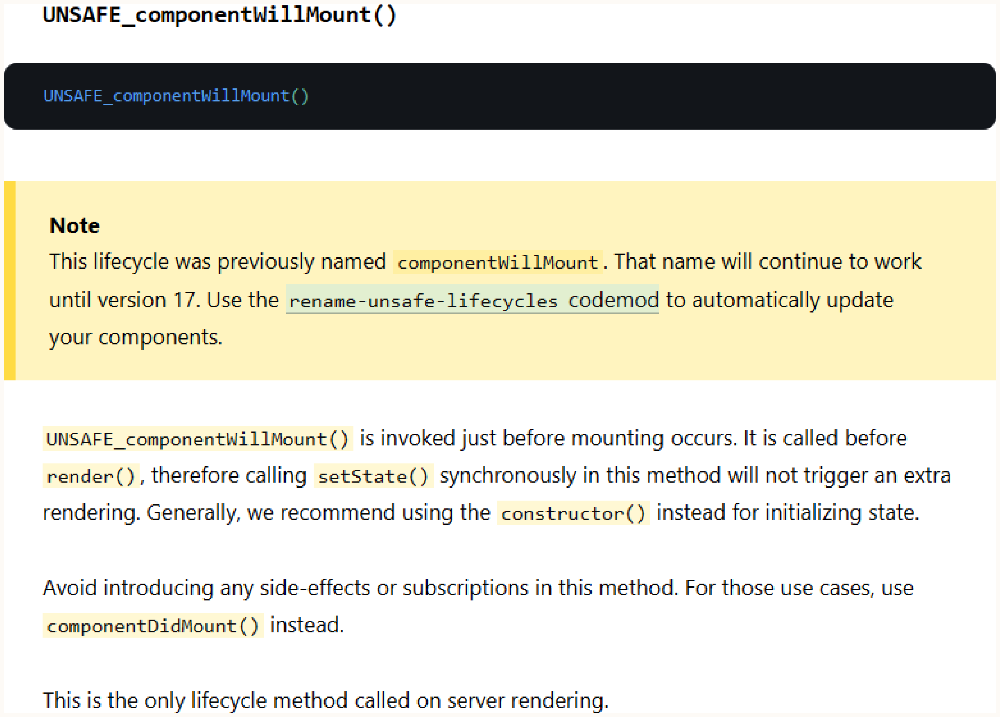

# Chapter 23: Secure User Experience

## Information Disclosures
- **Core Concept**: Balancing UI usefulness with information security.
- **Architectural Context (Error Messages)**:
  - *Reflect server's error message/code*: Leaks internal state.
  - *Reflect allowlisted server error message/code*: Good balance.
  - *Generic error with server code*: Better, still leaks code.
  - *Only server code*: Leaks code.
  - **Neither message nor code**: Most secure, poor usability.
  - **How it works**: Filter server state through an allowlist of generic error messages.
  - **When to use**: Always use allowlisted generic errors to prevent information leakage while maintaining usability. Use generic HTTP codes (e.g., 400 Bad Request) unless specific APIs require detailed status codes.
  - **Easter Egg/Alternative**: Using HTTP `418 I'm a teapot` is technically secure for custom generic errors because it has no official real-world use and won't interfere with third-party tools.

## Enumeration
- **Core Concept**: When multiple queries, or a combination thereof, allow an attacker to deduce unintended information.
- **Example**: Iterating over `GET /user/:id` to deduce total user count, or testing username/password combinations to find valid usernames based on distinct error messages ("wrong password" vs "user does not exist").
- **Impact**: Reduces brute-force complexity (finding just a password for a known username instead of both) and enables targeted attacks (e.g., spear phishing) that avoid rate limits or detection.
- **Mitigation**:
  - Generic error messages (e.g., "authentication failed").
  - Avoid guessable patterns (e.g., sequential IDs).
  - Enforce rate limits on endpoints susceptible to enumeration.

## Secure User Experience Best Practices
- **Dark Patterns**: UI designs that trick users into unintended actions, degrading security/privacy.
- **Light Patterns**: UI designs that gently guide users to improve security/privacy.
  - **How it works**: Contextual warnings/options presented when a risky action is invoked, rather than buried in settings. This converts better because the user connects action directly with consequence.
  - **When to use**: When "secure by default" isn't feasible. For example, warning users about irreversible financial damage on every cryptocurrency transaction, prompting them to enable transfer limits.
  - **Code Example**: React's use of `UNSAFE_componentWillMount()` gently guides developers away from risky lifecycle functions via naming conventions.

