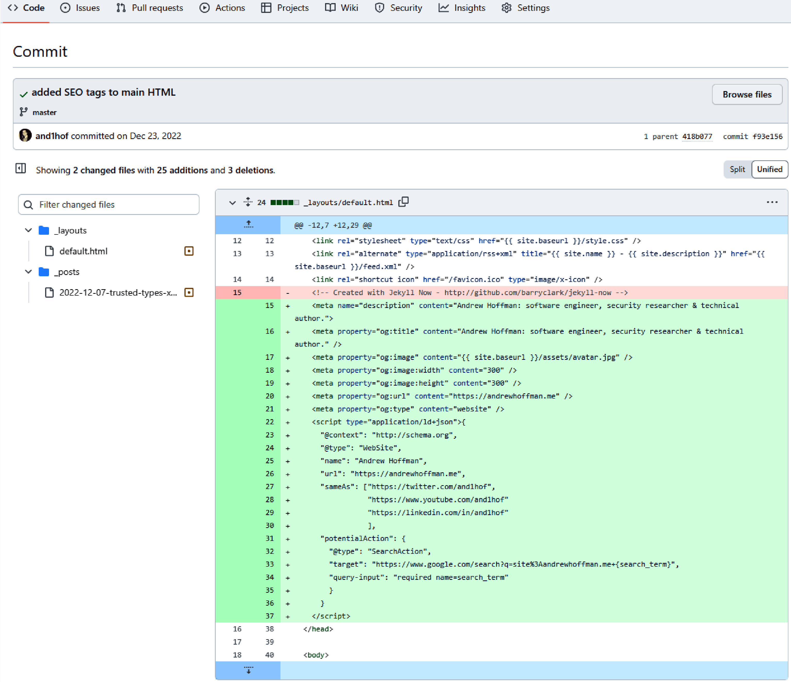

# Chapter 25: Reviewing Code for Security

## Code Security Review Timing

Code security reviews must occur after the architecture stage.

### Benefits of Code Security Reviews
- **Security:** Dramatically reduces the number of high-impact security bugs released into production.
- **Objective Perspective:** Provides an unbiased pair of eyes—often from outside the immediate development team—that may catch otherwise unknown bugs and architecture flaws.

### Review Strategies
- **Merge Request (Pull Request) Review**
  - **How it works:** Code is reviewed in a single sitting once the full feature set is developed and integrated.
  - **When to use:** Standard practice for most functionality and security reviews.
- **Granular Review (Per Commit / Pair-Programming)**
  - **How it works:** Consistent, ongoing review intertwined with the development process, focusing on smaller chunks of code.
  - **When to use:** Recommended for mission-critical security features requiring extremely high security consciousness.

## How to Start a Code Review

1. Pull the branch to a local development machine for comprehensive tool access.
2. Example flow:
   ```bash
   git checkout main
   git pull origin main
   git checkout <username>/feature
   git diff origin/main...
   ```
   This returns the list of different files and specific line changes.



## Vulnerability Types

- **Archetypical Vulnerabilities:** Common flaws (e.g., XSS, CSRF, SQL Injection) easily identified by automated tools or standard checklists.
- **Business Logic Vulnerabilities:** Flaws requiring deep context into the feature's goal, users, functionality, and business impact. Example: An API endpoint improperly validating a user's subscription status before allowing a premium action.

## Security Review Prioritization Framework

Begin reviews with highest-risk components. A proven framework to evaluate a web application:
1. **Client-Side Code:** Understand the business logic and user capabilities to define the attack surface.
2. **API Layer:** Evaluate APIs called by the client to understand data exchange and server-side entry points.
3. **Dependencies:** Trace API dependencies such as databases, logs, helper libraries, and file uploads.
4. **Unintentionally Exposed APIs:** Identify APIs built for future features or accidentally exposed to the public.
5. **Remaining Codebase:** Review the rest of the application in descending order of risk.

## Secure-Coding Anti-Patterns

Anti-patterns are hastily implemented or improperly understood solutions that introduce security risks.

### Blocklists vs. Allowlists

- **Blocklists (Anti-pattern)**
  - **How it works:** Rejects inputs matching a list of known malicious values.
  - **When to use:** Only as a temporary mitigation with a strict timeline for a permanent solution.
  - **Risk:** Inherently incomplete. Requires perfect knowledge of all current and future malicious inputs.
  ```javascript
  const blocklist = ['http://www.evil.com', 'http://www.badguys.net'];
  const isDomainAccepted = function(domain) {
    return !blocklist.includes(domain);
  };
  ```

- **Allowlists (Recommended)**
  - **How it works:** Failsafe mechanism that exclusively permits known-good inputs.
  - **When to use:** Always preferable for input validation and integrations.
  ```javascript
  const allowlist = ['https://happy-site.com', 'https://www.my-friends.com'];
  const isDomainAccepted = function(domain) {
    return allowlist.includes(domain);
  };
  ```

### Boilerplate Code
- **What:** Deploying default framework code or configurations without hardening.
- **Risk:** Abstractions might lack proper security mechanisms (e.g., older MongoDB instances exposed publicly without auth; Ruby on Rails boilerplate 404 pages leaking the framework version; EmberJS default landing pages left in production).
- **Fix:** Thoroughly evaluate and configure any boilerplate code prior to production release.

### Trust-by-Default (Improper Permissions)
- **What:** Running all application modules (e.g., logging, database access, disk writes) under a single, highly privileged service account.
- **Risk:** A single code execution vulnerability compromises all server resources.
- **Fix:** Implement a strict permission model. Isolate modules to run under separate users with the minimum required permissions.

### Client/Server Coupling
- **What:** Tightly bound client and server code (e.g., server parsing complex HTML containing auth logic instead of pure data formats).
- **Risk:** Difficult to enforce strict security boundaries and easier to exploit due to lack of separation.
- **Fix:** Develop client and server independently. Enforce communication over predefined data formats and network protocols.
