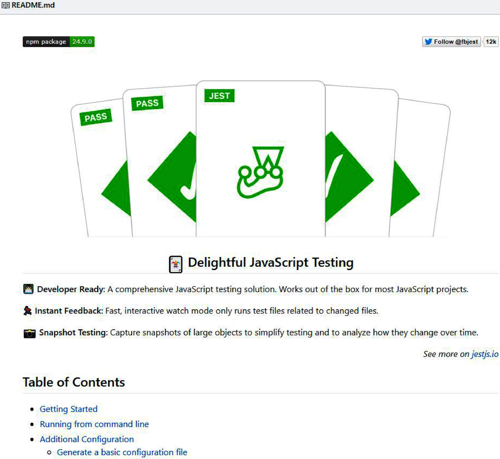

# Chapter 26: Vulnerability Discovery

Post-architecture and code review, vulnerability discovery processes targeting production code are essential. 

## Security Automation
Automated discovery catches routine flaws efficiently but struggles with complex, chained, or logical vulnerabilities.

### 1. Static Analysis
*   **How it works**: Analyzes source code without executing it, looking for syntax errors, common mistakes, and OWASP Top 10 vulnerabilities. Evaluates inputs, sinks, and basic code paths.
*   **When to use**: Continuously. Locally during development (linters), on-demand against repositories, and triggered on CI/CD commits/pushes. Best suited for statically typed languages.
*   **Tools**: Checkmarx (paid), PMD (Java), Bandit (Python), Brakeman (Ruby).
*   **Common Detections**:
    *   *General XSS*: DOM manipulation via `innerHTML`.
    *   *Reflected XSS*: Variables pulled from URL params.
    *   *DOM XSS*: Specific DOM sinks like `setInterval()`.
    *   *SQL Injection*: User-provided strings in queries.
    *   *CSRF*: State-changing `GET` requests.
    *   *DoS*: Improperly written regular expressions.
*   **Custom Configurations**: Can be configured to enforce secure coding practices, such as rejecting API endpoints missing proper authorization imports or inputs bypassing a single-source-of-truth validations library.
*   **Limitations**: High false-positive rate. Performs poorly on dynamically typed languages (e.g., JavaScript) because mutable objects and lack of typecasting obscure application state without runtime evaluation. 

### 2. Dynamic Analysis
*   **How it works**: Analyzes code post-execution by running the application, providing inputs, and comparing outputs against models of vulnerabilities/misconfigurations.
*   **When to use**: In production-like environments (servers, licenses configured) after deployment. Essential for dynamic languages and catching runtime-specific side-effects (e.g., sensitive data in memory, side-channel attacks).
*   **Tools**: IBM AppScan (paid), Veracode (paid), Iroh (free).
*   **Limitations**: Slower, more expensive, and requires significant upfront configuration compared to static analysis. Yields fewer false positives and deeper introspection.

### 3. Vulnerability Regression Testing
*   **How it works**: Automated tests (similar to functional tests) verifying that previously patched vulnerabilities do not re-enter the codebase. 
*   **When to use**: On CI/CD commit/push hooks or via scheduled daily runs.



#### Example: CSRF Regression Test
A vulnerable endpoint used `GET` for state changes. The fix was migrating to `POST`. The regression test ensures the endpoint only accepts `POST`.

**Vulnerable Endpoint Code:**
```javascript
app.get('/changeSubscriptionTier', function(req, res) {
  if (!currentUser.isAuthenticated) { return res.sendStatus(401); }
  if (!req.params.newTier) { return res.sendStatus(400); }
  if (!tiers.includes(req.params.newTier)) { return res.sendStatus(400); }

  modifySubscription(currentUser, req.params.newTier)
    .then(() => {
      return res.sendStatus(200);
    })
    .catch(() => {
      return res.sendStatus(400);
    });
});
```

**Regression Test Code:**
```javascript
// Regression test ensuring the endpoint only accepts POST requests
const tester = require('tester');
const requester = require('requester');

const testTierChange = function() {
  requester.options('http://app.com/api/changeSubscriptionTier')
    .on('response', function(res) {
      if (!res.headers) { 
        return tester.fail(); 
      } else {
        const verbs = res.headers['Allow'].split(',');
        if (verbs.length > 1) { return tester.fail(); }
        if (verbs[0] !== 'POST') { return tester.fail(); }
      }
    })
    .on('error', function(err) {
      console.error(err);
      return tester.fail();
    });
};
```

## External Vulnerability Discovery

### Responsible Disclosure Programs
*   **How it works**: A formalized, publicized method for users to report discovered vulnerabilities without facing legal retaliation. Usually includes submission templates, safe harbor clauses, and embargo periods preventing public disclosure until patched.
*   **When to use**: Mandatory baseline for any application to capture unreported flaws found by end-users.

### Bug Bounty Programs
*   **How it works**: Incentivizes independent security researchers by offering cash rewards for valid vulnerability reports. Facilitated through platforms that handle triage and legal templates.
*   **When to use**: To actively encourage crowdsourced penetration testing by freelance hackers.


### Third-Party Penetration Testing
*   **How it works**: Contracting security firms to audit specific application segments. Unlike bug bounty hunters, firms can be legally provided with source code (white-box testing) for deeper evaluation and assigned specific scopes.
*   **When to use**: Prior to releasing high-risk features into production, or for periodic audits of critical legacy codebase areas.
