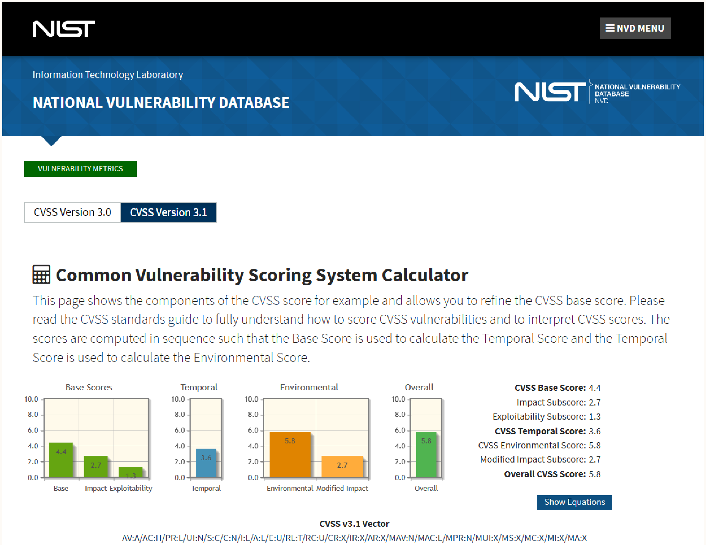
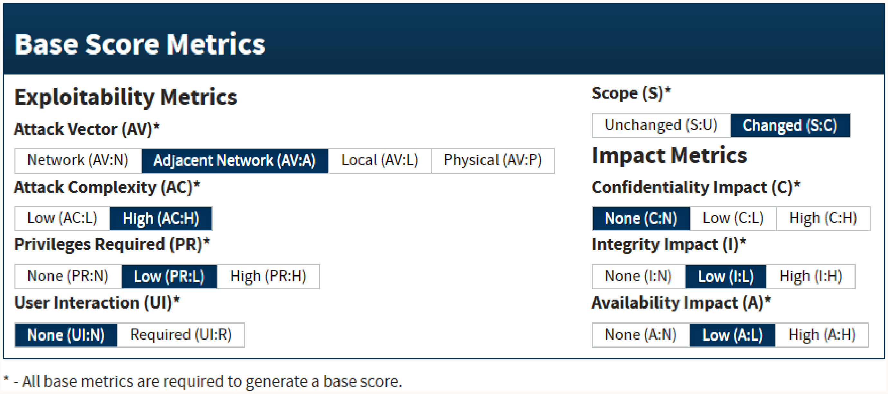
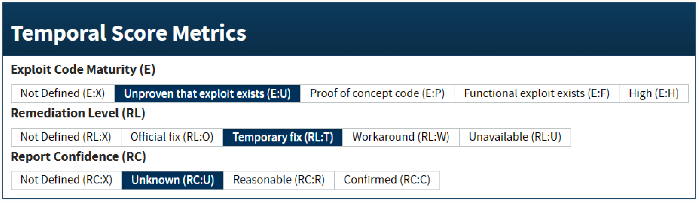
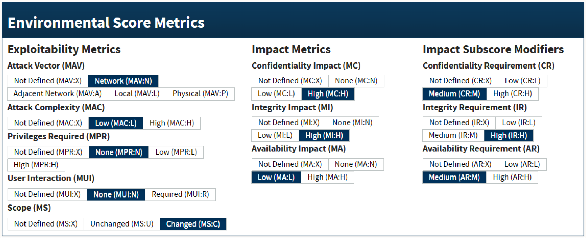

# Chapter 27: Vulnerability Management

Vulnerability management is the pipeline for obtaining, triaging, and resolving vulnerabilities found in applications.

## Reproducing Vulnerabilities

The first step in managing a vulnerability report is reproduction in a production-like environment.

*   **How it works**: Use a fully automated staging environment that closely mimics production but uses mock users and objects instead of real customer data. Additionally, prior to releasing a new feature, it should be available in an internal build (accessible via internal network or encrypted login) to facilitate testing.
*   **When to use**: Immediately upon receiving a vulnerability report (e.g., internal finding, bug bounty report).
*   **Benefits**: 
    *   Eliminates false positives (saving engineering time and bounty payouts).
    *   Differentiates actual vulnerabilities from user-configuration errors.
    *   Provides deep technical insight into the root cause in the codebase.

## Ranking Vulnerability Severity: Common Vulnerability Scoring System (CVSS)

CVSS is the industry-standard, no-cost framework for ranking vulnerabilities based on exploitability and impact. Version 3.1 breaks scoring into Base, Temporal, and Environmental metrics.

### 1. CVSS Base Scoring

Scores the vulnerability in a vacuum based on eight inputs, resulting in a severity score from 0 to 10.

**Inputs (How it works):**
*   **Attack Vector (AV)**: Delivery method (Network, Adjacent, Local, Physical). Network is highest severity.
*   **Attack Complexity (AC)**: Difficulty of exploit (Low, High). Low means repeatable without specific setup.
*   **Privileges Required (PR)**: Authorization needed (None, Low, High).
*   **User Interaction (UI)**: Is target user interaction required? (None, Required).
*   **Scope (S)**: Range of impact (Unchanged, Changed). "Changed" means the exploit spreads beyond the targeted functionality (e.g., to OS/filesystem).
*   **Confidentiality Impact (C)**: Type of data compromised (None, Low, High).
*   **Integrity Impact (I)**: Application state changes (None, Low, High). This applies to server data as well as local client-side stores in a web application (local storage, session storage, IndexedDB).
*   **Availability Impact (A)**: Interruption to legitimate users (None, Low, High). This is important for evaluating DoS attacks or code execution attacks that intercept intended functionality.

**Severity Mapping:**
*   0.1–4.0: Low
*   4.1–6.9: Medium
*   7.0–8.9: High
*   9.0+: Critical

### 2. CVSS Temporal Scoring

Scores how well-equipped the organization is to deal with the vulnerability given its state at the time of reporting.

**Categories:**
*   **Exploitability**: Is it a theory/PoC, or a deployable, working exploit?
*   **Remediation Level**: Availability of mitigations (e.g., Official Fix vs. Unavailable).
*   **Report Confidence**: Quality of the report (e.g., Unknown vs. Confirmed with reproduction steps).

### 3. CVSS Environmental Scoring

Scores the vulnerability relative to the specific application's business and context requirements.

**Additional Inputs:**
*   **Confidentiality Requirement**: High for apps with strict contractual needs (healthcare, gov).
*   **Integrity Requirement**: High for systems storing crucial records (tax data) vs. throwaway sandboxes.
*   **Availability Requirement**: High for systems requiring 24/7 uptime.

## Advanced Vulnerability Scoring

Organizations should evolve beyond CVSS if their architecture demands it.
*   **When to use**: For applications interacting with physical technology, IoT devices, or non-standard deployment models. Custom algorithms better encapsulate specific business risks (e.g., physical safety, regulatory non-compliance from leaked camera feeds).

## Beyond Triage and Scoring

Post-triage vulnerability resolution involves strict engineering practices. While scoring prioritizes fixes, **other business-centric metrics (customer contracts, business relationships)** must also be considered.

1.  **Permanent Application-Wide Fixes**: Vulnerabilities should be resolved holistically across the entire codebase.
2.  **Handling Partial Fixes**: If a permanent fix is unavailable, a temporary/partial fix can be shipped. However, **never close the original bug** unless a new bug is explicitly opened detailing the remaining vulnerable surface area.
3.  **Regression Testing**: Every closed security bug *must* ship with a corresponding regression test to prevent accidental reintroduction.
