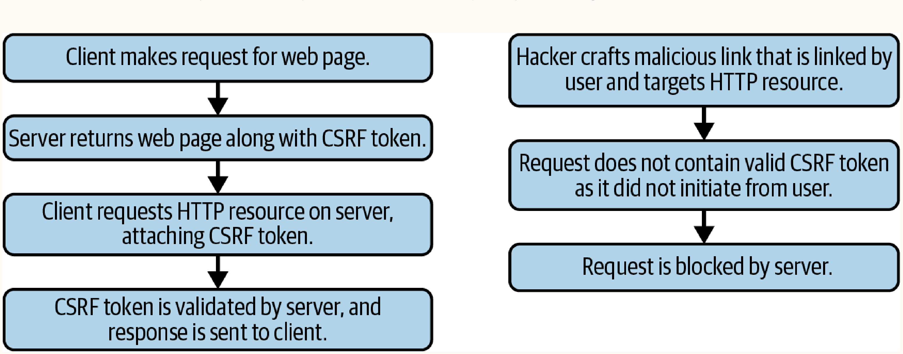

# Chapter 29. Defending Against CSRF Attacks

## 1. Header Verification
**How it works:** Validates the origin of incoming HTTP requests by checking two headers that cannot be modified programmatically with JavaScript in major browsers:
- `Origin` header: Sent only on HTTP POST requests. Indicates where the request originated.
- `Referer` header: Sent on all requests (except when the referring link has `rel=noreferer`). Indicates where the request originated from.

**When to use:** Use as a first line of defense to quickly reject requests from untrusted origins. Best employed in conjunction with other defenses (like CSRF tokens).

**Limitations:** Can be bypassed if an attacker achieves Cross-Site Scripting (XSS) on an allowlisted origin, allowing them to initiate attacks from a trusted source.

```javascript
const validLocations = [
  'https://www.mega-bank.com',
  'https://api.mega-bank.com',
  'https://portal.mega-bank.com'
];

// Basic validation checking if headers match trusted locations
const validateHeadersAgainstCSRF = function(headers) {
  const origin = headers.origin;
  const referer = headers.referer;
  // Whenever possible, check both headers. If neither is present, reject the request.
  if (!origin || !referer) return false; 
  if (!validLocations.includes(origin) || !validLocations.includes(referer)) {
    return false;
  }
  return true;
};
```

## 2. CSRF Tokens (Anti-CSRF Tokens)
The most powerful and common defense against CSRF attacks. 



**How it works:**
1. The server generates a unique, cryptographically secure token (low collision algorithm) per session or request.
2. The client includes this token in all state-changing requests (forms, AJAX).
3. The server verifies the token's authenticity, expiration, and manipulation before processing the request. 

**When to use:** Use as the primary defense mechanism against CSRF for any application that manages user sessions.

### Stateless CSRF Tokens
For modern stateless APIs, managing stateful CSRF tokens is resource-intensive. A stateless CSRF token can be constructed using encryption, containing:
- A unique user identifier.
- A timestamp (for expiration).
- A cryptographic nonce (whose key only exists on the server).

## 3. Anti-CRSF Coding Best Practices

### Stateless GET Requests
**How it works:** Ensure HTTP GET requests never store or modify server-side state. Separate data retrieval (GET) and data modification (POST/PUT/DELETE) into distinct endpoints.
**When to use:** Universally applicable. It is a fundamental architecture principle to prevent CSRF attacks via easily distributable vectors like links (`<a>`) or images (``).

**Vulnerable Architecture Example:**
```javascript
// Vulnerable: Modifies state on GET
const user = function(req, res) {
  getUserById(req.query.id).then((user) => {
    if (req.query.updates) { user.update(req.updates); }
    return res.json(user);
  });
};
```

### Application-Wide CSRF Mitigation via Middleware
**How it works:** Implement application-wide middleware that runs on every server-side route prior to any business logic. This middleware should strictly enforce header verification and CSRF token validation.
**When to use:** Use in any web framework that supports request lifecycle middleware (e.g., Express.js) to ensure no endpoints are accidentally left unprotected.

```javascript
// Middleware requires robust helper functions to validate headers based on method:
const validateHeaders = function(headers, method) {
  const origin = headers.origin;
  const referer = headers.referer;
  let isValid = false;
  
  if (method === 'POST') {
    isValid = validLocations.includes(referer) && validLocations.includes(origin);
  } else {
    isValid = validLocations.includes(referer);
  }
  return isValid;
};

// And to decrypt and validate the stateless CSRF token:
const validateCSRFToken = function(token, user) {
  const text_token = crypto.decrypt(token);
  const user_id = text_token.split(':')[0];
  const date = text_token.split(':')[1];
  const nonce = text_token.split(':')[2];
  
  let validUser = false;
  let validDate = false;
  let validNonce = false;
  
  if (user_id === user.id) { validUser = true; }
  if (dateTime.lessThan(1, 'week', date)) { validDate = true; }
  if (crypto.validateNonce(user_id, date, nonce)) { validNonce = true; }
  
  return validUser && validDate && validNonce;
};

// The main application-wide middleware:
const CSRFShield = function(req, res, next) {
  if (!validateHeaders(req.headers, req.method) || 
      !validateCSRFToken(req.csrf, session.currentUser)) {
    logger.log(req);
    return res.sendStatus(401); // Reject unauthorized
  }
  return next(); // Proceed to route logic
};
```

**Client-Side Automation:**
To support backend middleware, clients should automatically inject the CSRF token into all requests. Techniques include using the Proxy pattern to overwrite default `XMLHttpRequest`/`fetch` behavior, or creating a wrapper library for HTTP requests.
