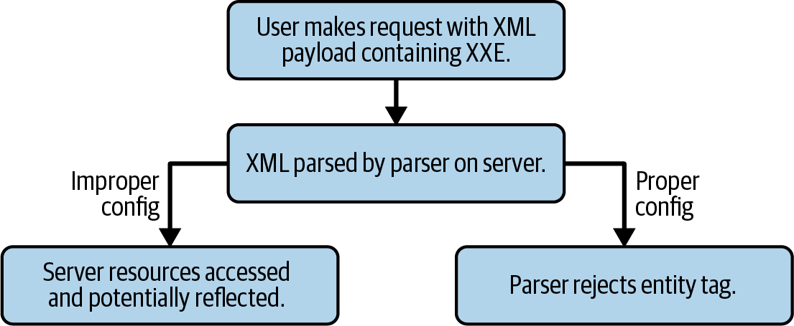

# Chapter 30. Defending Against XXE

## Mitigation Strategy
Generally, XXE is mitigated by disabling external entities in the XML parser. This usually requires a single line of configuration.

**Code Example:**
```java
factory.setFeature("http://apache.org/xml/features/disallow-doctype-decl", true);
```

**How it works:**
The parser is configured to reject external entity tags (`!DOCTYPE` declarations), preventing the parser from accessing and reflecting server resources.

**When to use:**
Apply this to any application utilizing server-side XML parsing. *Note:* Java-based XML parsers are particularly vulnerable as XXE is often enabled by default. Always verify your XML parser's API documentation; never assume default security.



## Evaluating Other Data Formats
Re-architecting an application to use JSON or other formats (YAML, BSON, EDN) can entirely eliminate XXE risk.

### JSON vs XML

| Category | XML | JSON |
| :--- | :--- | :--- |
| Payload size | Large | Compact |
| Specification complexity | High | Low |
| Ease of use | Requires complex parsing | Simple parsing for JS compatibility |
| Metadata support | Yes | No |
| Rendering | Easy | Difficult |
| Mixed content | Supported | Unsupported |
| Schema validation | Supported | Unsupported |
| Object mapping | None | JavaScript |
| Readability | Low | High |
| Comment support | Yes | No |
| Security | Lower | Higher |

**When to use JSON:**
- APIs dealing with lightweight structured data for JavaScript clients.
- APIs requiring flexibility and ongoing development (less rigid contract).

**When to use XML:**
- Applications processing actual XML, SVG, or DOM-derived types.
- Applications requiring schema validation for deeply rigid data structures.
- Payloads that will eventually be rendered via HTML-like structuring.

**Security Note:**
XML's security risks primarily stem from the power of its specification, specifically its ability to incorporate external files and multimedia. This makes it naturally less secure than JSON, which simply stores key/value pairs in a string-based format.

## Advanced XXE Risks

**How it works:**
XXE frequently begins as a read-only exploit but functions as a "gateway" or reconnaissance platform, exposing data typically inaccessible outside the web server.

**Impact:**
The acquired data facilitates deeper compromise, escalating the attack from read-only access to potential Remote Code Execution (RCE) and full server takeover.

## Summary
Improperly configured XML parsers are common in production web applications, making XXE attacks widespread despite being easy to mitigate. Given the severe potential damage to an organization, application, or brand, it is imperative to double-check each XML parser configuration prior to publishing any application that makes use of XML or XML-like data types.
