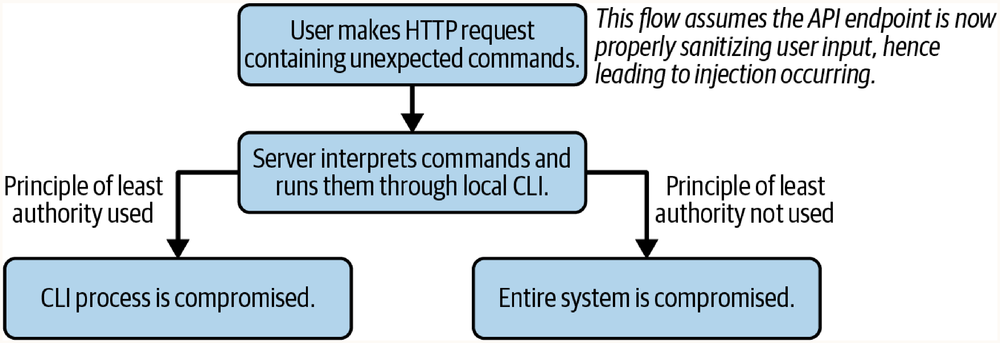

# Chapter 31. Defending Against Injection

## Mitigating SQL Injection
SQL injection is the most common form of injection attack. Defenses against it often apply to other injection forms.

### Detecting SQL Injection
Look for SQL operations in the codebase. Usually, these happen on the server (past routing). Find all database adapters (e.g., MySQL, MSSQL) and generic DSLs.

```javascript
// Example: Node.js SQL adapter imports
const sql = require('mssql');
// OR
const mysql = require('mysql');
```

```javascript
// Example: Vulnerable literal syntax query
const sql = require('sql');
const getUserByUsername = function(username) {
  const q = new sql();
  q.select('*');
  q.from('users');
  q.where(`username = ${username}`); // Vulnerable to injection
  q.then((res) => {
    return `username is : ${res}`;
  });
};
```

### Prepared Statements

- **How it works**: Queries are compiled first with placeholders (bind variables) for variables. Then, user-supplied data replaces the placeholders at runtime. The intention of the query is locked before user data is evaluated, preventing manipulation of the SQL operation (e.g., turning a `SELECT` into a `DELETE`).
- **Performance Trade-off**: Requires two trips to the database (one for compiling the statement and one for executing it with variables at runtime). However, in most applications, this performance loss is minimal.
- **When to use**: Always. Prepared statements are the primary defense against SQL injection and are supported by almost all major SQL databases.

```sql
-- Example: MySQL Prepared Statement
PREPARE q FROM 'SELECT name, barCode from products WHERE price <= ?';
SET @price = 12;
EXECUTE q USING @price;
DEALLOCATE PREPARE q;
```

### Database-Specific Defenses

- **How it works**: Databases offer native functions to automatically escape risky characters in SQL queries.
- **When to use**: Use as a secondary mitigation or when a query cannot be parameterized. It is not a comprehensive defense.

**Examples:**
- **Oracle (Java)**: `ESAPI.encoder().encodeForSQL(new OracleCodec(), str);`
- **MySQL**: `SELECT QUOTE('test''case');` (Escapes backslashes, single quotes, NULL). Also `mysql_real_escape_string()`.

## Generic Injection Defenses
Injection can also target command-line utilities or interpreters (Command Injection).

**High-risk targets include:**
- Task schedulers
- Compression/optimization libraries
- Remote backup scripts
- Databases
- Loggers
- Any call to the host OS
- Any interpreter or compiler
- **Dependencies**: Third-party packages often bring in sub-dependencies that fall into the high-risk categories above.

### Principle of Least Authority (Least Privilege)

- **How it works**: Each module or service in a system only has access to the data and resources strictly required to perform its job.
- **When to use**: System architecture and service deployment. It limits the blast radius if a component is compromised.



### Allowlisting Commands

- **How it works**: Instead of passing user-submitted commands directly to a server interpreter, validate input against a strict, pre-defined allowlist of acceptable commands, syntaxes, order, and frequency. Reject anything not on the list.
- **When to use**: Whenever user input must translate into server-side operations or CLI executions. Never use a blocklist, as new commands may introduce unforeseen vulnerabilities.

**Vulnerable Implementation:**

*Client-side HTML:*
```html
<div class="options">
  <h2>Commands</h2>
  <input type="text" id="command-list"/>
  <button type="button" onclick="sendCommands()">Send Commands to Server</button>
</div>
```

*Server-side Node.js:*
```javascript
const cli = require('../util/cli');

/* Accepts commands from the client, runs them against the CLI. */
const postCommands = function(req, res) {
  cli.run(req.body.commands); // Executes user-supplied commands directly
};
```

**Secure Implementation (Allowlist):**
```javascript
const cli = require('../util/cli');
const commands = [
  'print',
  'cut',
  'copy',
  'paste',
  'refresh'
];

/* Accepts commands from the client ONLY if they appear in the allowlist array. */
const postCommands = function(req, res) {
  const userCommands = req.body.commands;
  userCommands.forEach((c) => {
    if (!commands.includes(c)) { return res.sendStatus(400); }
  });
  cli.run(req.body.commands);
};
```
