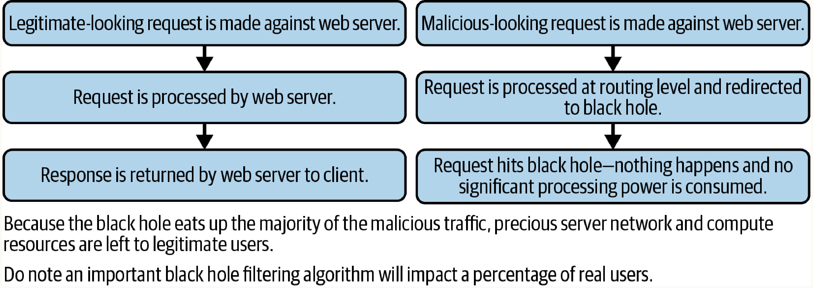

# Chapter 32: Defending Against DoS

## DoS Mitigation Strategy
- **Logging**: Implement comprehensive server logging including request details and response times. Log the performance of asynchronous, background "job"-style functions to uncover hidden server-side DoS vulnerabilities.
- **Threat Model**: DoS attacks typically target one or more of the following:
  - Exhaust server resources
  - Exhaust client resources
  - Request unavailable resources
  - Deny access to resources

## Protecting Against Regex DoS
- **Vulnerability**: Regular expressions performing significant backtracing against repeated groups.
  - Example pattern: `(a[ab]*)+` (`+` performs a greedy match, `*` matches the subexpression repeatedly).
- **Prevention**:
  - **Static Analysis**: Use OSS static analysis tools (linters) and regex performance testers to scan for and block "evil regex" from entering the codebase.
  - **User Input Restriction**: Never allow user-supplied or uploaded regular expressions. Ensure integrated applications do not rely on user-supplied or poorly written regex.

## Protecting Against Logical DoS
- **Vulnerability**: Segments of logic accidentally introduced by developers that can be abused to consume system resources. Unlike binary vulnerabilities (e.g., XSS), logical DoS is measured on a scale of exploitability depending on the attacker's resources and the victim's device power (e.g., an exploitable client-side function might be unnoticed on a powerful desktop but paralyze an older mobile device). Generally, extremely difficult to exploit code is considered "safe," while the rest is "vulnerable."
- **Prevention**: Identify areas utilizing critical system resources. Categorize exposed functionality by DoS risk (high/medium/low) and err on the side of caution.

## Protecting Against DDoS
- **Overview**: Orchestrated from centralized sources using botnets (compromised PCs, mobile devices, IoT routers, etc.) to overwhelm a target with sheer volume of legitimate-looking traffic, locking out actual users.
- **Mitigation Strategies**:

### Bandwidth Management Service
- **How it works**: Third-party vendor services analyze incoming packets before they reach your web server. Packets matching malicious patterns are intercepted and dropped.
- **When to use**: The most effective and easiest initial defense, capable of intercepting large request quantities that standard web infrastructure cannot handle.

### Blackholing
- **How it works**: Suspicious or repeated traffic is routed to a "blackhole" server. This server appears to function like the application server but performs no operations, saving precious server network and compute resources. Legitimate traffic is routed normally.
- **When to use**: Effective against small DDoS attacks. Performs poorly against large-scale DDoS attacks and risks rerouting legitimate traffic if targeting lacks accuracy.

> **Important**: Deep metrics on legitimate user usage patterns must be established before implementing aggressive DDoS mitigations to avoid blocking legitimate traffic with oversensitive filters.
