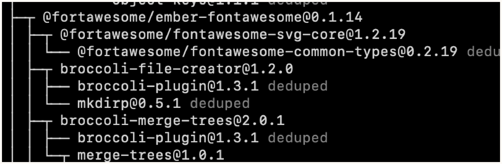

# Chapter 35. Securing Third-Party Dependencies

## Evaluating Dependency Trees
Third-party dependencies often rely on their own subdependencies (fourth-party dependencies), forming a comprehensive **dependency tree**.



### Modeling a Dependency Tree
Modeling a dependency tree identifies redundant dependencies across different parts of an application. It allows standardizing dependency versions to minimize the attack surface and memory overhead.

### Dependency Trees in the Real World
In practice, different subdependencies may rely on differing versions of the same library (e.g., `JQuery 3.4.0` vs `JQuery 2.2.1`). Because one version may contain vulnerabilities while another does not, it is critical that **each unique version** of each unique dependency is evaluated independently.

### Automated Evaluation
Manually evaluating large dependency trees is impossible. Trees must be modeled in memory and evaluated iteratively against CVE (Common Vulnerabilities and Exposures) databases (e.g., NIST).

- **How it works**: Use a third-party scanner (like Snyk) or an automated script to convert the dependency tree into a list and cross-reference it with a remote CVE database. For example, to list the dependency tree in npm:
  ```bash
  npm list --depth=[depth]
  ```
- **When to use**: Implement as a standard CI/CD step for all projects utilizing package managers to continuously monitor for vulnerable packages across thousands of dependencies.

## Secure Integration Techniques

### Separation of Concerns
Running third-party code on the main application server poses a risk of system compromise if the principle of least authority is not strictly implemented.

- **How it works**: Run the third-party integration on an isolated server. The primary server communicates with the isolated server via HTTP using JSON payloads. This ensures the dependency acts as a "pure function" and prevents script execution on the primary server (mitigating vulnerability chaining). Alternatively, implement hardware-defined process and memory boundaries on a single server.
  - *Edge Cases/Risks*: Any confidential data sent to the isolated dependency server could still be modified or recorded if the dependency is compromised. Furthermore, HTTP communication introduces application performance overhead due to in-transit network time.
- **When to use**: Use for high-risk integrations where the dependency does not require tight coupling with the core application state, and the latency of HTTP/inter-process communication is acceptable.

### Secure Package Management
Package managers (like npm or Maven) typically auto-update to the latest patch versions (e.g., via the `^` caret in npm), potentially pulling in vulnerable code without the application owner's knowledge.

- **How it works**:
  1. **Strict Versioning**: Remove the caret (`^`) in `package.json` to lock the top-level dependency to an exact version (e.g., `1.0.24` instead of `^1.0.24`).
  2. **Shrinkwrapping**: Since strict versioning doesn't apply to descendant subdependencies, generate a lockfile locking the *entire* tree:
     ```bash
     npm shrinkwrap
     ```
     This creates an `npm-shrinkwrap.json` file, pinning the exact version of the entire dependency and subdependency tree.
  3. **Advanced Locking**: To eliminate the risk of a maintainer overwriting an existing version number with malicious code, modify the shrinkwrap file to reference explicit Git SHAs or deploy a private package mirror containing verified versions.
- **When to use**: Mandatory for all applications relying on package managers to guarantee reproducible builds and protect against unverified downstream updates or supply-chain attacks.
