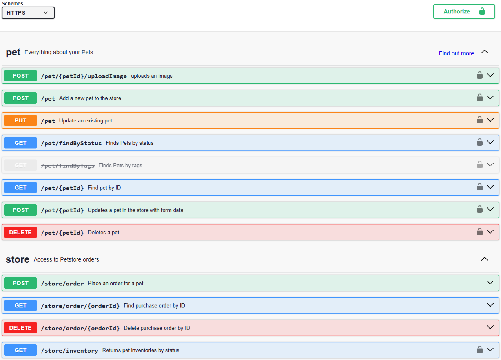
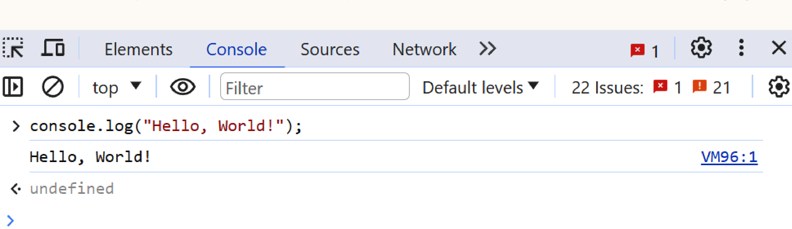
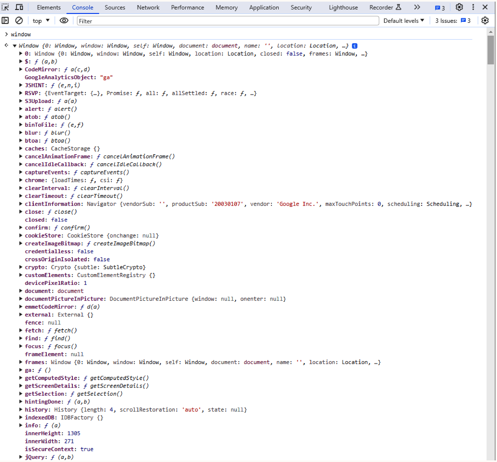
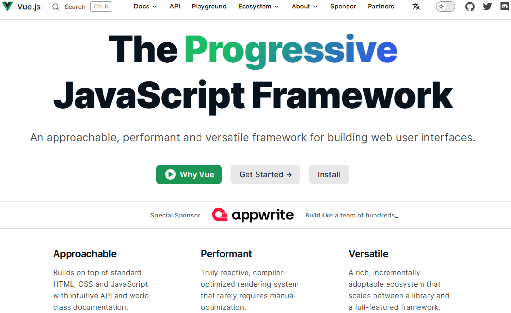
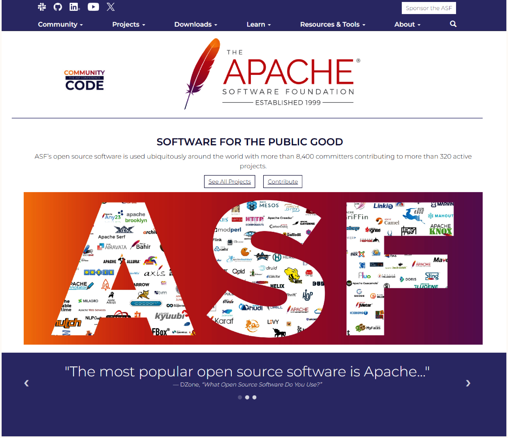
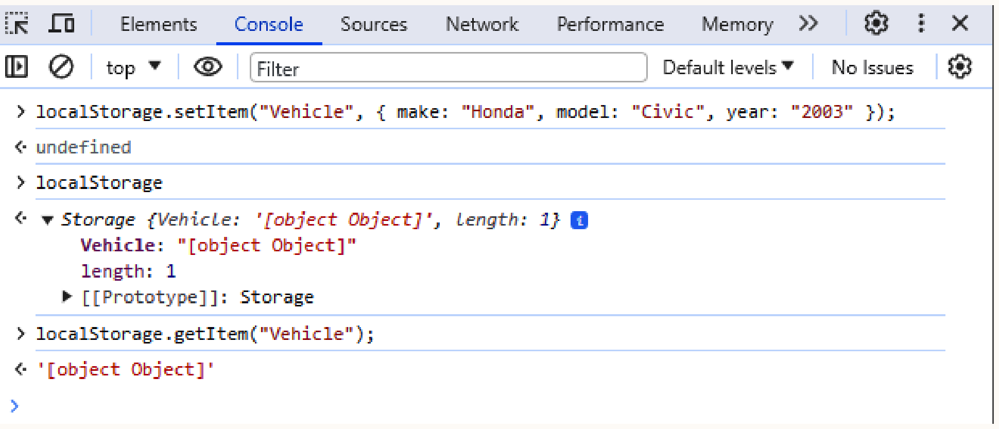
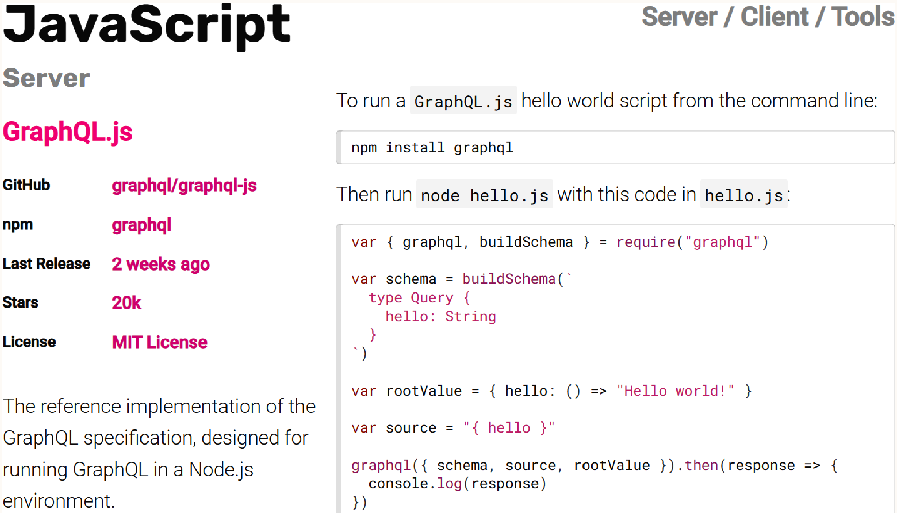
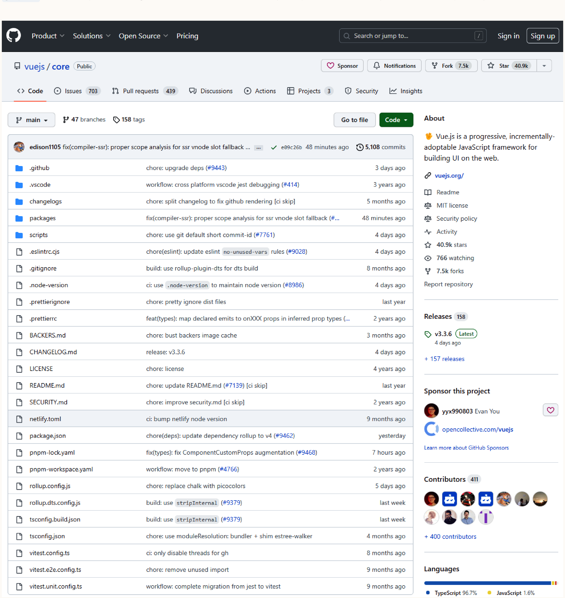
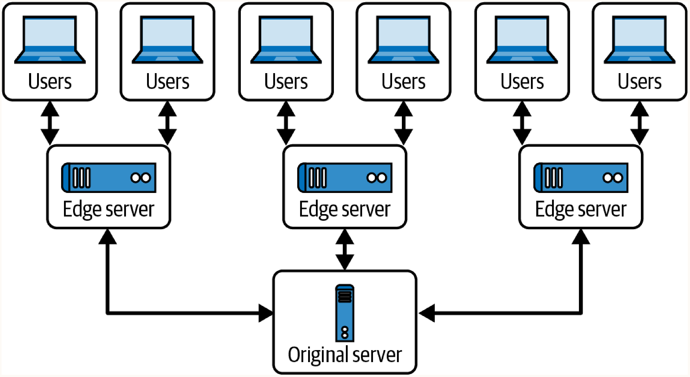

# Chapter 3: The Structure of a Modern Web Application

## Modern vs Legacy Web Applications
- **Legacy**: Monolithic applications where the server renders HTML/CSS/JS. Updates require full page reloads.
- **Modern**: Decoupled architecture. Typically composed of multiple APIs communicating over a network protocol.
- **Key Technologies**: REST APIs, JSON, JavaScript, SPA frameworks, web servers, databases, client-side data stores.
- **Upcoming Technologies**: Cache API, WebSockets, and Web Assembly for non-JavaScript client-side code.

## REST APIs
- **How it works**: Representational State Transfer maps HTTP verbs to resources. Follows a strict structural pattern instead of exposing server-side logic directly. Tools like Swagger are often used for automatic API documentation.
- **When to use**: Building scalable, stateless web APIs.
- **Traits**:
  - **Separation**: Client decoupled from API logic.
  - **Stateless**: No state stored on connection. Authentication tokenized per request.
  - **Cacheable**: Caching easily configured per endpoint.
  - **Endpoint Specificity**: Hierarchical, self-documenting endpoints (e.g., `GET /moderators/joe`, `PUT /moderators/joe`).

## JSON (JavaScript Object Notation)
- **How it works**: Lightweight, human-readable, hierarchical data format.
- **When to use**: Standard in-transit data format for modern web apps (largely replacing SOAP/XML).
- **Details**: Native browser support enables fast parsing and maps directly to JavaScript objects.

## JavaScript

### Variables & Scope
- `var`: Function-scoped or globally scoped. Hoisted. Globals attach to the `window` object, risking namespacing conflicts. Note: Defining a variable without any keyword (e.g., `age = 25`) also attaches it to the global `window` object.
- `let`: Block-scoped, mutable.
- `const`: Block-scoped, immutable assignment (properties of the object can still mutate). Attempting reassignment results in a `TypeError`.

### Functions
Functions are first-class objects, meaning they can be assigned and reassigned.
- Types: Named, Anonymous, Arrow functions, and IIFEs (Immediately Invoked Function Expressions for encapsulation).

### Context (`this`)
Represents function runtime state. Managed via:
- `bind(ctx)`: Returns a new function mapped to the context.
- `call(ctx, arg1)`: Executes with context and an argument list.
- `apply(ctx, [args])`: Executes with context and an argument array.
- Arrow functions `() => {}` automatically inherit the context of their parent function.

### Prototypal Inheritance
- **How it works**: JavaScript objects inherit from prototypes (via the `__proto__` property), allowing objects to instantiate new objects without strict class blueprints. Since JS inheritance trees are mutable, changes to a prototype (like adding a function) propagate to all child objects in real-time.
- **Security implication**: Prototypes can be modified at runtime. **Prototype Pollution** attacks allow malicious modification of parent objects, inadvertently changing child object functionality.

### Asynchrony
Handles unpredictable network request times.
- **Callbacks**: Passed into async functions, but can lead to difficult-to-read code.
- **Promises**: Reusable objects executing on completion (`.then()`, `.catch()`).
- **Async/Await**: Syntactic sugar over Promises. `await` halts execution within an `async` function until resolution, keeping the code highly readable.

## Browser DOM (Document Object Model)
- **How it works**: Hierarchical tree of nodes used to manage state in modern web browsers.
- **Key Objects**: `window` (topmost global context) and `document` (DOM tree root).
- **Security implication**: Not all script-related vulnerabilities are JS flaws; some stem from improper DOM implementation.

## SPA Frameworks
- **How it works**: Provide reusable UI components managing their own lifecycle, from rendering to logic execution. Internal state is stored on the client.
- **When to use**: Building complex, logic-rich web applications without requiring full page reloads.
- **Examples**: ReactJS, EmberJS, VueJS, AngularJS.

## Authentication & Authorization
- **Authentication (AuthN)**: Identifying a user.
  - **Basic Auth**: Base64 encoded credentials in header (vulnerable to XSS and WiFi interception without HTTPS).
  - **Digest Auth**: Cryptographic hashes (defends against interception and replay attacks).
  - **OAuth**: Token verification via third-party providers (Facebook, Google). Dangerous if one provider is compromised.
  - Note: These are often coupled with Multifactor Authentication (MFA) to ensure tokens aren't compromised.
- **Authorization (AuthZ)**: Determining resource access limits.
  - Centralized authorization classes are preferred over per-API checks to minimize human error and logic fragmentation.
  - Common resources requiring strict checks: settings/profile updates, password resets, private messages, paid functionality, and moderation actions.

## Web Servers
- **Apache**: Highly configurable, pluggable, open-source. Still widely used.
- **NGINX**: Built for high-volume applications with large numbers of unique connections. Less architectural overhead per connection. Its parent company (F5 Networks) uses a paid+ model for additional features.
- **IIS**: Microsoft environments, ideal for MS-specific technologies. Popularity has diminished due to expensive licenses and poor compatibility with open source software (OSS).

## Databases
### Server-Side
- **SQL**: Strict query language, reliable (PostgreSQL, MySQL, Microsoft SQL Server, SQLite). Susceptible to SQL Injection.
- **NoSQL**: Schema-less, flexible documents (MongoDB, CouchDB, DocumentDB). Not as easy or efficient at querying/aggregating as SQL.
- **Specialized**: Search engine databases requiring synchronization (Elasticsearch).

### Client-Side
- **Local Storage**: Browser-managed, persistent key/value storage. Protected by the Same Origin Policy (SOP).
- **Session Storage**: Operates like local storage but clears when the tab is closed.
- **IndexedDB**: Asynchronous, queryable NoSQL database natively in the browser. Can be checked via `if (window.indexedDB)`.
- **Security implication**: Poorly architected apps may store sensitive information (like authentication tokens or secrets) in client-side data stores.

## GraphQL
- **How it works**: API query language often implemented by wrapping existing REST API endpoints.
- **When to use**: To reduce network latency/hops by allowing clients to bundle requests and fetch exact hierarchical data structures in a single query.
- **Security implication**: Allows complex client-side queries against existing server resources, demanding thorough access control logic.

## Version Control Systems & CI/CD
- **How it works**: Git tracks code variations, handles branches, and integrates with Continuous Integration/Continuous Deployment (CI/CD) pipelines to automate testing and build deployments.
- **Security implication**: An application's holistic attack surface includes the VCS and CI/CD pipelines, where a compromise can be catastrophic.

## CDN/Cache
- **How it works**: Distributes static or infrequently updated content geographically via edge nodes. Local and browser caches are configured via HTTP headers like `etag` or `cache-control`.
- **When to use**: To scale globally, reduce web server load, and provide lower latency.
- **Security implication**: Stale caches can lead to privilege escalation or information disclosure. The expansion of client-side, local, and network caches broadens the application attack surface.

