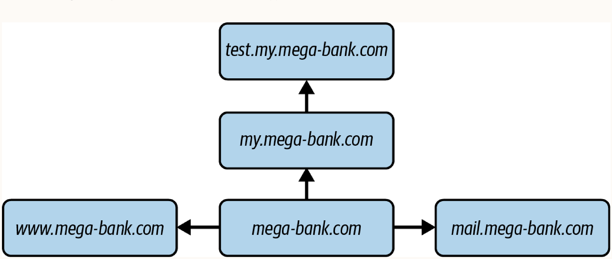
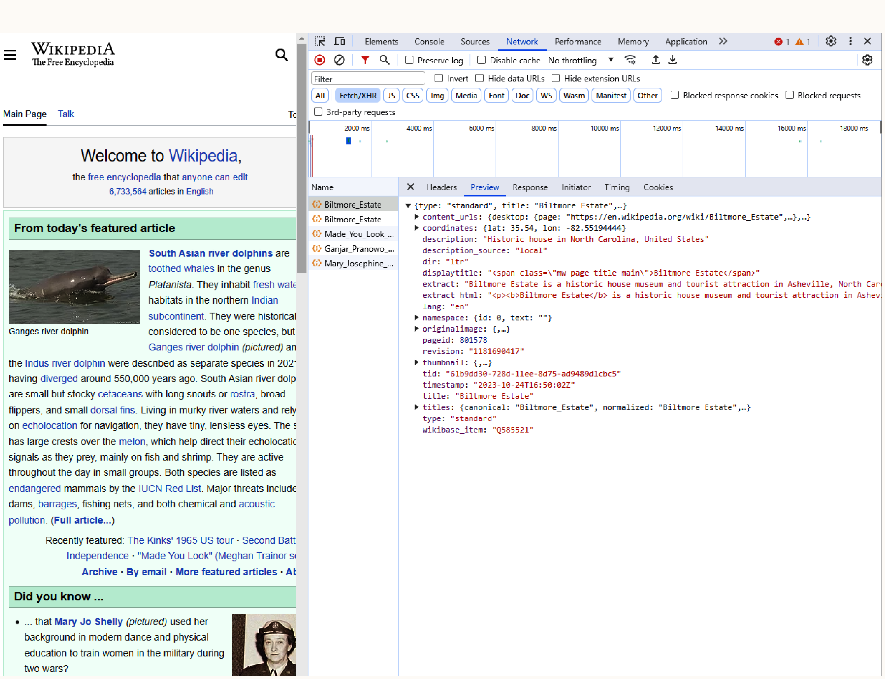
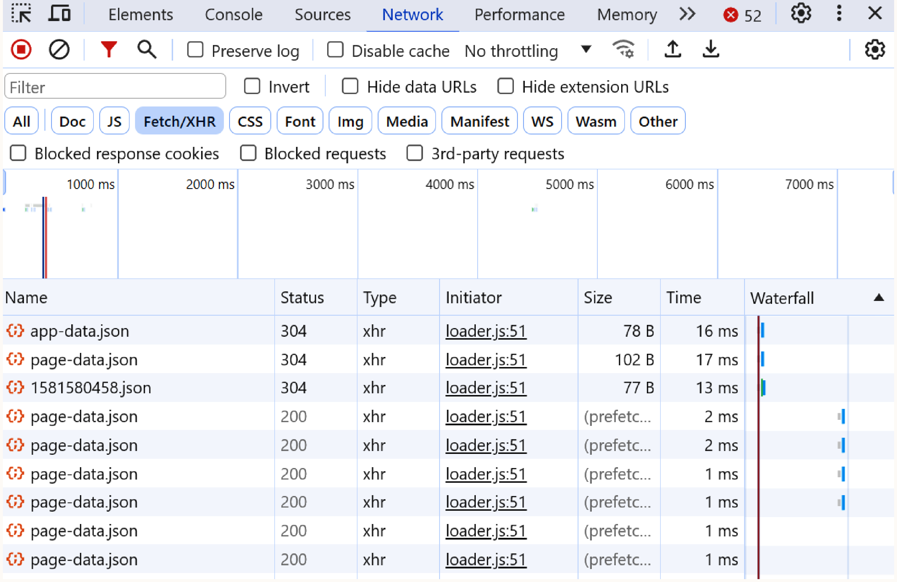
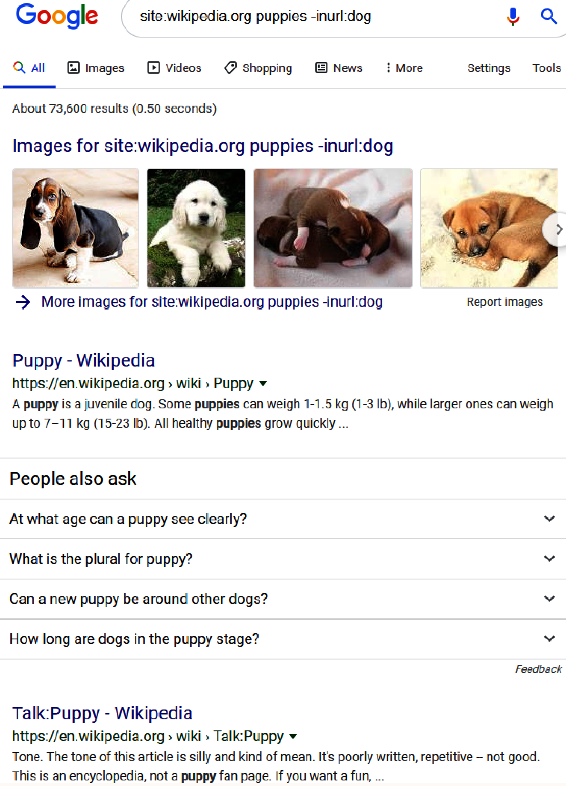
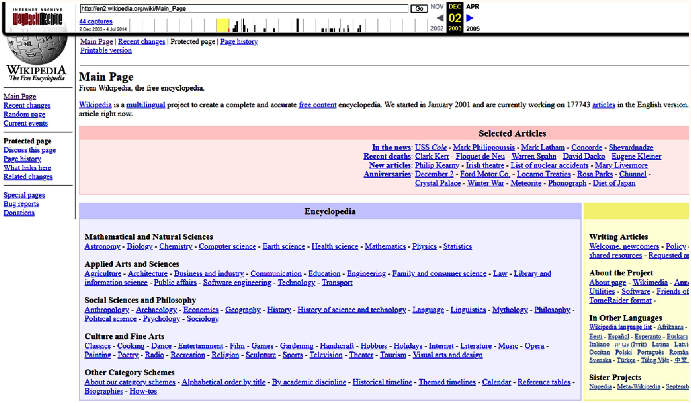
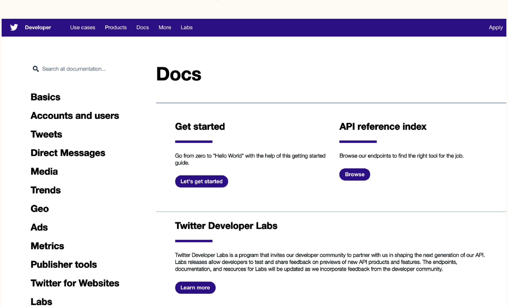

# Chapter 4: Finding Subdomains

## 1. Multiple Applications per Domain
Modern web applications rarely use a single domain. They are distributed across multiple subdomains for different services (e.g., client, server, APIs, email, admin panels). Finding these subdomains is a critical first step in reconnaissance.



---

## 2. Browser's Built-In Network Analysis Tools

**How it works**:
Open browser Developer Tools -> **Network** tab -> **XHR** filter. As you interact with the web application, this captures background HTTP requests (GET, POST, PUT, DELETE). Inspecting the `Request URL` in the headers reveals the target subdomains and affiliated servers.
- **Response tab**: Shows the raw response payload.
- **Timing tab**: Shows metrics on queuing, downloading, and waiting times. These performance metrics are critical for finding **side-channel attacks** (e.g., measuring load time between two scripts on a server called via the same endpoint to gauge what code is running).

**When to use**:
For initial, passive reconnaissance. It maps visible API endpoints and dependencies without triggering third-party scanner alerts.




---

## 3. Taking Advantage of Public Records

Accidental data leaks (e.g., DNS listings, unreleased pages, keys) are frequently indexed by search engines, social media, and archiving tools. 

### Search Engine Caches (Google Dorks)
**How it works**:
Use search operators to filter indexed results. By combining `site:` (target domain) and `-inurl:` (exclude string), you isolate hidden subdomains.
Example: `site:example.com -inurl:www` removes the main `www` application, revealing admin or development subdomains.
*Edge Case/Warning*: The `-inurl:` operator filters out the string from the *entire* URL, not just the subdomain. For example, `https://admin.example.com/www` would be filtered as a false positive.

**When to use**:
To uncover subdomains that were unintentionally indexed by search engines.



### Accidental Archives
**How it works**:
Query historical website snapshots via Archive.org. Inspect the HTML source of old pages and search for standard URL schemes (`http://`, `https://`, `ftp://`, `file://`, `ftps://`).
*Pro-tip*: Historical snapshots are particularly valuable if you know or can guess a point in time when a web application shipped a major release or had a serious security vulnerability disclosed. You can automate this by grabbing the source from 10 different dates and grepping for URL schemes.

**When to use**:
To find legacy APIs, internal links, or endpoints that were exposed in previous deployments but are removed from the live application.



### Social Snapshots
**How it works**:
Querying social media APIs (e.g., Twitter/X Search API) for links containing the target domain. Note that the free tier limits you to 100 tweets/query, 30 queries/min, and 250 queries/month. For complete coverage of viral or large apps, you may need the **streaming API** or **firehose API** (which guarantees 100% delivery of matching tweets).

**When to use**:
To find subdomains tied to marketing campaigns, ad trackers, or hiring events (e.g., `careers.microsoft.com`).



**X (Twitter) Search API Example**:
```bash
curl --request POST \
--url https://api.twitter.com/1.1/tweets/search/30day/Prod.json \
--header 'authorization: Bearer <MY_TOKEN>' \
--header 'content-type: application/json' \
--data '{
"maxResults": "100",
"keyword": "\"example.com\""
}'
```
*(Note: Enclose the keyword in escaped double quotes `\"` to perform an exact match instead of fuzzy matching).*

---

## 4. Zone Transfer Attacks

**How it works**:
A DNS zone transfer is a standardized mechanism that allows DNS servers to synchronize and share their records (stored in a text-based format known as a *zone file*) with other authorized DNS servers. 
If a primary DNS server is misconfigured to resolve requests for unauthorized servers rather than specifically defined secondary servers, an attacker can spoof a valid DNS server and request the entire zone file.

This attack involves pretending to be a DNS server needing to update its records:
1. **Find the target's nameservers**: Use the `host` lookup utility (found in Unix-based systems) with the `-t` flag to request the nameservers responsible for resolving the domain.
   `host -t example.com`
   *(e.g., returns `ns1.bankhost.com` and `ns2.bankhost.com`)*
2. **Request the zone transfer**: Use the `host` utility with the `-l` flag to attempt to get the zone transfer file from one of the discovered nameservers.
   `host -l example.com ns1.bankhost.com`

If successful, the output will dump the entire zone file, revealing internal subdomains (e.g., `admin.example.com`, `internal.example.com`) and their public IP addresses. 
If the server is properly configured and secured against this, it will simply reject the attempt with a message like `: Transfer Failed`.

**When to use**:
As a rapid, high-yield check against improperly secured DNS infrastructure. While many modern applications are properly configured to reject these attempts, the attack only takes two lines of Bash and is almost always worth trying due to the massive potential payoff of uncovering completely hidden subdomains.

---

## 5. Brute Forcing Subdomains

**How it works**:
Brute forcing implies testing every possible combination of subdomains until a match is found. The feedback loop is simple: an algorithm generates a subdomain, fires a request to `<subdomain-guess>.example.com`, and if a response is received, it is marked as live.

Unlike local brute forcing, a remote brute force requires network connectivity and suffers from network latency (typically 50 to 250 ms per request). This means requests **must be made asynchronously** and fired off as rapidly as possible rather than waiting for prior responses.

*Code Mechanics*:
- **Asynchronous Design**: The snippet utilizes Node.js `Promises` and `Promise.all` to queue and execute all DNS resolutions concurrently, dramatically reducing execution time.
- **`dns.resolve` vs `dns.lookup`**: The native implementation of `dns.lookup` relies on `libuv` to perform OS `getaddrinfo` operations synchronously (blocking the thread). `dns.resolve`, however, resolves queries natively asynchronously, making it much more performant for this task.
- **Error Handling**: While omitted for simplicity in the snippet, a robust script should include a `.catch()` block to gracefully handle DNS library errors without interrupting the ongoing brute force loop.

**When to use**:
As an absolute last resort. Because it tests every combination, it is extremely time-consuming and inefficient. 
> [!WARNING]
> Brute force attacks are very easy to detect and could result in your IP addresses being logged or permanently banned by the server or its admin.

**Node.js Async DNS Resolution snippet**:
```javascript
const dns = require('dns');

// Function to generate subdomain permutations
const generateSubdomains = function(length) {
  const charset = 'abcdefghijklmnopqrstuvwxyz'.split('');
  let subdomains = charset;
  let temp;
  for (let i = 1; i < length; i++) {
    temp = [];
    for (let k = 0; k < subdomains.length; k++) {
      for (let m = 0; m < charset.length; m++) {
        temp.push(subdomains[k] + charset[m]);
      }
    }
    subdomains = temp;
  }
  return subdomains;
};

const subdomains = generateSubdomains(4); // Generated permutations
const promises = [];

subdomains.forEach((subdomain) => {
  promises.push(new Promise((resolve, reject) => {
    dns.resolve(`${subdomain}.example.com`, function (err, ip) {
      return resolve({ subdomain: subdomain, ip: ip });
    });
  }));
});

Promise.all(promises).then(function(results) {
  results.forEach((result) => {
    if (!!result.ip) console.log(result); // Only log successful resolutions
  });
});
```

---

## 6. Dictionary Attacks

**How it works**:
A targeted form of brute-forcing that iterates through a curated list of common subdomains rather than randomly generating characters. A popular open-source DNS scanner called `dnscan` provides extensive lists. The top 25 most common subdomains are: `www`, `mail`, `ftp`, `localhost`, `webmail`, `smtp`, `pop`, `ns1`, `webdisk`, `ns2`, `cpanel`, `whm`, `autodiscover`, `autoconfig`, `m`, `imap`, `test`, `ns`, `blog`, `pop3`, `dev`, `www2`, `admin`, `forum`, `news`.

**When to use**:
Preferred over raw brute forcing. It is much faster and effectively discovers standard, non-obfuscated subdomains.

**Node.js Dictionary Attack (Streaming from CSV)**:
```javascript
const dns = require('dns');
const csv = require('csv-parser');
const fs = require('fs');
const promises = [];

fs.createReadStream('subdomains-10000.txt')
  .pipe(csv())
  .on('data', (subdomain) => {
    promises.push(new Promise((resolve, reject) => {
      dns.resolve(`${subdomain}.example.com`, function (err, ip) {
        return resolve({ subdomain: subdomain, ip: ip });
      });
    }));
  })
  .on('end', () => {
    Promise.all(promises).then(function(results) {
      results.forEach((result) => {
        if (!!result.ip) console.log(result);
      });
    });
  });
```
