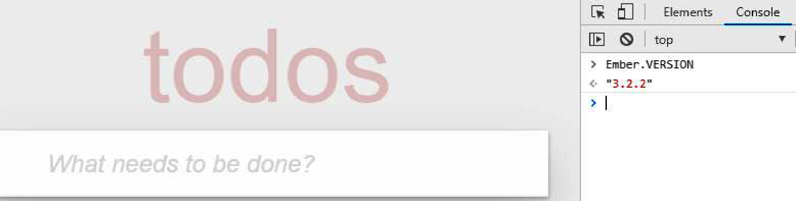
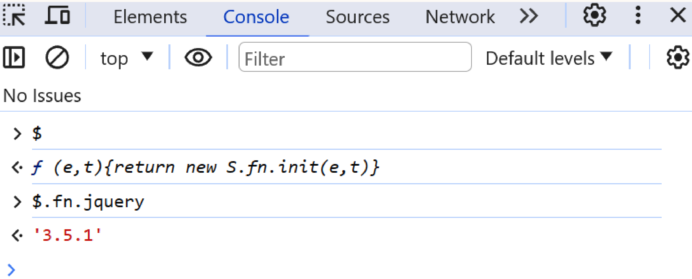
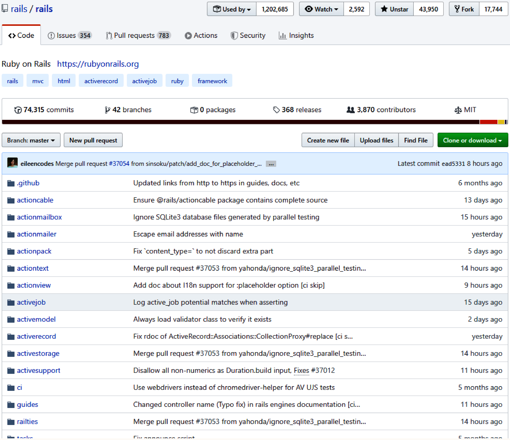
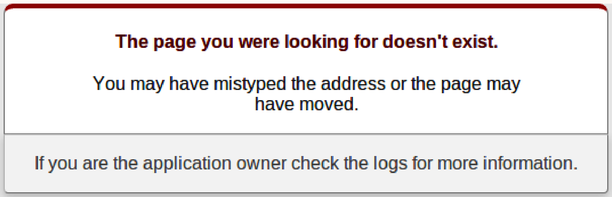

# Chapter 6. Identifying Third-Party Dependencies

Third-party integrations often introduce vulnerabilities, making them a primary attack vector. Identifying specific frameworks, libraries, and their versions during reconnaissance allows attackers to leverage known vulnerabilities (e.g., CVEs) without creating new exploits.

## Detecting Client-Side Frameworks

### SPA Frameworks

**How it works:** Each framework introduces specific syntax, DOM element management, and global variables in the browser. By inspecting the DOM and console, the framework and its version can be identified.
**When to use:** Use these techniques during reconnaissance to map the client-side technology stack.

#### EmberJS
- Sets a global variable `Ember`.
- Tags DOM elements with `ember-id` (e.g., `id=ember1`), typically wrapped in a `<div class="ember-application">` parent element.
- **Detect version:**
  ```javascript
  console.log(Ember.VERSION);
  ```



#### Angular
- **Older versions (< 4.0):** Expose global `angular` object. Version is found at `angular.version`.
- **Angular 4.0+:** Global `ng` object exists.
- **Detect version (Angular 4.0+):**
  ```javascript
  const elements = getAllAngularRootElements();
  const version = elements[0].attributes['ng-version'];
  console.log(version);
  ```

#### React
- Exposes a global `React` object.
- Often uses `<script type="text/jsx">`.
- **Detect version:**
  ```javascript
  console.log(React.version);
  ```

#### VueJS
- Exposes a global `Vue` object.
- **Detect version:**
  ```javascript
  console.log(Vue.version);
  ```
- Re-enable developer tools if disabled by the application:
  ```javascript
  Vue.config.devtools = true;
  ```

### Detecting JavaScript Libraries

**How it works:** Helper libraries often use top-level global objects for namespacing (e.g., `_` for Lodash/Underscore, `$` for JQuery). Alternatively, DOM traversal can extract all loaded scripts.
**When to use:** To identify specific utility libraries that may harbor known vulnerabilities like Prototype Pollution or ReDoS.



**Detect all external scripts:**
```javascript
const getScripts = function() {
  const scripts = document.querySelectorAll('script');
  scripts.forEach((script) => {
    if (script.src) {
      console.log(`i: ${script.src}`);
    }
  });
};
getScripts();
```

### Detecting CSS Libraries

**Detect all imported CSS files:**
```javascript
const getStyles = function() {
  const scripts = document.querySelectorAll('link');
  scripts.forEach((link) => {
    if (link.rel === 'stylesheet') {
      console.log(`i: ${link.getAttribute('href')}`);
    }
  });
};
getStyles();
```

## Detecting Server-Side Frameworks

Server-side dependencies are detected via HTTP traffic marks (headers, fields) or exposed endpoints.

### Header Detection

Insecurely configured servers leak data in default headers.
- **Example Response:**
  ```text
  X-Powered-By: ASP.NET
  Server: Microsoft-IIS/4.5
  X-AspNet-Version: 4.0.25
  ```

### Default Error Messages and 404 Pages

**How it works:** Clone the open-source framework's repository and examine the git commit history for default files (like `404.html`). Look for specific, timestamped changes (e.g., removal of an HTML5 attribute, modification of CSS classes) to fingerprint the version running on the target.
**When to use:** When standard header detection fails and an application exposes default, out-of-the-box error pages from open-source frameworks (e.g., Ruby on Rails).

**Example: Ruby on Rails 404 Page Fingerprinting**
By examining the git commit history for the default `public/404.html` page, you can identify specific historical changes:
- **April 20, 2017:** Namespaced CSS selectors (`.rails-default-error-page`) added.
- **November 21, 2013:** `U+00A0` replaced with whitespace.
- **April 5, 2012:** HTML5 `type="text/css"` attribute removed.

By cross-referencing the presence or absence of these elements with official release schedules (e.g., on Ruby Gems), you can determine a version range (e.g., between `3.2.16` and `4.2.8`), which can then be checked against vulnerability databases to find applicable exploits (e.g., CVE-2016-6316 XSS vulnerability for versions `3.2.x` to `4.2.7`).




## Database Detection

### Primary Key Scanning

**How it works:** Analyze HTTP traffic payloads (REST paths, query parameters, JSON body) for primary keys. Cross-reference the structure of these keys with known database key generation algorithms.
**When to use:** When the application does not expose database error messages, and you need to identify the backend storage system by observing how it generates persistent object IDs.

**MongoDB Example:**
MongoDB generates a 12-byte `ObjectId` string formatted as hexadecimal:
- First 4 bytes: Unix timestamp
- Next 5 bytes: Random
- Final 3 bytes: Counter
- **Example:** `507f1f77bcf86cd799439011`

While the `ObjectId` spec includes helper methods like `getTimestamp()`, these are rarely exposed to the client. Instead, you must analyze HTTP traffic payloads to find 12-byte strings matching the format above.

These keys may appear in REST patterns (`GET /users/:id`), request bodies (`PUT /users, body = { id: id }`), query params (`GET /users?id=id`), or directly in API response metadata:
```json
{
  "_id": "507f1f77bcf86cd799439011",
  "username": "joe123"
}
```
